# DIVINE DOMINION — Screens & Flows (Stage 2A)

> Cross-references: [UI & Visuals](09-ui-and-visuals.md) · [In-Game Interactions](09c-in-game-interactions.md) · [Overview](01-overview.md) · [Commandments](03-commandments.md) · [Scope](12-scope-and-risks.md) · [Constants](constants.md) · [INDEX](../INDEX.md)

---

## Decision Log

| # | Decision | Choice | Rationale |
|---|----------|--------|-----------|
| 1 | Commandment selection layout | **Option D: Hybrid (Tabs + Grid / List toggle)** | Visual card grid for first-timers, compact list toggle for veterans. "All" tab for cross-category browsing. Best of both worlds. |
| 2 | Store screen | **Deferred** | All content ships free at launch. Store screen reserved for future expansion packs. No IAP at launch. |
| 3 | Earth History style | **Option B: Timeline with pivotal moments** | Sweet spot between narrative depth and buildability. Auto-logged pivotal moments during gameplay. |
| 4 | Tutorial depth | **Option C: Contextual tooltips** | 3 initial callouts + contextual tooltips on first encounter. Skip option in settings. Respects strategy-gamer persona. |

---

## 1. Screen Flow Diagram

```mermaid
flowchart TD
    LAUNCH[App Launch] --> SPLASH[Splash Screen<br>1-2s]
    SPLASH --> MAIN_MENU[Main Menu]

    MAIN_MENU --> NEW_EARTH[New Earth]
    MAIN_MENU --> CONTINUE[Continue<br>visible only if save exists]
    MAIN_MENU --> HISTORY[Earth History]
    MAIN_MENU --> STORE[Store]
    MAIN_MENU --> SETTINGS[Settings]

    NEW_EARTH --> FIRST{First Earth?}
    FIRST -->|Yes| ARCHETYPE[Archetype Selection<br>Shepherd / Judge / Conqueror]
    FIRST -->|No| CMD_SELECT[Commandment Selection<br>Hybrid: Grid + List]

    ARCHETYPE --> CMD_REVIEW[Commandment Review<br>Pre-filled 10, swap allowed]
    CMD_REVIEW --> WORLD_GEN[World Generation<br>Loading screen]
    CMD_SELECT --> WORLD_GEN

    WORLD_GEN --> GAME[Live Game Map]
    CONTINUE --> GAME

    GAME --> PAUSE[Pause Menu]
    PAUSE --> GAME
    PAUSE --> SETTINGS
    PAUSE --> THIS_RUN[This Earth<br>Current timeline + moments]
    THIS_RUN --> PAUSE
    PAUSE --> MAIN_MENU

    GAME --> ERA_SUMMARY[Era Summary Card]
    ERA_SUMMARY --> GAME

    GAME --> EVENT[Event Card]
    EVENT --> GAME

    GAME --> RESULTS[Results Screen<br>Win / Lose / Ascension]
    RESULTS --> NEW_EARTH
    RESULTS --> HISTORY
    RESULTS --> MAIN_MENU

    HISTORY --> EARTH_DETAIL[Earth Detail<br>Timeline + Pivotal Moments]
    EARTH_DETAIL --> HISTORY

    SETTINGS --> MAIN_MENU
    SETTINGS --> PAUSE

    %% Error states (2A-owned)
    PURCHASE_CONFIRM --> PURCHASE_FAIL[Purchase Failed<br>Toast + retry option]
    RESTORE --> RESTORE_FAIL[Restore Failed<br>Toast + contact support]

    style GAME fill:#2a2a4e,stroke:#d4a857,stroke-width:2px
    style RESULTS fill:#2a2a4e,stroke:#d4a857,stroke-width:2px
    style CMD_SELECT fill:#2a2a4e,stroke:#d4a857,stroke-width:2px
```



---

## 2. Main Menu

### Layout (Portrait, Top-to-Bottom)

| Element | Position | Details |
|---------|----------|---------|
| **Background** | Full screen | Slow-rotating vector Earth, dark void, faint stars. Era palette shifts if player has completed Earths. |
| **Title** | Top center, below safe area | "DIVINE DOMINION" — gold, tracking-wide, serif-like. |
| **God Profile preview** | Below title | Earth counter badge: "Earth #4" or "First Awakening" if new. |
| **New Earth** | Primary CTA, center | Gold filled button, 48pt height. Label: "Create New Earth". |
| **Continue** | Below New Earth | Outlined button, same width. Only visible if save exists. Shows era name + year: "Continue — Enlightenment, 1723". |
| **Earth History** | Below Continue | Text button. "Earth History →". |
| **Store** | Below History | Text button. "Store →". |
| **Settings** | Top-right corner | Gear icon, 44pt touch target. |
| **Version** | Bottom, above home indicator | "v1.0.0" — 10pt, 40% opacity. |

### State Variations

| State | Changes |
|-------|---------|
| **First launch** | No Continue button. No Earth counter. Title animation plays (fade in from void). |
| **Returning, no save** | Earth counter shows. No Continue button. |
| **Returning, save exists** | Continue button visible with era/year context. |
| **Soft-launch free** | Store button present but badge reads "All Content Unlocked" instead of prices. |
| **Post-soft-launch (paid)** | Store button shows normally. |

### Safe Area

- **Top:** 44pt inset (notch/Dynamic Island). Settings gear sits within safe area.
- **Bottom:** 34pt inset (home indicator). Version number sits above home indicator.

---

## 2b. Pause Menu

Full-screen overlay, dark scrim (70% opacity) over the game map. Centered content.

### Layout

| Element | Position | Details |
|---------|----------|---------|
| **Title** | Top center, below safe area | "Paused" — 20pt, gold, tracking-wide |
| **Resume** | Center, primary CTA | Gold filled button, 48pt height, full width minus 64pt padding. Label: "Resume" |
| **This Earth** | Below Resume | Outlined button, same width. Label: "This Earth" — opens current run timeline |
| **Settings** | Below This Earth | Outlined button, same width. Label: "Settings" — opens settings modal |
| **Main Menu** | Below Settings, separated by 24pt gap | Text button, muted. Label: "Exit to Main Menu". Tap → confirmation: "Progress is auto-saved. Exit?" with "Exit" / "Cancel" |

### Behavior

- Pause triggered by: pause button (HUD), two-finger tap, or app backgrounding.
- Resume via: Resume button, or two-finger tap again.
- While paused: simulation fully stopped, no time passes, map visible but dimmed behind scrim.
- Settings opened from pause returns to pause menu (not to game).
- "This Earth" shows the current Earth timeline (pivotal moments so far). Back arrow returns to pause menu.

---

## 3. Settings Screen

Full-screen modal, slides up from bottom. Dark background matching main menu.

### Layout

| Group | Setting | Control | Default | Notes |
|-------|---------|---------|---------|-------|
| **Audio** | Sound effects | Toggle | On | Controls all SFX |
| | SFX volume | Slider (0-100%) | 80% | Only visible when SFX is On |
| **Feel** | Haptics | Toggle | On | Vibration feedback on powers, events |
| | Reduced motion | Toggle | Off | Simplifies animations, disables particles |
| **Controls** | Left-hand mode | Toggle | Off | Mirrors FAB, controls, bottom sheet anchor |
| | Speed default | Segmented: 1× / 2× / 4× | 1× | Default sim speed on game start |
| **Display** | Font scaling | Slider: 80% – 140% | 100% | Affects HUD text, event cards, panels |
| | High contrast | Toggle | Off | Increases text/border contrast for readability |
| | Colorblind mode | Picker: Off / Deuteranopia / Protanopia / Tritanopia | Off | Remaps religion/tension/disease colors |
| **Tutorial** | Show tutorial tips | Toggle | On | When off, contextual tooltips suppressed |
| **Account** | Restore purchases | Button | — | Triggers App Store / Play Store restore |
| **About** | Support / feedback | Link → email / form | — | Opens external link |
| | Privacy policy | Link → web | — | Opens in-app browser |
| | Version | Label | — | "v1.0.0 (build 42)" |

### Behavior

- Settings persist to `localStorage` / `IndexedDB`, keyed per device.
- Changes apply immediately (no "save" button).
- Close via X button (top-right) or swipe down.
- Tapping "Restore purchases" shows a loading spinner, then success toast or error toast.

---

## 4. Commandment Selection UX

### First Earth: Archetype Flow

1. **Archetype Selection Screen** — Three full-width cards, vertically stacked with scroll-snap. Top card fully visible, next card peeks ~40pt from below (reveals name + icon, signals "scroll for more"). Page indicator dots (1 of 3) centered below cards.
   - **The Shepherd** — "Guide through compassion." 3 sample commandments shown. Warm golden tones.
   - **The Judge** — "Rule through order." 3 sample commandments shown. Silver/steel tones.
   - **The Conqueror** — "Expand through strength." 3 sample commandments shown. Deep crimson tones.
   - Each card: 320pt wide, ~400pt tall. Philosophy one-liner, 3 commandments with icons, "Choose This Path" button.
   - All 3 archetypes are free and visually identical in presentation.

2. **Commandment Review Screen** — Hybrid layout (grid mode) showing the 10 pre-selected commandments.
   - All 10 checked. Player can tap any to deselect, then browse alternatives.
   - "Swap" interaction: deselect one → grid filters to show only alternatives in that same category (not the full 50-commandment browser) → select replacement. First Earth always uses category-filtered alternatives to avoid overwhelming new players. Full browser is available from subsequent Earths only.
   - Counter reads "10 / 10 selected" — Confirm button enabled.
   - Tension warnings shown inline if pre-selected set has conflicts.

### Subsequent Earths: Full Browser

Hybrid layout with two modes:

#### Grid Mode (Default)

| Element | Spec |
|---------|------|
| **Mode toggle** | Segmented control: "Cards" (active) / "List". 36pt height. Full width. |
| **Category tabs** | Horizontal scroll. "All" tab first (default), then 7 categories. Active tab: gold underline. 36pt height. |
| **Card grid** | 2 columns, 10px gap. Cards: ~167pt wide, ~110pt tall. |
| **Card contents** | Category color dot (8pt), name (12pt semibold), effect summary (10pt gray), check circle (20pt, top-right). |
| **Selected card** | Gold border, subtle gold background tint, filled check with ✓. |
| **Locked card** | 50% opacity, lock icon replacing check circle. Tap → popover (see IAP). |
| **Tension warning** | Red text below effect: "⚠ Tension pair" — only if a conflicting commandment is also selected. |
| **Counter** | Pill badge below header: "4 / 10 selected". Gold tint. |
| **Confirm button** | Sticky bottom bar with gradient fade. Gold filled, 48pt height, full width minus 32pt padding. Disabled (40% opacity) until 10 selected. |

#### List Mode

| Element | Spec |
|---------|------|
| **Search bar** | Text input + "Tensions" filter button. 44pt height. |
| **Category headers** | Collapsible. Uppercase, gold, 12pt. Chevron indicates expanded/collapsed. |
| **List row** | Checkbox (22pt) + name (13pt semibold) + effect (11pt gray) + chevron for detail. Row height: ~56pt. |
| **Selected row** | Filled gold checkbox with ✓. |
| **Tension row** | Red "⚠ Conflicts with..." text below effect. |
| **Chevron** | Tapping chevron or long-pressing row → detail popover with flavor text + full mechanical description. |

#### Info Popover (Both Modes)

Triggered by tapping the info chevron (list) or long-pressing a card (grid):

| Field | Content |
|-------|---------|
| Name | Full commandment name |
| Category | With color dot |
| Flavor text | One line, italic |
| Mechanical effect | Full description with numbers |
| Tension pairs | List of conflicting commandments, if any, with schism % |
| Status | "Selected" / "Available" / "Locked — Part of Full Game Unlock" |

Popover: 300pt wide, anchored to card/row, dismissible by tapping outside.

#### Scroll & Performance

- Grid mode: smooth scroll, ~13-25 cards visible in "All" tab. Performance note: 50 cards is within DOM limits on modern phones, but implementation should use list virtualization (e.g., virtual scroll) if profiling shows jank on mid-range devices.
- List mode: all categories collapsed by default except the first. Expanding shows 5 items per category.
- Category tabs scroll horizontally. Active tab scrolls into view automatically.

---

## 5. Store (Reserved for Future Expansion Packs)

All content ships free at launch. No in-app purchases, no content gating.

The Store screen is accessible from Main Menu but is **not active at launch**. It displays: "All content included — expansion packs coming soon." No purchase prompts, no lock icons, no price cards.

### Future Expansion Pack Infrastructure

When expansion packs are introduced post-launch, this section will be updated with:
- Store screen layout (pack cards, pricing, descriptions)
- Purchase and restore flows (App Store / Play Store integration)
- Entry points from menu and results screen

### Achievement-Locked Commandments

15 commandments unlock through gameplay achievements (not payment). When a player taps a locked commandment in the selection screen:

- Small popover anchored to the card/row.
- Content: commandment name, unlock condition (e.g., "Win a run", "Survive past 1900").
- Dismiss: tap outside or X.

---

## 6. Earth History Interface

### Earth List Screen

Accessible from Main Menu → "Earth History".

| Element | Details |
|---------|---------|
| **Header** | "Earth History" — centered. Back arrow top-left. |
| **Empty state** | "No Earths yet. Create your first one." + "Create New Earth" button. |
| **Earth cards** | Vertical list, newest first. Each card: 100pt tall, full width. |

#### Earth Card Contents

| Field | Position | Example |
|-------|----------|---------|
| **Earth number** | Top-left, bold | "Earth #3" |
| **Outcome icon** | Top-right | Green globe (won) / Red cracked globe (lost) / Gold glow (ascension) |
| **Outcome label** | Next to icon | "Humanity Saved" / "Humanity Fell" / "Ascension" |
| **Commandments preview** | Below number | 10 tiny category color dots in a row |
| **Key stats** | Bottom row | "Era 8 · 1.2M followers · 37 interventions · 2h 14m" |

Tap a card → Earth Detail screen.

### Loading & Capacity

| State | Behavior |
|-------|----------|
| **Loading** | Spinner centered in list area: "Loading Earth History..." Shown if reading saved Earths takes > 300ms. |
| **Max capacity** | 50 Earths retained. When the 46th Earth is saved, a subtle banner appears at the top of the list: "Oldest Earths will be removed after 50." At 50, saving a new Earth auto-deletes the oldest. |
| **Virtualization** | List uses virtual scrolling for performance. Only visible cards + 2 buffer cards rendered. |

### Earth Detail Screen (Timeline)

| Element | Details |
|---------|---------|
| **Header** | "Earth #3" — outcome icon. Back arrow. |
| **Commandments** | Horizontal scroll of 10 commandment pills (name + category dot). Tap for info popover. |
| **Stats bar** | Key stats row: eras survived, followers, interventions, time played. |
| **Timeline** | Vertical timeline, newest moment at top. Gold line with dot markers. |

#### Timeline Pivotal Moments

5-8 moments per Earth, auto-logged during gameplay.

| Moment Type | Trigger | Display |
|-------------|---------|---------|
| **War** | War declared between nations involving player religion | "1743 — War of the Northern Plains. [Nation A] attacked [Nation B]." |
| **Schism** | Schism event fires | "1801 — The Great Schism. Your faith split over [commandment tension]." |
| **Miracle** | Player casts Miracle with 500+ conversions | "1755 — Miracle at [Region]. 2,000 converted." |
| **Science** | Science milestone unlocked | "1870 — Electricity discovered. [Nation] leads." |
| **Religion shift** | Major religion boundary change (>3 regions flip) | "1900 — The Faith retreats from the East. 4 regions lost." |
| **Alien hint** | Alien signal events | "2031 — Strange signals detected from the stars." |
| **Disaster** | Player uses disaster with 10k+ casualties | "1832 — The Great Flood. [Region] devastated." |
| **Victory/Defeat** | Game end | "2187 — The Defense Grid activates. Earth is saved." |

#### Pivotal Moment Data Capture

During gameplay, the simulation auto-logs events to an array on the game state:

```typescript
interface PivotalMoment {
  year: number;
  type: 'war' | 'schism' | 'miracle' | 'science' | 'religion_shift' | 'alien' | 'disaster' | 'outcome';
  headline: string;   // 1-line summary (template-generated)
  details?: string;   // Optional 2nd line with specifics
}
```

Logged to `GameState.pivotalMoments[]`. Persisted with save. Max 20 per Earth (oldest non-outcome dropped if exceeded).

---

## 7. Results / End-of-Earth Screen

Full-screen overlay after game ends. Dark background, content centered.

### Win Layout

| Element | Details |
|---------|---------|
| **Icon** | Gold globe, radiating light. Subtle particle effect. |
| **Headline** | "Humanity Saved." — 28pt, gold, serif. |
| **Sub-headline** | "The Defense Grid held. Your faith endures across the stars." — 14pt, gray. |
| **Stats grid** | 2×3 grid of stat cards (see below). |
| **Commandments** | "Your 10 Laws" — horizontal scroll of commandment pills. |
| **Primary CTA** | "Create New Earth" — gold button, 48pt. |
| **Secondary links** | "View Earth History" · "Main Menu" — text links below CTA. |
| **Share placeholder** | Reserved 48pt height below secondary links. Hidden at launch. When sharing is implemented, shows "Share Your Earth" button here. |

### Lose Layout

| Element | Details |
|---------|---------|
| **Icon** | Cracked red globe, fading. |
| **Headline** | "Humanity Fell." — 28pt, muted red. |
| **Sub-headline** | "The skies burned. But you remember. Another Earth awaits." — 14pt, gray. |
| **Stats grid** | Same as win. |
| **Commandments** | Same, plus: "Would you change any?" — tappable gold text link. Tapping navigates to commandment selection for the next Earth (pre-fills current set, player can swap before confirming). |
| **Primary CTA** | "Awaken on a New Earth" — gold button. |
| **Secondary links** | Same as win. |
| **Unlock prompt** | If player has unearned unlockable commandments: "15 more commandments unlock through achievements." Text line, subtle, below secondary links. Not a modal, not a pop-up. |
| **Share placeholder** | Reserved 48pt height below paid prompt / secondary links. Hidden at launch. Same slot as Win layout. |

### Ascension Layout (Special Win)

| Element | Details |
|---------|---------|
| **Icon** | Transcendent white-gold globe with orbital rings. |
| **Headline** | "Ascension." — 28pt, white-gold. |
| **Sub-headline** | "Peace reigns. Knowledge illuminates. Faith binds all. You have transcended." |
| **Stats + Commandments** | Same structure. |
| **Title earned** | "Title Earned: Ascended" — gold badge. |
| **Share placeholder** | Reserved 48pt height below title earned. Hidden at launch. Same slot as Win/Lose layouts. |

### Stats Grid

| Stat | Example |
|------|---------|
| Followers at end | "2.4M" |
| Divine interventions | "37" |
| Wars fought | "12" |
| Eras survived | "11 of 12" |
| Science level | "Milestone 9: Space Programs" |
| Time played | "3h 47m" |

---

## 8. Tutorial / Onboarding Flow

### Phase 1: Initial Callouts (First 5 Minutes)

Triggered sequentially during first Earth only. Each is a spotlight overlay (dimmed background, highlighted element, tooltip anchored to element).

| # | Trigger | Target Element | Callout Text | Position |
|---|---------|---------------|-------------|----------|
| 1 | World map first appears | Player's starting region (gold glow) | "Your first followers. They don't know you yet. Tap to meet them." | Bottom of region |
| 2 | Player taps region | Region info panel | "Faith, population, development — everything a god needs to know about their people." | Above panel |
| 3 | Panel dismissed | FAB (pulsing) | "Your divine power. Tap to bless — or to unleash something less kind." | Left of FAB |

After callout 3, the tutorial releases control. The world unpauses.

### Phase 2: Contextual Tooltips (First Era)

Each tooltip appears once, on first encounter of the trigger condition. Not shown if "Show tutorial tips" is off in Settings.

| # | Trigger Condition | Target Element | Tooltip Text |
|---|-------------------|---------------|-------------|
| 4 | First event notification appears | Event toast | "Something's happening. Tap to weigh in — or stay silent." |
| 5 | First battle starts on map | Battle VFX | "War. You can intervene, or let mortals sort it out. Both have consequences." |
| 6 | First era transition | Era summary card | "A new era. The world changes whether you're ready or not." |
| 7 | Player opens FAB and sees both blessing and disaster arcs | Disaster side of dual-arc | "The dark side. Powerful, effective, and your followers will have opinions about it." |
| 8 | 3+ minutes without opening divine overlay | Divine Eye at FAB apex | "The Eye sees what mortals can't — plans, pressures, hidden threats." |
| 9 | First schism risk appears (tension pair selected) | Schism crack VFX | "Your commandments contradict each other. Your followers noticed." |
| 10 | Player swipes right for first time (or 5 min mark) | Commandments panel edge | "Swipe to review your commandments. They're doing more than you think." |

### Tooltip Style

- Spotlight: 60% dark overlay on everything except target element.
- Tooltip: Dark card with gold border, white text, 13pt. Max 2 lines.
- Dismiss: Tap anywhere. Tooltip fades out (200ms).
- "Got it" button on tooltip. No "Next" — each is independent.

### Returning Players

- Tutorial state persisted per device (not per Earth).
- Phase 1 callouts only fire once ever (first Earth).
- Phase 2 tooltips only fire once ever per tooltip.
- "Show tutorial tips" toggle in Settings resets Phase 2 tooltips when turned back on.
- No tutorial replay option — once dismissed, gone (reset via Settings toggle).

### Skip

- Phase 1: Subtle "Skip" text link (top-right corner, 40% opacity) visible during all 3 callouts. Tapping skips remaining Phase 1 callouts and releases control. Most players won't notice it; veterans will.
- Phase 2 tooltips can be globally disabled via Settings → "Show tutorial tips" → Off.

---

## 9. Loading States

### App Launch (Splash)

| Phase | Duration | Visual |
|-------|----------|--------|
| Splash screen | 1-2s | App icon centered, dark background. Fades in. |
| Transition to menu | 0.5s | Splash fades, main menu fades in. |

**Target:** Main menu visible within 2.5s of app tap.

### Continue (Save Load)

| Phase | Duration | Visual |
|-------|----------|--------|
| Loading | 0.5-1s | Main menu blurs. Centered spinner with "Loading Earth #3..." text. |
| Transition | 0.3s | Blur clears, game map fades in at saved camera position. |

**Target:** Game playable within 1.5s of tapping Continue.

### New Earth (World Generation)

| Phase | Duration | Visual |
|-------|----------|--------|
| Generation | 2-4s | Dark screen with vector Earth rotating slowly. Progress text cycles: "Forming continents..." → "Nations arise..." → "Faiths take root..." → "Your followers gather." |
| Transition | 0.5s | Globe zooms into map view. Tutorial begins (first Earth) or game starts (subsequent). |

**Target:** Map visible within 5s of confirming commandments. Progress text provides perceived progress; actual generation may be faster.

### Maximum Acceptable Load Times

| Transition | Target | Fallback |
|------------|--------|----------|
| App launch → menu | ≤ 2.5s | If > 4s, show loading spinner on splash |
| Continue → game | ≤ 1.5s | If > 3s, show progress bar |
| New Earth → game | ≤ 5s | If > 8s, show "This is taking longer than usual" text |

---

## 10. Stage 2B Handoff

### a. Settings → In-Game Behavior Map

| Setting | In-Game Elements Affected | 2B Must... |
|---------|--------------------------|------------|
| **Left-hand mode** | FAB moves to bottom-left. Event cards anchor left. Bottom sheet stays center (full-width, no mirror needed). Swipe semantics stay the same (swipe right = commandments, swipe left = stats) — only anchored UI elements mirror, not gesture directions. | Design all anchored elements with a `handedness` parameter. |
| **Reduced motion** | Cloud drift stops. Particle VFX replaced with static tint. Battle VFX simplified (no sparks, just icon overlay). Trade particle flow replaced with static golden lines. Religion wave-front replaced with instant tint change. | Provide a `reducedMotion` alternative for every animation. |
| **Speed default** | HUD speed control initializes to this value. Speed selector shows current default highlighted. | Read from settings on game start, not hardcoded to 1×. |
| **Font scaling** | HUD year/era text, event card body text, region panel text, tooltip text. NOT: button labels, tab labels, icons. Max scaled size: 140% of base. | Use rem-based sizing for scalable elements. Define which elements scale. |
| **High contrast** | Text labels on map, region borders, panel backgrounds, button outlines. Increases contrast ratios to WCAG AA (4.5:1 for text, 3:1 for UI). | Provide a high-contrast theme variant for all in-game UI elements. |
| **Colorblind mode** | Religion overlay colors, tension/schism warning colors, disease tint colors, trade route colors. All must have per-mode palettes. | Define 4 palette sets (normal + 3 colorblind). Stage 7 produces exact hex values. |

### b. Tutorial Callout Targets

2B must design these elements so tooltip callouts can attach without overlapping other UI.

| Callout # | Target Element | Callout Text | Anchor Position | Trigger |
|-----------|---------------|-------------|-----------------|---------|
| 1 | Player starting region | "These are your first followers. Tap to learn about them." | Below region center | Map first appears |
| 2 | Region info panel | "This panel shows your region's people..." | Above panel top edge | Player taps region |
| 3 | FAB | "This is your divine power. Tap to bless your followers." | Left of FAB (or right if left-hand mode) | Panel dismissed |
| 4 | Event toast | "An event needs your attention. Tap to decide." | Below toast | First event notification |
| 5 | Battle VFX | "A war has begun. You can intervene..." | Above battle | First battle starts |
| 6 | Era summary card | "A new era dawns. The world is changing." | Below card | First era transition |
| 7 | Disaster side of dual-arc | "Disasters harm regions..." | Adjacent to disaster arc | First FAB open showing disasters |
| 8 | Divine Eye at FAB apex | "Tap the Eye to see hidden information..." | Above Eye | 3+ min without overlay |
| 9 | Schism crack VFX | "Your commandments are in tension..." | Near crack | First schism risk |
| 10 | Screen left edge | "Swipe right to review your commandments..." | Center-left | First swipe or 5 min mark |

### c. Design Tokens (Shared with 2B)

These values are binding for both 2A and 2B. Neither may contradict them.

| Token | Value | Notes |
|-------|-------|-------|
| `MIN_TOUCH_TARGET` | 44pt | Apple HIG / Material Design minimum |
| `SAFE_AREA_TOP` | 44pt | Notch / Dynamic Island inset |
| `SAFE_AREA_BOTTOM` | 34pt | Home indicator inset |
| `PRIMARY_CTA_HEIGHT` | 48pt | All primary action buttons |
| `TOAST_POSITION` | Top, below safe area | 16pt from safe area top |
| `TOAST_MAX_HEIGHT` | 80pt | 2-line max |
| `MODAL_BORDER_RADIUS` | 20pt | Bottom sheets, modals, popovers |
| `SHEET_BORDER_RADIUS` | 16pt | Info panels, settings groups |
| `ANIM_DURATION_ENTRY` | 250ms | Sheets sliding up, modals fading in |
| `ANIM_DURATION_EXIT` | 200ms | Sheets sliding down, modals fading out |
| `TOOLTIP_MAX_WIDTH` | 280pt | Tutorial and info tooltips |
| `TOOLTIP_ARROW_SIZE` | 8pt | Pointer arrow on tooltips |
| `BOTTOM_SHEET_REST` | 50% screen height | Default half-screen rest position |
| `SEGMENTED_CONTROL_HEIGHT` | 36pt | Mode toggles, speed selectors |

### d. Error State Ownership

| Owner | Error State | Behavior |
|-------|-------------|----------|
| **2A** | Purchase failed | Toast: "That didn't go through. Check your connection and try again — divinity is patient." Dismisses in 5s. |
| **2A** | Restore failed | Toast: "Couldn't restore your purchases. These things happen even to gods." + "Contact support" link. Dismisses in 8s. |
| **2A** | Store unavailable | Store screen shows "The cosmic marketplace is temporarily closed. Try again shortly." |
| **2A** | Navigation error (dead screen) | Fallback: redirect to Main Menu. Log error silently. |
| **2B** | Auto-save failed | Toast: "Couldn't save your Earth. We'll try again in a moment." + auto-retry 3×. If all fail: modal with "Save to file" option. |
| **2B** | LLM timeout / fallback | Silent fallback to template. No user-facing error. |
| **2B** | Corrupted save | Modal: "Something went wrong with your saved Earth. Start fresh, or try to recover what's left?" + "Try Recovery" / "New Earth" buttons. |
| **2B** | Offline state | No error — game is fully offline. If LLM was expected: silent template fallback. |
| **2B** | Low memory | Reduce ambient animations. If critical: "Low memory — consider closing other apps." toast. |
| **2B** | App backgrounded mid-event | Auto-pause. On resume: event card still visible, no state lost. Same for phone calls, notifications, and app switches — event state is preserved exactly. |
| **2B** | Multiple events pending | Events queue and are presented one-by-one (highest priority first). Badge on event toast shows count: "2 events need attention." Player cannot reorder or defer — must resolve in priority order. Max queue: 5 (excess events are auto-resolved with "Stay Silent" outcome). |

---

### e. Event Card Scope — The God's Dilemma

Events are NOT global decisions. Every event is scoped to a specific nation, region, or pair of nations. The player is a god choosing between competing groups of their own followers.

**2B must design event cards to show:**

| Element | Purpose | Example |
|---------|---------|---------|
| **Scope badge** | Which nation/region this event affects | "Kingdom of Valdorn" or "Eastern Provinces" |
| **Map highlight** | Affected region(s) pulse behind the semi-transparent event card overlay. If the region is off-screen, a directional arrow appears on the card edge pointing toward it + a "Show on map" text link that smooth-pans the camera (500ms ease-in-out) before re-showing the event card. Camera never moves automatically — the player stays in control. | Affected region pulses, rest of map dims to 40% |
| **Follower stakes** | How many of YOUR followers are on each side | "Your followers: 12K in Valdorn (attackers) · 8K in Alaris (defenders)" |
| **Per-choice consequences** | Each choice shows what happens to followers on EACH side, not just one | "Bless Defenders → +faith in Alaris, −faith in Valdorn (your followers there feel abandoned)" |

**The core UX principle:** The player must always feel the weight of being a god above nations, not a king of one nation. When their followers are on both sides of a conflict, the event card must make both sides visible — the impossible choice is the game's emotional core.

**Scoping rules for event types:**

| Scope | Event Types | Example |
|-------|-------------|---------|
| **Single region** | Natural disasters, local religious events, cultural events | "Drought strikes the Northern Plains" |
| **Single nation** | Internal politics, revolutions, corruption | "Corruption spreads in the Valdorn court" |
| **Two nations** | Wars, alliances, border conflicts, trade disputes | "Valdorn invades Alaris — your followers are in both" |
| **Global** | Science milestones, alien events, era-defining moments | "Electricity discovered — the world changes" (rare, ~10% of events) |

Most events (70-80%) are single-region or single-nation. The god's perspective comes from seeing many small scoped events happening across a world full of their followers.

---

## Visual Identity Intent (Constraint for Stage 7)

The screen layouts and flows defined in this document are **structural wireframes** — they define what goes where and what leads to what. The visual skin is **not defined here**. Stage 7 must apply a distinctive visual identity that passes the following tests:

### The "Screenshot Test"

A screenshot of any screen — menu, commandment selection, event card, map, results — must be recognizable as DIVINE DOMINION without a logo visible. If it could be mistaken for another strategy game, the identity has failed.

### Anti-Generic Rules

Stage 7 must NOT:

- Use gold-on-dark-background as the default palette (this is the #1 most generic mobile game look)
- Reference "Monument Valley" or "Mini Metro" as the art direction — those are inspiration, not identity
- Use standard Material/iOS UI components without worldbuilding them (a button should feel like it belongs to a god's interface, not a settings page)
- Use smooth vector as the only texture — mixed media (texture + vector, or ink + clean lines) creates distinctiveness

Stage 7 MUST:

- Present 3+ distinctive visual identity directions with rendered samples (not descriptions)
- Show each direction applied to: map view, event card, commandment card, main menu
- Define a signature visual element unique to this game (e.g., the way blessings unfurl, the way borders breathe, the texture on UI panels)
- Choose a color palette with a name and story, not just hex values (e.g., "Temple Saffron" not "#d4a857")
- Replace the generic "Smooth Vector Atlas" description in `09-ui-and-visuals.md` with the chosen identity

### What Stage 2A's wireframes define (binding)

- Screen flow and navigation graph
- Information hierarchy per screen (what's shown, in what order)
- Touch target sizes, safe areas, design tokens
- Interaction patterns (tap, swipe, long-press targets)
- Content structure (what data appears on each card/panel)

### What Stage 7 defines (overrides wireframe visuals)

- All colors, textures, gradients, shadows
- Typography (font family, weights, character)
- Visual treatment of cards, panels, buttons, toasts
- Animation style and personality (easing, timing, character)
- Icon style and detail level
- Map rendering style and terrain treatment

---

## Wireframes

Interactive wireframes for the commandment selection screen are available at:
`docs/wireframes/commandment-selection.html` — open in browser to view all layout options with the chosen Option D (Hybrid) highlighted.
