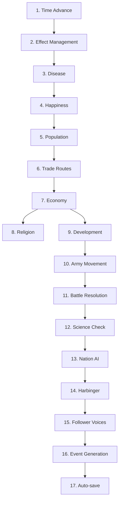

# DIVINE DOMINION — Simulation Formulas

> Cross-references: [Constants](constants.md) · [Commandments](03-commandments.md) · [World](04-world.md) · [Divine Powers](06-divine-powers.md) · [Eras](07-eras-and-endgame.md) · [Harbinger](14-harbinger.md) · [Follower Voices](13-follower-voices.md) · [Types](../../src/types/game.ts) · [INDEX](../INDEX.md)
>
> **Note:** This file intentionally exceeds 300 lines — it is a technical reference document containing all simulation formulas in one place per Stage 3 requirements.

---

## Decision Points (Human-Confirmed)

| # | Decision | Choice |
|---|----------|--------|
| 1 | Tick frequency | **0.5 game-years per tick** — 1,200 ticks total, 5 ticks/min at 1×. Smooth simulation without mobile perf risk. |
| 2 | Battle resolution | **Hybrid** — deterministic base ± 15% seeded variance. Predictable with drama. Reproducible via seed. |
| 3 | Commandment stacking | **Additive with hard caps** — sum modifiers per stat, cap at +75% / −50%. Prevents degeneracy, forces diverse builds. |
| 4 | Religion spread | **Heat diffusion** — continuous float per religion per region. UI shows dominant (>60%) with "contested" indicator. |
| 5 | Disease scope | **Full** — natural emergence (war, famine, overcrowding, trade) + divine Plague + trade-route spread. |

---

## Tick Rate Conversion

All per-tick constants from `constants.md` are calibrated for **0.5 game-year ticks**. When the original constant was designed for 1-year ticks, it has been halved.

| Property | Value |
|----------|-------|
| Game-years per tick | 0.5 |
| Ticks per real minute (1×) | 5 |
| Ticks per real minute (2×) | 10 |
| Ticks per real minute (4×) | 20 |
| Total ticks per game | 1,200 |
| Real-second interval between ticks (1×) | 12s |

Era durations in ticks (constant tick rate, variable era length):

| Era | Years | Ticks | Real Minutes (1×) |
|-----|-------|-------|-------------------|
| 1–4, 6, 9–12 | 50 | 100 | 20 |
| 5 (Industry) | 70 | 140 | 28 |
| 7–8 (Atomic, Digital) | 40 | 80 | 16 |
| **Total** | **600** | **1,200** | **240** |

---

## Seeded PRNG Specification

All `seeded_random()` calls use a deterministic PRNG. Without this, the simulation is not reproducible — blocking testing, replays, and the Prototype Checkpoint.

| Property | Value |
|----------|-------|
| Algorithm | **mulberry32** — 32-bit state, fast, good statistical distribution |
| World seed | `WorldState.seed` — set at world generation, immutable for the run |
| Per-call seed derivation | `((worldSeed ^ tickNumber) * 2654435761 + callIndex) >>> 0` |
| Call index | Auto-incrementing counter, reset to 0 at start of each tick |
| Output range | float in \[0, 1) — uniform distribution |

**mulberry32 reference** (the implementation agent must use this exact algorithm):

```
function mulberry32(seed: number): float
  seed |= 0
  seed = (seed + 0x6D2B79F5) | 0
  t = imul(seed ^ (seed >>> 15), 1 | seed)
  t = (t + imul(t ^ (t >>> 7), 61 | t)) ^ t
  return ((t ^ (t >>> 14)) >>> 0) / 4294967296
```

**Critical rules:**
- `Math.random()` MUST NOT appear in any `src/simulation/` file. Lint rule should enforce this.
- UI/rendering code may use `Math.random()` freely — it has no impact on simulation state.
- Call order within a tick must be deterministic: systems run in pipeline order (D1), and within each system, regions/nations are processed by sorted ID.

---

## Deliverable 1: Simulation Tick Order

### Pipeline (17 steps, 6 phases)

```
PHASE 1 — TIME
  1. Advance time          currentYear += TICK_GAME_YEARS
  2. Effect management     Expire effects past endYear; apply ongoing effect modifiers

PHASE 2 — NATURAL SYSTEMS (use last tick's state for inputs marked *)
  3. Disease tick           Emergence check, spread between regions, mortality → pop reduction
  4. Happiness update       Derived from last tick's economy*, war, disease, blessings, gov, commandments
  5. Population growth      Logistic growth with modifiers (happiness, disease, war, blessings, commandments)
  6. Trade route update     Form/dissolve routes; calculate volume (uses last tick's economy*)
  7. Economy computation    population × development × trade × government × commandments + trade wealth
  8. Religion spread        Heat diffusion across borders and trade routes
  9. Development growth     f(economy, trade, era, government, commandments, blessings)

PHASE 3 — MILITARY
 10. Army tick              Movement along paths, supply attrition, morale decay
 11. Battle resolution      When hostile armies share a region → casualties, morale, retreat

PHASE 4 — PROGRESSION
 12. Science milestone      Count nations at dev thresholds; check trigger conditions
 13. Nation AI decisions    Evaluate state → declare war / sue for peace / form trade / etc.

PHASE 5 — CHARACTERS & EVENTS (Session 2: deliverables 14–17)
 14. Harbinger tick         Era 7+: spend Signal Strength budget on sabotage actions
 15. Follower Voice tick    Emergence check, aging, loyalty decay, petition generation
 16. Event generation       Roll for events based on updated world state

PHASE 6 — HOUSEKEEPING
 17. Auto-save check        At era boundaries and every 50 ticks (~10 real min at 1×)
```

### Data Dependencies (no circular deps)



### Circular Dependency Prevention

Trade volume (step 6) uses population and development — not economy directly. Economy (step 7) reads trade_wealth from step 6. No trade↔economy circular dependency exists. Happiness (step 4) uses **last tick's** economy to avoid a happiness↔economy loop.

### Ownership Validation (Step 6)

When a region changes nation ownership (conquest), all trade routes touching that region are re-evaluated. Routes between now-hostile nations are immediately disrupted. Routes between now-friendly nations persist.

### Disease Cleanup (Step 3, Phase 6)

After disease recovery checks, any disease where `isActive == false` and `affectedRegions.length == 0` is removed from `WorldState.diseases[]`. This prevents unbounded array growth over 1,200 ticks.

### Performance Note (Step 8 at 4×)

Religion spread is the heaviest per-tick computation: up to ~160 regions × 12 religions × 6 neighbors = 11,520 pair evaluations at 20 ticks/sec (4× speed). Implementation must use typed arrays for influence values and process pairs from a frozen snapshot (see D3). Profile on target devices during Prototype Checkpoint.

---

## Deliverable 2: Battle Resolution

### 2.1 Lookup Tables

**Terrain modifiers** (attack/defense multiplier when fighting in this terrain):

| Terrain | Attack Mod | Defend Mod |
|---------|-----------|-----------|
| plains | 1.00 | 1.00 |
| hills | 0.90 | 1.10 |
| forest | 0.85 | 1.15 |
| mountain | 0.70 | 1.30 |
| desert | 0.90 | 1.10 |
| tundra | 0.80 | 1.20 |
| coast | 1.00 | 1.00 |
| ocean | N/A | N/A |

**Commander modifiers:**

| Trait | Attack Mod | Defend Mod |
|-------|-----------|-----------|
| aggressive | 1.15 | 0.90 |
| cautious | 0.90 | 1.15 |
| brilliant | 1.10 | 1.10 |
| reckless | 1.25 | 0.80 |
| (none) | 1.00 | 1.00 |

### 2.1b Nation Development Aggregation

Wherever formulas reference "nation development" (battle tech advantage, nuclear deterrence, science milestones, recruitment), this is the **population-weighted average** of the nation's region development levels:

```
nation.development = sum(region.population × region.development for region in nation.regions)
                     / sum(region.population for region in nation.regions)
```

This prevents a single high-dev capital from making an entire sprawling empire "advanced" — the nation's overall tech reflects its population centers. A nation with 3 regions (Dev 8 at 200K pop, Dev 3 at 50K pop, Dev 2 at 10K pop) has nation dev = (1,600K + 150K + 20K) / 260K = **6.81**, not 8.

### 2.2 Technology Advantage (sub-formula)

In plain English: a nation with guns beats a nation with swords. Each development level represents roughly 50 years of technological progress. A Dev 8 army (circa 1950 — tanks, aircraft, radio) fighting a Dev 3 army (circa 1700 — muskets, cavalry) has a massive advantage, like the British at Omdurman or the US in the Gulf War.

Only the MORE advanced side gets a bonus. The less advanced side is not additionally penalized below 1.0 — they still have numbers, terrain knowledge, and desperation on their side.

```
FORMULA: Technology Advantage
INPUTS:
  dev_a: int [1, 12]   — attacker's home nation development level
  dev_d: int [1, 12]   — defender's home nation development level
FORMULA:
  tech_mod_a = 1.0 + max(0, dev_a - dev_d) × BATTLE_TECH_ADVANTAGE_PER_DEV
  tech_mod_d = 1.0 + max(0, dev_d - dev_a) × BATTLE_TECH_ADVANTAGE_PER_DEV
OUTPUT:
  tech_mod_a: float [1.0, 2.65]
  tech_mod_d: float [1.0, 2.65]
EDGE CASES:
  Same dev: both 1.0. Fair fight — tech is equal.
  Dev 8 vs Dev 3 (tanks vs muskets): advanced side gets 1.75×. Needs ~2:1 numbers to overcome.
  Dev 12 vs Dev 1 (drones vs swords): advanced side gets 2.65×. Near-hopeless without
    massive numerical superiority, terrain, and luck.
  Dev 2 vs Dev 1 (small gap): 1.15×. Slight edge — better training and equipment.
CONSTANTS:
  BATTLE_TECH_ADVANTAGE_PER_DEV = 0.15
```

**What the dev gap feels like in play:**

| Gap | Example Era Matchup | Tech Mod | What It Takes to Overcome |
|-----|---------------------|----------|--------------------------|
| 0 | Equal tech | 1.00 | Fair fight |
| 1 | Better-drilled troops | 1.15 | Good commander or terrain |
| 3 | Muskets vs bows | 1.45 | 1.5:1 numbers + terrain |
| 5 | Rifles vs pikes | 1.75 | 2:1 numbers + fortress |
| 8 | Tanks vs cavalry | 2.20 | Near-impossible without divine help |
| 11 | Modern vs medieval | 2.65 | Only divine intervention can save you |

### 2.3 Faith Combat Bonus (sub-formula)

In plain English: armies fighting for their faith fight harder. Defenders protecting a holy heartland dig in with fanatical resolve. Attackers on a crusade or jihad (enabled by the "Smite the Wicked" commandment) charge with zealous intensity. This is separate from morale — a demoralized zealot still fights harder than a demoralized mercenary.

```
FORMULA: Faith Combat Bonus
INPUTS:
  defender_religion_influence: float [0, 1]  — influence of defender's religion in battle region
  attacker_has_holy_war: boolean             — "Smite the Wicked" commandment + different religions
  defender_has_righteous_defense: boolean     — "Righteous Defense" commandment active
FORMULA:
  faith_mod_a = 1.0
  faith_mod_d = 1.0

  // Holy war: attacker fights with religious fervor
  if attacker_has_holy_war:
    faith_mod_a += FAITH_COMBAT_HOLY_WAR_BONUS

  // Defending sacred ground: locals resist with conviction
  if defender_religion_influence >= FAITH_COMBAT_STRONGHOLD_THRESHOLD:
    faith_mod_d += FAITH_COMBAT_DEFEND_BONUS

  // Righteous Defense commandment: can't attack, but defends ferociously
  if defender_has_righteous_defense:
    faith_mod_d += FAITH_COMBAT_RIGHTEOUS_BONUS

OUTPUT:
  faith_mod_a: float [1.0, 1.20]
  faith_mod_d: float [1.0, 1.45]
EDGE CASES:
  No religious factors: both 1.0. Secular war.
  Holy war crusader attacking a rival faith stronghold: attacker gets 1.20×,
    defender gets 1.15× (stronghold). Crusader has edge but locals resist hard.
  Righteous Defense + stronghold (max faith defense): 1.15 + 0.30 = 1.45×.
    Extremely hard to crack — but they can't attack you back.
  Holy war vs secular target (no stronghold, no defense commandment):
    Attacker gets 1.20×, defender 1.0×. Zealots roll over apathetic defenders.
CONSTANTS:
  FAITH_COMBAT_HOLY_WAR_BONUS = 0.20
  FAITH_COMBAT_STRONGHOLD_THRESHOLD = 0.80
  FAITH_COMBAT_DEFEND_BONUS = 0.15
  FAITH_COMBAT_RIGHTEOUS_BONUS = 0.30
```

### 2.4 Supply Factor (sub-formula)

(Unchanged from original — renumbered from 2.2)

```
FORMULA: Supply Factor
INPUTS:
  distance_from_friendly: int [0, ∞)    — regions from nearest owned territory
  supply_range: int                      — SUPPLY_RANGE_BASE (3)
FORMULA:
  if distance_from_friendly <= supply_range:
    supply_factor = 1.0
  else:
    overshoot = distance_from_friendly - supply_range
    supply_factor = max(0.3, 1.0 - overshoot × 0.15)
OUTPUT:
  supply_factor: float [0.3, 1.0]
EDGE CASES:
  distance = 0 (home territory): supply_factor = 1.0
  distance = 10 (deep enemy): max(0.3, 1.0 - 7×0.15) = max(0.3, -0.05) = 0.3
CONSTANTS: SUPPLY_RANGE_BASE = 3
```

### 2.5 Battle Resolution Formula

```
FORMULA: Battle Resolution
INPUTS:
  str_a: int [500, 50000]           — attacker troop strength
  str_d: int [500, 50000]           — defender troop strength
  morale_a: float [0, 1]            — attacker morale
  morale_d: float [0, 1]            — defender morale
  terrain: TerrainType              — defending region terrain
  cmd_a: CommanderTrait | null      — attacker commander
  cmd_d: CommanderTrait | null      — defender commander
  supply_a: float [0.3, 1.0]       — attacker supply factor (2.4)
  fort_level: int [0, 5]            — defender city level (0 = open field)
  divine_a: float [0.5, 2.0]       — divine modifier on attacker (default 1.0)
  divine_d: float [0.5, 2.0]       — divine modifier on defender (default 1.0)
  tech_mod_a: float [1.0, 2.65]    — technology advantage (2.2)
  tech_mod_d: float [1.0, 2.65]    — technology advantage (2.2)
  faith_mod_a: float [1.0, 1.20]   — faith combat bonus (2.3)
  faith_mod_d: float [1.0, 1.45]   — faith combat bonus (2.3)
  rng_seed: number                  — seeded RNG for variance

FORMULA:
  terrain_atk = TERRAIN_ATTACK_MODS[terrain]
  terrain_def = TERRAIN_DEFEND_MODS[terrain]
  cmd_atk = COMMANDER_ATTACK_MODS[cmd_a]       (1.0 if null)
  cmd_def = COMMANDER_DEFEND_MODS[cmd_d]        (1.0 if null)
  fort_mod = 1.0 + fort_level × BATTLE_FORT_BONUS_PER_LEVEL

  eff_a = str_a × (BATTLE_MORALE_WEIGHT + (1 - BATTLE_MORALE_WEIGHT) × morale_a)
        × terrain_atk × cmd_atk × supply_a × divine_a × tech_mod_a × faith_mod_a
  eff_d = str_d × (BATTLE_MORALE_WEIGHT + (1 - BATTLE_MORALE_WEIGHT) × morale_d)
        × terrain_def × cmd_def × fort_mod × divine_d × tech_mod_d × faith_mod_d

  // Safety guard: if eff_d rounds to zero, attacker auto-wins
  if eff_d < 1.0: attacker auto-wins, defender takes max casualties, retreats

  ratio = eff_a / eff_d
  variance = seeded_random(rng_seed, -BATTLE_VARIANCE_RANGE, +BATTLE_VARIANCE_RANGE)
  adj_ratio = ratio × (1 + variance)

  loss_rate_a = BATTLE_BASE_CASUALTY_RATE × clamp(1 / adj_ratio, BATTLE_CASUALTY_CLAMP_MIN, BATTLE_CASUALTY_CLAMP_MAX)
  loss_rate_d = BATTLE_BASE_CASUALTY_RATE × clamp(adj_ratio, BATTLE_CASUALTY_CLAMP_MIN, BATTLE_CASUALTY_CLAMP_MAX)

  casualties_a = max(1, floor(str_a × loss_rate_a))
  casualties_d = max(1, floor(str_d × loss_rate_d))

  winner = adj_ratio >= 1.0 ? 'attacker' : 'defender'
  winner_morale_change = BATTLE_WINNER_MORALE_CHANGE
  loser_morale_change = BATTLE_LOSER_MORALE_CHANGE

  loser_remaining = (loser == attacker ? str_a - casualties_a : str_d - casualties_d)
  loser_morale_result = (loser == attacker ? morale_a : morale_d) + loser_morale_change
  retreated = loser_remaining < BATTLE_RETREAT_STRENGTH_THRESHOLD × (loser original str)
           OR loser_morale_result < BATTLE_RETREAT_MORALE_THRESHOLD

  // Clamp morale after applying changes
  army_a.morale = clamp(morale_a + morale_change_a, 0, 1)
  army_d.morale = clamp(morale_d + morale_change_d, 0, 1)

OUTPUT:
  casualties_a: int [1, str_a]
  casualties_d: int [1, str_d]
  winner: 'attacker' | 'defender'
  morale_change_a: float     (+0.10 if winner, -0.20 if loser)
  morale_change_d: float     (+0.10 if winner, -0.20 if loser)
  retreated: boolean          (loser retreats to nearest friendly region)

EDGE CASES:
  str_a = 500, str_d = 50000: ratio ≈ 0.01 → attacker takes heavy losses (30%). Retreats.
  Equal forces, equal morale, plains, same dev: ratio ≈ 1.0. Variance decides. ~50/50.
  morale = 0: effectiveness = BATTLE_MORALE_WEIGHT (0.50) — fights at half strength.
  fort_level = 5: fort_mod = 1.75 — massive defender advantage.
  Dev 8 vs Dev 3, equal forces: tech gives attacker 1.75×. Decisive victory.
  Holy war vs faith stronghold: attacker 1.20×, defender 1.15×. Bloody on both sides.

CONSTANTS:
  BATTLE_BASE_CASUALTY_RATE = 0.10
  BATTLE_VARIANCE_RANGE = 0.15
  BATTLE_WINNER_MORALE_CHANGE = 0.10
  BATTLE_LOSER_MORALE_CHANGE = -0.20
  BATTLE_RETREAT_STRENGTH_THRESHOLD = 0.30
  BATTLE_RETREAT_MORALE_THRESHOLD = 0.20
  BATTLE_FORT_BONUS_PER_LEVEL = 0.15
  BATTLE_MORALE_WEIGHT = 0.50
  BATTLE_CASUALTY_CLAMP_MIN = 0.30
  BATTLE_CASUALTY_CLAMP_MAX = 3.00
  BATTLE_TECH_ADVANTAGE_PER_DEV = 0.15
  FAITH_COMBAT_HOLY_WAR_BONUS = 0.20
  FAITH_COMBAT_STRONGHOLD_THRESHOLD = 0.80
  FAITH_COMBAT_DEFEND_BONUS = 0.15
  FAITH_COMBAT_RIGHTEOUS_BONUS = 0.30
```

### Post-Battle Rules

**Army destruction:** If an army's strength drops below `ARMY_STRENGTH_MIN` (500) after casualties, the army is destroyed — remaining troops disperse. The army is removed from `WorldState.armies[]`. This prevents tiny zombie armies cluttering the map.

**Divine modifier derivation:** `divine_a` and `divine_d` come from `ActiveEffect` entries on the battle region:
- `Shield of Faith` on defending region: `divine_d += 0.50` (defender strengthened)
- `Earthquake` / `Great Storm` on region: both sides get `divine *= 0.80` (chaos hurts everyone)
- `Miracle` on a player-religion region: `divine += 0.30` for the side following the player's religion
- No active divine effects: `divine_a = 1.0`, `divine_d = 1.0`
- **Stacking order:** Start at base 1.0. Apply all additive modifiers first (Shield +0.50, Miracle +0.30). Then apply all multiplicative modifiers (Earthquake ×0.80). Finally clamp to \[0.5, 2.0\]. Example: Shield + Earthquake = (1.0 + 0.50) × 0.80 = 1.20.
- Full mapping of all 12 powers to combat effects will be specified in Session 2, Deliverable 9

**Government evolution:** 5 government types (monarchy, republic, democracy, theocracy, military_junta) with non-linear transitions. Transition rules are defined in `04b-nation-ai.md` §Government Evolution. Transitions are event-driven (development, era, stability, faith, war state) via Nation AI decisions (tick step 13). For all formulas, `government` is a static input that changes infrequently.

### 2.6 Battle Walkthrough A — Equal tech, no faith (baseline)

**Scenario:** Attacker str=8500, morale=0.75 vs Defender str=6200, morale=0.85. Terrain=hills, no commanders, no fortification, supply=1.0, no divine, same dev (both Dev 5), no faith bonuses, variance=+0.05.

| Step | Computation | Value |
|------|-------------|-------|
| terrain_atk | TERRAIN_ATTACK_MODS[hills] | 0.90 |
| terrain_def | TERRAIN_DEFEND_MODS[hills] | 1.10 |
| tech_mod_a | 1.0 + max(0, 5-5) × 0.15 | 1.00 |
| tech_mod_d | 1.0 + max(0, 5-5) × 0.15 | 1.00 |
| faith_mod_a / faith_mod_d | No holy war, no stronghold | 1.00 / 1.00 |
| eff_a | 8500 × 0.875 × 0.90 × 1.0 × 1.0 × 1.0 × 1.0 × 1.0 | **6,693.75** |
| eff_d | 6200 × 0.925 × 1.10 × 1.0 × 1.0 × 1.0 × 1.0 × 1.0 | **6,308.50** |
| ratio / adj_ratio | 1.0611 × 1.05 | **1.1142** |
| casualties_a / casualties_d | 763 / 690 | **9.0% / 11.1%** |
| winner | attacker | attacker barely wins |

**Result:** Same as before — narrow attacker victory. Tech and faith are both neutral. **PASS**.

### 2.7 Battle Walkthrough B — Tech gap (guns vs swords)

**Scenario:** An industrialized nation (Dev 7) invades a pre-industrial neighbor (Dev 3). Attacker str=5000, morale=0.80 vs Defender str=8000, morale=0.70. Plains, no commanders, no fort, no divine, no faith, variance=0 (neutral luck).

*In plain English: the defender has 60% more troops, but the attacker has rifles while the defender has swords and pikes. Who wins?*

| Step | Computation | Value |
|------|-------------|-------|
| terrain | Plains | atk=1.0, def=1.0 |
| tech_mod_a | 1.0 + max(0, 7-3) × 0.15 = 1.0 + 0.60 | **1.60** |
| tech_mod_d | 1.0 + max(0, 3-7) × 0.15 = 1.0 + 0 | **1.00** |
| eff_a | 5000 × (0.5+0.5×0.80) × 1.0 × 1.0 × 1.0 × 1.0 × 1.60 × 1.0 = 5000 × 0.90 × 1.60 | **7,200** |
| eff_d | 8000 × (0.5+0.5×0.70) × 1.0 × 1.0 × 1.0 × 1.0 × 1.00 × 1.0 = 8000 × 0.85 | **6,800** |
| ratio | 7200 / 6800 | **1.0588** |
| adj_ratio | 1.0588 × (1 + 0) | **1.0588** |
| loss_rate_a | 0.10 × clamp(1/1.0588, 0.3, 3.0) = 0.10 × 0.9445 | **0.0944** |
| loss_rate_d | 0.10 × clamp(1.0588, 0.3, 3.0) = 0.10 × 1.0588 | **0.1059** |
| casualties_a | floor(5000 × 0.0944) | **472** |
| casualties_d | floor(8000 × 0.1059) | **847** |
| winner | adj_ratio 1.0588 >= 1.0 | **attacker** |

**Result:** 5,000 troops with rifles beat 8,000 troops with swords. Attacker loses 472 (9.4%), defender loses 847 (10.6%). Tech flipped a 60% numerical disadvantage into a win. The defender doesn't retreat (still has 89% strength), so they'd fight again next tick — but they're losing a war of attrition they can't win without upgrading their tech. **Feels right** — mirrors colonial-era battles where smaller European forces defeated larger indigenous armies. **PASS**.

### 2.8 Battle Walkthrough C — Holy war crusade

**Scenario:** A zealot nation declares holy war ("Smite the Wicked") on a rival faith's heartland. Attacker str=7000, morale=0.90 vs Defender str=7000, morale=0.80. Plains, same dev (both Dev 6), no commanders, no fort. Defender's religion has 85% influence in the battle region (stronghold). Defender also has "Righteous Defense" commandment. Variance=+0.03.

*In plain English: equal armies, but the attacker is on a crusade and the defender is fighting for their holy land. Who wins?*

| Step | Computation | Value |
|------|-------------|-------|
| terrain | Plains | atk=1.0, def=1.0 |
| tech_mod | Same dev | both 1.00 |
| faith_mod_a | Holy war bonus | **1.20** |
| faith_mod_d | Stronghold (0.15) + Righteous Defense (0.30) | **1.45** |
| eff_a | 7000 × (0.5+0.5×0.90) × 1.0 × 1.0 × 1.0 × 1.0 × 1.0 × 1.20 = 7000 × 0.95 × 1.20 | **7,980** |
| eff_d | 7000 × (0.5+0.5×0.80) × 1.0 × 1.0 × 1.0 × 1.0 × 1.0 × 1.45 = 7000 × 0.90 × 1.45 | **9,135** |
| ratio | 7980 / 9135 | **0.8736** |
| adj_ratio | 0.8736 × 1.03 | **0.8998** |
| loss_rate_a | 0.10 × clamp(1/0.8998, 0.3, 3.0) = 0.10 × 1.1114 | **0.1111** |
| loss_rate_d | 0.10 × clamp(0.8998, 0.3, 3.0) = 0.10 × 0.8998 | **0.0900** |
| casualties_a | floor(7000 × 0.1111) | **777** |
| casualties_d | floor(7000 × 0.0900) | **630** |
| winner | adj_ratio 0.8998 < 1.0 | **defender** |

**Result:** The defenders win despite equal numbers and slightly lower morale. Faith made the difference — the defenders' combined stronghold + Righteous Defense bonus (1.45x) overwhelmed the crusader's holy war bonus (1.20x). The attacker loses 777 (11.1%) vs defender's 630 (9.0%). The message is clear: attacking a devout people on their own sacred ground is costly, even for zealots. To crack this, the attacker needs tech advantage, more troops, or divine intervention. **PASS**.

---

## Deliverable 3: Religion Spread

### 3.1 Terrain Resistance

| Terrain | Resistance |
|---------|-----------|
| plains | 0.00 |
| hills | 0.10 |
| forest | 0.15 |
| coast | 0.05 |
| desert | 0.25 |
| mountain | 0.35 |
| tundra | 0.30 |
| ocean | 1.00 |

### 3.2 Heat Diffusion Formula

**Snapshot rule:** All flows are computed from a frozen copy of influence values at tick start. Deltas are accumulated per region, then applied in one pass after all pairs are processed. This prevents iteration-order dependence.

```
FORMULA: Religion Spread (per tick)
INPUTS:
  snapshot[region][r]: float [0, 1] — frozen copy of all influence values at tick start
  adjacency: list of (regionA, regionB) pairs sharing a border
  trade_routes: active trade routes between regions
  missionaries: map of regionId → { religionId, cmd_missionary_mod }
  cmd_spread_mod: float             — commandment modifier on general spread rate
                                       (if player religion has passiveSpread: true, add +0.50 to this value;
                                        see convert_by_example in 03-commandments.md)

FORMULA:
  // Accumulate deltas from frozen snapshot
  delta[region][r] = 0 for all regions and religions

  For each adjacent pair (A, B):
    terrain_resistance = TERRAIN_RESISTANCE[B.terrain]  // resistance of receiving region
    has_trade = trade_routes.has(A, B)

    For each religion r with snapshot[A][r] > 0 OR snapshot[B][r] > 0:
      gradient = snapshot[A][r] - snapshot[B][r]

      // Dominance inertia: dominant religion resists erosion
      losing_region = gradient > 0 ? A : B
      dominant_r = argmax(snapshot[losing_region])
      if r == dominant_r AND snapshot[losing_region][r] >= CONVERSION_DOMINANT_THRESHOLD:
        effective_gradient = gradient × RELIGION_DOMINANCE_INERTIA
      else:
        effective_gradient = gradient

      // Diffusion flow (bilateral)
      flow = SPREAD_DIFFUSION_RATE × effective_gradient × (1 - terrain_resistance)

      // Trade route bonus (bilateral, direction of gradient)
      if has_trade AND effective_gradient != 0:
        flow += TRADE_ROUTE_SPREAD_BONUS × sign(effective_gradient) × (1 - terrain_resistance)

      // Commandment spread modifier (bilateral)
      flow *= (1 + clamp(cmd_spread_mod, -0.50, 0.75))

      // Accumulate bilateral flow
      delta[A][r] -= flow
      delta[B][r] += flow

  // Missionary conversion (ONE-SIDED — only adds to neighboring regions)
  For each missionary M in region src with religion mr:
    missionary_rate = MISSIONARY_CONVERSION_RATE
                    × (1 + clamp(M.cmd_missionary_mod, -0.50, 0.75))
    For each region nbr adjacent to src:
      terrain_resistance = TERRAIN_RESISTANCE[nbr.terrain]
      delta[nbr][mr] += missionary_rate × (1 - terrain_resistance)
      // Source region is NOT reduced — missionaries generate new faith, not transfer it

  // Apply all deltas
  For each region:
    for each r: inf[r] = snapshot[region][r] + delta[region][r]

  // Normalize
  For each region:
    for each r: inf[r] = max(0, inf[r])
    total = sum(inf[r] for all r)
    if total > 1.0: inf[r] *= (1.0 / total) for all r
    if total < 0.01: inf[UNAFFILIATED] = 1.0 - total  // see Neutral Religion below

  // Dominant religion update
  dominant = argmax(inf[r])   // excludes UNAFFILIATED
  if inf[dominant] >= CONVERSION_DOMINANT_THRESHOLD: region.dominantReligion = dominant

OUTPUT:
  Updated religiousInfluence[] per region
  Updated dominantReligion per region

EDGE CASES:
  All influence = 0: UNAFFILIATED fills to 1.0. Region has no dominant religion.
  Single religion at 1.0 with dominance inertia: outflow reduced by 40%,
    creating stable religious borders instead of late-game convergence.
  Ocean between regions: terrain_resistance = 1.0 → flow = 0.
  Missionary at region border: generates 0.01/tick in each neighbor (one-sided).

CONSTANTS:
  SPREAD_DIFFUSION_RATE = 0.01
  TRADE_ROUTE_SPREAD_BONUS = 0.005
  MISSIONARY_CONVERSION_RATE = 0.01
  CONVERSION_DOMINANT_THRESHOLD = 0.60
  CONVERSION_STRONGHOLD_THRESHOLD = 0.80
  RELIGION_DOMINANCE_INERTIA = 0.60
  MODIFIER_CAP_POSITIVE = 0.75
  MODIFIER_CAP_NEGATIVE = -0.50
```

### Neutral Religion (UNAFFILIATED)

When total religious influence in a region drops below 0.01 (e.g., after mass death or conquest), the remainder is assigned to a special `UNAFFILIATED` ReligionId. This is not a real religion — it has no commandments, no spread mechanics, and cannot be dominant. It acts as a placeholder representing secular/indigenous beliefs. Any religion spreading into the region naturally displaces UNAFFILIATED influence. World gen ensures every region starts with at least one real religion at ≥ 0.10 influence.

### 3.3 Schism Check Formula

```
FORMULA: Schism Check (per tick, per region with player religion dominant)
INPUTS:
  tension_modifiers: float[]      — schism risk values from active tension pairs [0.15–0.30 each]
  happiness: float [0, 1]         — region happiness (proxy for stability)
  hypocrisy_level: float [0, 1]   — accumulated divine hypocrisy

FORMULA:
  total_tension = sum(tension_modifiers)
  schism_prob = total_tension × SCHISM_BASE_RISK_PER_TICK × (1 - happiness)
              × (1 + hypocrisy_level)
  if total_tension >= SCHISM_THRESHOLD:
    schism_prob *= 2.0

  if seeded_random() < schism_prob:
    SCHISM fires in this region

OUTPUT:
  schism_fired: boolean

EDGE CASES:
  No tension pairs: total_tension = 0, prob = 0. No schism possible from tension.
  Max tension (5 pairs × 0.30 = 1.50), happiness=0.3, hypocrisy=0.5:
    prob = 1.50 × 0.001 × 0.7 × 1.5 × 2.0 = 0.00315/tick
    Per era (100 ticks): ~27% chance. High but appropriate for extreme tension.
  happiness = 1.0: prob = 0 from tension (happy people don't schism).

CONSTANTS:
  SCHISM_BASE_RISK_PER_TICK = 0.001
  SCHISM_THRESHOLD = 0.50
```

### 3.4 Religion Spread Walkthrough

**Scenario:** Region A: player=0.70, rival=0.30. Region B: player=0.20, rival=0.60, neutral=0.20. Shared border, plains (resistance=0.00), no trade route, no missionary, no commandment mods.

**Dominance inertia check:**
- Region A: player=0.70 >= 0.60 (dominant). Outflow of player religion from A is reduced by x0.60.
- Region B: rival=0.60 >= 0.60 (dominant). Outflow of rival religion from B is reduced by x0.60.

| Religion | Gradient (A-B) | Inertia? | Eff. Gradient | Flow | delta A | delta B |
|----------|---------------|----------|--------------|------|---------|---------|
| Player | +0.50 | Yes (dom in A) | 0.30 | +0.003 | -0.003 | +0.003 |
| Rival | -0.30 | Yes (dom in B) | -0.18 | -0.0018 | +0.0018 | -0.0018 |
| Neutral | -0.20 | No | -0.20 | -0.002 | +0.002 | -0.002 |

After applying all deltas from snapshot:
- A: player=0.697, rival=0.3018, neutral=0.002. Sum=1.0008 -> normalize -> 0.6964, 0.3016, 0.0020
- B: player=0.203, rival=0.5982, neutral=0.198. Sum=0.9992 -> no normalization needed

Player gained 0.003 in B (vs. 0.005 without inertia). At this rate, ~133 ticks (67 years) to reach 0.60 via pure diffusion -- but Prophets + trade routes accelerate this dramatically. Meanwhile, the rival's stronghold in B erodes slowly, creating clear religious borders rather than grey mush. **PASS**.

---

## Deliverable 4: Disease System

### 4.1 Emergence Formula

```
FORMULA: Disease Emergence (per tick, per region)
INPUTS:
  population: int [0, ∞)
  is_at_war: boolean
  has_famine: boolean
  trade_route_count: int [0, 10]
  development: int [1, 12]

FORMULA:
  if population == 0: skip

  base = NATURAL_EMERGENCE_CHANCE_PER_TICK
  modifier = 1.0
  if is_at_war: modifier *= WAR_EMERGENCE_MULTIPLIER
  if has_famine: modifier *= FAMINE_EMERGENCE_MULTIPLIER
  trade_mod = 1.0 + trade_route_count × (TRADE_EMERGENCE_MULTIPLIER - 1.0) × 0.2
  modifier *= trade_mod
  density_factor = clamp(population / DISEASE_DENSITY_THRESHOLD, 0.5, 2.0)

  emergence_chance = base × modifier × density_factor

  if seeded_random() < emergence_chance:
    disease emerges → determine severity (4.2)

OUTPUT:
  emerged: boolean
  If emerged: new Disease object

EDGE CASES:
  No war, no famine, no trade, pop=25000:
    0.0005 × 1.0 × clamp(0.5, 0.5, 2.0) = 0.00025/tick. ~0.025/era. Rare.
  War + famine + 5 routes, pop=100000:
    0.0005 × 3.0 × 2.0 × 1.3 × 2.0 = 0.0078/tick. ~0.54/era. Likely.

CONSTANTS:
  NATURAL_EMERGENCE_CHANCE_PER_TICK = 0.0005
  WAR_EMERGENCE_MULTIPLIER = 3.0
  FAMINE_EMERGENCE_MULTIPLIER = 2.0
  TRADE_EMERGENCE_MULTIPLIER = 1.3
  DISEASE_DENSITY_THRESHOLD = 50000
```

### 4.2 Severity Determination

```
FORMULA: Disease Severity
INPUTS:
  modifier: float       — total emergence modifier from 4.1
  is_divine: boolean     — triggered by divine Plague power

FORMULA:
  if is_divine: severity = 'severe'
  else:
    roll = seeded_random()
    if modifier >= 5.0:    severity = roll < 0.3 ? 'pandemic' : 'severe'
    elif modifier >= 3.0:  severity = roll < 0.3 ? 'severe' : 'moderate'
    elif modifier >= 1.5:  severity = roll < 0.4 ? 'moderate' : 'mild'
    else:                  severity = 'mild'

  mortality_rate = DISEASE_MORTALITY_RATES[severity]
  spread_rate = DISEASE_SPREAD_RATES[severity]

OUTPUT:
  severity: DiseaseSeverity
  mortality_rate: float
  spread_rate: float

CONSTANTS:
  DISEASE_MORTALITY_RATES = { mild: 0.001, moderate: 0.005, severe: 0.015, pandemic: 0.030 }
  DISEASE_SPREAD_RATES = { mild: 0.010, moderate: 0.015, severe: 0.025, pandemic: 0.040 }
```

### 4.3 Spread Formula

```
FORMULA: Disease Spread (per tick, per adjacent region pair with one infected)
INPUTS:
  spread_rate: float               — from severity (4.2)
  has_trade_route: boolean         — trade route between regions
  target_is_quarantined: boolean
  target_dev: int [1, 12]
  target_is_immune: boolean        — previously recovered from this disease

FORMULA:
  if target_is_immune: skip

  spread_chance = spread_rate
  if has_trade_route: spread_chance += DISEASE_TRADE_SPREAD_BONUS
  if target_is_quarantined: spread_chance *= (1 - QUARANTINE_SPREAD_REDUCTION)
  dev_resistance = target_dev × DISEASE_DEV_SPREAD_RESISTANCE
  spread_chance *= (1 - dev_resistance)
  spread_chance = max(0, spread_chance)

  if seeded_random() < spread_chance:
    disease spreads to target region

OUTPUT:
  spread: boolean

EDGE CASES:
  Dev 12 + quarantined: spread_chance = (rate + 0.015) × 0.30 × 0.76 ≈ near zero. Almost immune.
  Dev 1, no quarantine, no trade: spread_chance = rate × 0.98. Nearly full transmission.
  Dev 1, no quarantine, trade: spread_chance = (rate + 0.015) × 0.98.

CONSTANTS:
  DISEASE_TRADE_SPREAD_BONUS = 0.015  (flat bonus; NOT the same as TRADE_EMERGENCE_MULTIPLIER)
  QUARANTINE_SPREAD_REDUCTION = 0.70
  DISEASE_DEV_SPREAD_RESISTANCE = 0.02
```

### 4.4 Mortality Formula

```
FORMULA: Disease Mortality (per tick, per infected region)
INPUTS:
  population: int
  mortality_rate: float            — from severity (4.2)
  development: int [1, 12]
  is_divine: boolean               — divine plague = 2× severity
  has_harvest_blessing: boolean    — Bountiful Harvest reduces mortality

FORMULA:
  if population == 0: skip

  rate = mortality_rate
  if is_divine: rate *= DIVINE_PLAGUE_SEVERITY_MULTIPLIER
  dev_reduction = development × DISEASE_DEV_MORTALITY_REDUCTION
  rate *= max(0.1, 1.0 - dev_reduction)
  if has_harvest_blessing: rate *= 0.5

  deaths = max(0, floor(population × rate))
  population -= deaths

OUTPUT:
  deaths: int [0, population]

EDGE CASES:
  Dev 12, severe, no divine: 0.015 × (1 - 0.84) = 0.015 × 0.16 = 0.0024/tick. Manageable.
  Dev 1, pandemic, divine: 0.030 × 2.0 × (1 - 0.07) = 0.0558/tick. Devastating.
  Population = 0: skip.

CONSTANTS:
  DIVINE_PLAGUE_SEVERITY_MULTIPLIER = 2.0
  DISEASE_DEV_MORTALITY_REDUCTION = 0.07
```

### 4.5 Recovery Formula

```
FORMULA: Disease Recovery (per tick, per infected region)
INPUTS:
  development: int [1, 12]
  has_harvest_blessing: boolean

FORMULA:
  recovery_rate = RECOVERY_RATE_BASE + development × DISEASE_DEV_RECOVERY_BONUS
  if has_harvest_blessing: recovery_rate *= 2.0

  // Safety valve: guaranteed recovery after max duration
  ticks_infected = currentTick - disease.infectionStartTickByRegion.get(regionId)
  if ticks_infected >= DISEASE_MAX_INFECTION_TICKS:
    region auto-recovers (no roll needed)

  elif seeded_random() < recovery_rate:
    region recovers; added to disease.immuneRegionIds

  if all affected regions recovered:
    disease.isActive = false
    // Disease cleanup: removed from WorldState.diseases[] in housekeeping

OUTPUT:
  recovered: boolean

EDGE CASES:
  Dev 1: 0.010 + 0.005 = 0.015/tick. ~1 - 0.985^67 = 64% within 67 ticks. Punishing but not era-long.
  Dev 12: 0.010 + 0.060 = 0.070/tick. ~1 - 0.93^15 = 66% within 15 ticks. Fast.
  Worst case (unlucky rolls): auto-recovers at 60 ticks (30 game-years). Never infinite.
  Dev 1 + harvest: 0.015 × 2.0 = 0.030/tick. ~34 ticks median. Divine intervention matters.

CONSTANTS:
  RECOVERY_RATE_BASE = 0.010
  DISEASE_DEV_RECOVERY_BONUS = 0.005
  DISEASE_MAX_INFECTION_TICKS = 60
```

### 4.6 Disease Walkthrough

**Scenario:** Population 50,000/region, 2 trade routes, Era 5, no divine. Disease emerges and runs 3 ticks.

**Tick 0 — Emergence:** Region is at war, no famine, pop=50000, dev=5.
- modifier = 1.0 × 3.0 (war) = 3.0
- trade_mod = 1.0 + 2 × (1.3-1.0) × 0.2 = 1.0 + 0.12 = 1.12 → modifier = 3.36
- density = clamp(50000/50000, 0.5, 2.0) = 1.0
- chance = 0.0005 × 3.36 × 1.0 = 0.00168/tick → emerges (assume roll succeeds)
- Severity: modifier=3.36 ≥ 3.0, roll=0.5 → 'moderate'
- mortality_rate = 0.005, spread_rate = 0.015

**Tick 1 — Mortality + Spread:**
- Deaths: 0.005 × max(0.1, 1 - 5×0.07) = 0.005 × 0.65 = 0.00325 → floor(50000 × 0.00325) = 162 deaths
- Pop: 50000 → 49838
- Spread to neighbor (dev=5, not quarantined, has trade route):
  spread_chance = 0.015 + 0.015 (DISEASE_TRADE_SPREAD_BONUS) = 0.030
  dev_resistance = 5 × 0.02 = 0.10
  spread_chance *= (1 - 0.10) = 0.030 × 0.90 = **0.027** → spreads

**Tick 2 — Mortality in both regions:**
- Region 1: floor(49838 × 0.00325) = 161 deaths → 49677
- Region 2 (just infected): floor(50000 × 0.00325) = 162 deaths → 49838
- Recovery check region 1: 0.010 + 5×0.005 = 0.035. Roll 0.8 > 0.035 → no recovery.

**Tick 3 — Mortality continues:**
- Region 1: floor(49677 × 0.00325) = 161 → 49516
- Region 2: floor(49838 × 0.00325) = 161 → 49677
- Recovery region 1: roll 0.02 < 0.035 → recovers! Immune.
- Region 2 continues until recovery.

**Result:** 484 deaths in region 1 over 3 ticks (0.97% of pop). Moderate severity with Dev 5 = manageable. Recovery now checks at 0.035/tick (was 0.030), so expected recovery in ~29 ticks (~14.5 years) instead of ~33. **PASS**.

---

## Deliverable 5: Trade Routes

### 5.1 Formation Formula

```
FORMULA: Trade Route Formation (per tick, per eligible nation pair)
INPUTS:
  are_adjacent: boolean           — regions share a border
  have_sea_access: boolean        — both nations have coastal regions
  at_war: boolean                 — nations currently at war
  at_holy_war: boolean            — religions in holy war
  dev_A: int [1, 12]
  dev_B: int [1, 12]
  diplomatic_opinion: float [-1, 1]

FORMULA:
  if at_war OR at_holy_war: route cannot form

  score = 0
  if are_adjacent: score += 0.30
  if have_sea_access: score += 0.20
  score += max(0, diplomatic_opinion) × 0.20
  dev_factor = (min(dev_A, dev_B)) / 12.0
  score += dev_factor × 0.30

  if score >= FORMATION_THRESHOLD:
    // Select endpoints: for each nation, pick the highest-population region that
    // is adjacent to (or has sea access to) a region of the other nation.
    // If no adjacent pair exists and both have coastal regions, use sea route.
    // Route forms between these two endpoint regions.
    endpoint_a = highest-pop region of A adjacent to any region of B (or coastal if sea)
    endpoint_b = highest-pop region of B adjacent to endpoint_a (or coastal if sea)

OUTPUT:
  formed: boolean

EDGE CASES:
  At war: always false.
  Adjacent + friendly (opinion=0.5): 0.30 + 0.10 = 0.40 ≥ 0.30 → forms.
  Sea-only + hostile opinion (−0.5): 0.20 + 0 = 0.20 < 0.30 → doesn't form.

CONSTANTS:
  FORMATION_THRESHOLD = 0.30
```

### 5.2 Distance Computation

Trade route volume depends on `distance` — the path length between the two endpoint regions. This must be computed at route formation and stored on the `TradeRoute` object.

```
FORMULA: Trade Route Distance
INPUTS:
  regionA: RegionId         — one endpoint
  regionB: RegionId         — other endpoint
  adjacency: Region.adjacentRegionIds   — populated at world gen
FORMULA:
  distance = BFS_shortest_path(regionA, regionB, using adjacentRegionIds)
  if no land path exists AND both endpoints have terrain != ocean:
    distance = SEA_TRADE_DISTANCE    // 3 — sea routes are longer
  if no path of any kind: route cannot form
OUTPUT:
  distance: int [1, 10]     — stored on TradeRoute.distance
EDGE CASES:
  Adjacent regions: distance = 1 (most valuable trade).
  Across a continent: distance = 5-8 (volume drops with 1/d² penalty).
  Island nations: sea route, distance = 3 (fixed).
CONSTANTS:
  SEA_TRADE_DISTANCE = 3
```

### 5.3 Volume Formula

```
FORMULA: Trade Route Volume (per tick)
INPUTS:
  pop_A: int        — region A population
  pop_B: int        — region B population
  dev_A: int [1,12] — region A development
  dev_B: int [1,12] — region B development
  distance: int [1,10]  — regions apart in path length
  is_disrupted: boolean

FORMULA:
  if is_disrupted: volume = 0; return

  pop_product = pop_A × pop_B
  dev_factor = sqrt(dev_A × dev_B) / 6.0
  distance_penalty = 1.0 / (distance × distance)

  raw_volume = (pop_product / TRADE_POP_NORMALIZER) × dev_factor × distance_penalty
  volume = clamp(raw_volume, 0, 1.0)

OUTPUT:
  volume: float [0, 1]

EDGE CASES:
  Min (pop 5K each, dev 1, dist 5): (25M / 10^10) × 0.167 × 0.04 = 0.0000002. Near zero.
  Max (pop 500K each, dev 12, dist 1): (250G / 10^10) × 2.0 × 1.0 = 50. Clamped to 1.0.

CONSTANTS:
  TRADE_POP_NORMALIZER = 10_000_000_000
```

### 5.4 Effects Formula

```
FORMULA: Trade Route Effects (per tick, per active route)
INPUTS:
  volume: float [0, 1]
  dev_A, dev_B: int [1, 12]

FORMULA:
  // Wealth
  wealth_A = volume × WEALTH_PER_VOLUME
  wealth_B = volume × WEALTH_PER_VOLUME

  // Tech transfer (higher dev teaches lower dev)
  dev_gap = abs(dev_A - dev_B)
  tech_transfer = dev_gap × TECH_TRANSFER_RATE × volume
  // Applied as dev_growth bonus to the lower-dev region

  // Religion spread: handled in religion tick via has_trade_route flag
  // Disease risk: handled in disease tick via trade_route_count

OUTPUT:
  wealth_A: float          — added to region A economy
  wealth_B: float          — added to region B economy
  tech_transfer: float     — dev growth bonus to lower-dev endpoint

CONSTANTS:
  WEALTH_PER_VOLUME = 0.05
  TECH_TRANSFER_RATE = 0.015
```

### 5.5 Disruption Formula

```
FORMULA: Trade Route Disruption
INPUTS:
  nations_at_war: boolean
  disaster_in_region: boolean    — earthquake, storm, or flood in either endpoint
  combo_storm_fleet: boolean     — Storm combo (2× disruption duration)
  endpoint_ownership_changed: boolean — region conquered by a different nation

FORMULA:
  if nations_at_war OR disaster_in_region:
    route.isActive = false
    duration = DISRUPTION_DURATION_YEARS
    if combo_storm_fleet: duration *= COMBO_STORM_FLEET_DISRUPTION_MULTIPLIER
    route.disruptedUntilYear = currentYear + duration

  // Conquest: re-evaluate route ownership
  if endpoint_ownership_changed:
    new_owner_A = regionA.nationId
    new_owner_B = regionB.nationId
    if nations[new_owner_A].atWarWith(new_owner_B):
      route.isActive = false
      route.disruptedUntilYear = currentYear + DISRUPTION_DURATION_YEARS
    // else: route persists under new ownership (trade continues)

  // Auto-resume check (per tick):
  if route.disruptedUntilYear <= currentYear AND not nations_at_war:
    route.isActive = true
    route.disruptedUntilYear = undefined

CONSTANTS:
  DISRUPTION_DURATION_YEARS = 5
  COMBO_STORM_FLEET_DISRUPTION_MULTIPLIER = 2.0
```

### 5.6 Trade Walkthrough

**Scenario:** Pop_A=80000, Pop_B=150000, Dev_A=4, Dev_B=6, distance=2, peacetime.

| Step | Computation | Value |
|------|-------------|-------|
| pop_product | 80000 × 150000 | 12,000,000,000 |
| dev_factor | sqrt(4 × 6) / 6 = sqrt(24) / 6 | 0.8165 |
| distance_penalty | 1 / (2 × 2) | 0.25 |
| raw_volume | (12G / 10G) × 0.8165 × 0.25 | **0.245** |
| wealth_A | 0.245 × 0.05 | **0.0122** |
| wealth_B | 0.245 × 0.05 | **0.0122** |
| dev_gap | abs(4 − 6) | 2 |
| tech_transfer | 2 × 0.015 × 0.245 | **0.00735** (applied to Dev 4 region) |

**Result:** Moderate volume (24.5%). Each region gains 0.012 wealth/tick. Dev-4 region gets 0.007 dev bonus/tick from knowledge transfer. A 2-dev gap now closes in ~272 ticks (136 years) instead of ~408 — noticeable but still gradual. **PASS**.

---

## Deliverable 6: Nation Population & Economy

### 6.1 Commandment Aggregation (used by all sub-formulas)

```
FORMULA: Aggregate Commandment Modifiers
INPUTS:
  selected_commandments: Commandment[]    — player's 10 commandments

FORMULA:
  aggregate = empty CommandmentEffects (all numeric fields = 0, booleans = true)
  for each commandment in selected_commandments:
    for each numeric field f in commandment.effects:
      aggregate[f] += commandment.effects[f]
    for each boolean field b in commandment.effects:
      if commandment.effects[b] == false: aggregate[b] = false

  // Cap numeric fields
  for each numeric field f in aggregate:
    aggregate[f] = clamp(f, MODIFIER_CAP_NEGATIVE, MODIFIER_CAP_POSITIVE)

OUTPUT:
  aggregate: CommandmentEffects (capped)

CONSTANTS:
  MODIFIER_CAP_POSITIVE = 0.75
  MODIFIER_CAP_NEGATIVE = -0.50
```

### 6.2 Happiness (Derived Value)

Happiness was used in population growth and schism risk but never had a formula. This defines it.

In plain English: happiness measures how content the people in a region are. Wealthy, peaceful, blessed people are happy. War-torn, plague-ridden, impoverished people are not. Happiness affects population growth (happy people have more kids) and schism risk (unhappy people question their faith).

```
FORMULA: Happiness (per tick, per region — computed before population growth)
INPUTS:
  economic_output: float           — from LAST tick (avoids circular dep with economy)
  population: int
  is_at_war: boolean
  has_disease: boolean
  has_active_blessing: boolean     — any blessing active in this region
  government: GovernmentType
  cmd_happiness_mod: float         — commandment modifier (e.g. "Celebrate Life" +0.20)
FORMULA:
  // Wealth comfort: richer people are happier
  econ_per_capita = economic_output / max(1, population / 1000)
  wealth_factor = min(HAPPINESS_WEALTH_CAP, econ_per_capita × HAPPINESS_WEALTH_FACTOR)

  happiness = HAPPINESS_BASE
            + wealth_factor
            + (is_at_war ? HAPPINESS_WAR_PENALTY : 0)
            + (has_disease ? HAPPINESS_DISEASE_PENALTY : 0)
            + (has_active_blessing ? HAPPINESS_BLESSING_BONUS : 0)
            + GOV_HAPPINESS_MODS[government]
            + clamp(cmd_happiness_mod, -0.20, 0.20)

  happiness = clamp(happiness, HAPPINESS_MIN, HAPPINESS_MAX)

OUTPUT:
  happiness: float [0.10, 0.95]

EDGE CASES:
  Peacetime, wealthy republic, blessed, good commandments:
    0.50 + 0.20 + 0 + 0 + 0.10 + 0.00 + 0.20 = 1.00 → clamped to 0.95. Very happy.
  War + disease + monarchy + poor + bad commandments:
    0.50 + 0.02 - 0.15 - 0.10 + 0 - 0.05 - 0.20 = 0.02 → clamped to 0.10. Miserable.
  Typical mid-game (republic, moderate wealth, peacetime):
    0.50 + 0.10 + 0 + 0 + 0 + 0.00 + 0 = 0.60. Feeds into pop growth as +0.001 bonus.

CONSTANTS:
  HAPPINESS_BASE = 0.50
  HAPPINESS_WEALTH_FACTOR = 0.02
  HAPPINESS_WEALTH_CAP = 0.20
  HAPPINESS_WAR_PENALTY = -0.15
  HAPPINESS_DISEASE_PENALTY = -0.10
  HAPPINESS_BLESSING_BONUS = 0.10
  HAPPINESS_MIN = 0.10
  HAPPINESS_MAX = 0.95
  GOV_HAPPINESS_MODS = { monarchy: -0.05, republic: 0.00, democracy: +0.10, theocracy: -0.05, military_junta: -0.15 }
```

### 6.3 Population Growth (Logistic Model)

```
FORMULA: Population Growth (per tick, per region)
INPUTS:
  population: int [0, ∞)
  development: int [1, 12]
  happiness: float [0, 1]
  is_at_war: boolean
  has_disease: boolean
  has_famine: boolean
  has_harvest: boolean               — Bountiful Harvest blessing active
  cmd_pop_mod: float                 — commandment populationGrowth modifier (capped)

FORMULA:
  if population == 0: return 0

  carrying_capacity = development × CARRYING_CAPACITY_PER_DEV
  logistic_factor = 1.0 - (population / carrying_capacity)

  base_rate = POPULATION_GROWTH_BASE
  happiness_bonus = (happiness - 0.5) × 0.01
  war_penalty = is_at_war ? -0.003 : 0
  disease_penalty = has_disease ? -0.004 : 0
  famine_penalty = has_famine ? -0.008 : 0
  harvest_bonus = has_harvest ? 0.005 : 0
  cmd_bonus = cmd_pop_mod × 0.005

  growth_rate = (base_rate + happiness_bonus + war_penalty + disease_penalty
               + famine_penalty + harvest_bonus + cmd_bonus)
             × logistic_factor

  growth_rate = clamp(growth_rate, -0.02, 0.02)

  delta = floor(population × growth_rate)
  new_pop = max(POPULATION_MIN_PER_REGION, population + delta)

OUTPUT:
  new_population: int
  growth_rate: float

EDGE CASES:
  pop = 0: stays 0 (dead region — can be repopulated by conquest/migration).
  pop = carrying_capacity: logistic_factor = 0, growth = 0. Stable.
  pop > carrying_capacity (from conquest): logistic_factor < 0, population declines naturally.
  All penalties active: rate ≈ 0.005 - 0.005 - 0.003 - 0.004 - 0.008 = -0.015 → population
    declines ~1.5%/tick. Devastating but not instant extinction.
  Maximum growth: 0.005 + 0.005 + 0.005 + 0.00375 = ~0.019 × logistic. Approaches cap.

CONSTANTS:
  POPULATION_GROWTH_BASE = 0.005
  CARRYING_CAPACITY_PER_DEV = 50000
  POPULATION_MIN_PER_REGION = 100
```

### 6.4 Economy Output

```
FORMULA: Economy (per tick, per region)
INPUTS:
  population: int
  development: int [1, 12]
  trade_route_count: int [0, 10]
  trade_wealth: float              — sum of wealth from all active routes touching this region (from 5.4)
  government: GovernmentType
  is_at_war: boolean
  has_golden_age: boolean
  cmd_econ_mod: float              — commandment economicOutput modifier (capped)

FORMULA:
  base = (population / ECONOMY_POP_DIVISOR) × development
  gov_mod = GOV_ECONOMY_MODS[government]
  war_mod = is_at_war ? ECONOMY_WAR_PENALTY : 1.0
  trade_mod = 1.0 + trade_route_count × ECONOMY_TRADE_BONUS_PER_ROUTE
  golden_mod = has_golden_age ? ECONOMY_GOLDEN_AGE_BONUS : 1.0
  cmd_mod = 1.0 + clamp(cmd_econ_mod, MODIFIER_CAP_NEGATIVE, MODIFIER_CAP_POSITIVE)

  // Multiplicative base from population and development
  economic_output = base × gov_mod × war_mod × trade_mod × golden_mod × cmd_mod

  // Additive trade wealth (volume-based income from D5.4)
  economic_output += trade_wealth

OUTPUT:
  economic_output: float [0, ∞)

EDGE CASES:
  pop = 0: economic_output = 0 + trade_wealth. Trade alone can sustain a depopulated region.
  No trade: trade_wealth = 0, trade_mod = 1.0. Economy is pure production.
  3 routes at volume 0.5 each: trade_wealth = 3 × 0.5 × 0.05 = 0.075. Additive.
    Plus trade_mod = 1.0 + 3 × 0.10 = 1.30 multiplicative. Both effects stack.
  All bonuses: base × 5.69 + trade_wealth. Strong but bounded.

CONSTANTS:
  ECONOMY_POP_DIVISOR = 1000
  GOV_ECONOMY_MODS = { monarchy: 1.00, republic: 1.15, democracy: 1.25, theocracy: 0.90, military_junta: 0.85 }
  ECONOMY_WAR_PENALTY = 0.70
  ECONOMY_TRADE_BONUS_PER_ROUTE = 0.10
  ECONOMY_GOLDEN_AGE_BONUS = 1.30
```

### 6.5 Development Growth

```
FORMULA: Development Growth (per tick, per region)
INPUTS:
  current_dev: float [1, 12]
  economic_output: float
  trade_route_count: int [0, 10]
  is_at_war: boolean
  government: GovernmentType
  era_index: int [1, 12]
  has_inspiration: boolean           — Inspiration blessing active
  cmd_research_mod: float            — commandment researchSpeed modifier (capped)
  trade_tech_transfer: float         — from trade effects formula (5.3)

FORMULA:
  econ_factor = log10(max(economic_output, 1)) × 0.1
  trade_factor = trade_route_count × DEV_TRADE_BONUS
  war_mod = is_at_war ? 0.5 : 1.0
  gov_mod = GOV_DEV_MODS[government]
  era_mod = 1.0 + (era_index - 1) × DEV_ERA_SCALING
  inspire_mod = has_inspiration ? 1.5 : 1.0
  cmd_mod = 1.0 + clamp(cmd_research_mod, MODIFIER_CAP_NEGATIVE, MODIFIER_CAP_POSITIVE)

  dev_growth = DEV_GROWTH_BASE_PER_TICK
             × (1 + econ_factor + trade_factor)
             × war_mod × gov_mod × era_mod × inspire_mod × cmd_mod

  dev_growth += trade_tech_transfer   // flat bonus from knowledge transfer

  new_dev = clamp(current_dev + dev_growth, 1, 12)

OUTPUT:
  new_dev: float [1, 12]

EDGE CASES:
  Dev = 12: already at max. dev_growth still computed but clamped. No overflow.
  War + monarchy + Era 1 + no trade: 0.003 × 1.0 × 0.5 × 0.8 × 1.0 × 1.0 × 1.0
    = 0.0012/tick. Over 100 ticks = +0.12 dev. Very slow — intentional.
  Peace + democracy + Era 12 + 3 routes + inspiration + max cmd:
    0.003 × ~2.0 × 1.0 × 1.2 × 2.1 × 1.5 × 1.75 = 0.040/tick.
    Over 100 ticks = +4.0 dev. Rapid but requires stacking every bonus.

CONSTANTS:
  DEV_GROWTH_BASE_PER_TICK = 0.003
  DEV_TRADE_BONUS = 0.03
  DEV_ERA_SCALING = 0.10
  GOV_DEV_MODS = { monarchy: 0.80, republic: 1.00, democracy: 1.20, theocracy: 0.90, military_junta: 0.70 }
```

### 6.6 Military Recruitment

```
FORMULA: Military Recruitment (per tick, per nation)
INPUTS:
  population: int                   — total nation population (sum of regions)
  economic_output: float            — total nation economy
  government: GovernmentType
  is_at_war: boolean
  cmd_military_mod: float           — commandment militaryStrength modifier (capped)
  current_army_strength: int        — sum of all army strengths for this nation

FORMULA:
  if current_army_strength >= ARMY_STRENGTH_MAX: available_recruits = 0; return

  recruitment_pool = population × RECRUITMENT_RATE
  econ_factor = clamp(economic_output / RECRUITMENT_ECON_THRESHOLD, 0.5, 2.0)
  gov_mod = GOV_MILITARY_MODS[government]
  war_mod = is_at_war ? 1.5 : 1.0
  cmd_mod = 1.0 + clamp(cmd_military_mod, MODIFIER_CAP_NEGATIVE, MODIFIER_CAP_POSITIVE)

  available_recruits = floor(recruitment_pool × econ_factor × gov_mod × war_mod × cmd_mod)
  remaining_capacity = ARMY_STRENGTH_MAX - current_army_strength
  available_recruits = min(available_recruits, remaining_capacity)
  available_recruits = max(0, available_recruits)

OUTPUT:
  available_recruits: int [0, ARMY_STRENGTH_MAX - current_army_strength]

EDGE CASES:
  pop = 0: recruits = 0.
  At war + monarchy + max cmd: 1200 × 2.0 × 1.2 × 1.5 × 1.75 = 7560/tick. Fast mobilization.
  current_army = 48000: remaining_capacity = 2000. Recruits capped at 2000 regardless of formula.
  current_army = 50000: recruits = 0. Army at maximum.

CONSTANTS:
  RECRUITMENT_RATE = 0.001
  RECRUITMENT_ECON_THRESHOLD = 500
  GOV_MILITARY_MODS = { monarchy: 1.20, republic: 1.00, democracy: 0.80, theocracy: 1.10, military_junta: 1.40 }
  ARMY_STRENGTH_MAX = 50000
```

### 6.7 Science Milestone Check

```
FORMULA: Science Milestone Check (per tick)
INPUTS:
  nations: Nation[]
  reached_milestones: ScienceMilestoneId[]
  diplomacy: DiplomaticRelation[]

FORMULA:
  for each milestone not in reached_milestones (in order):
    qualifying = nations where development >= milestone.devRequired

    // Special conditions for late milestones
    // "at peace" = nation.atWar == false (not at war with ANY other nation)
    // "cooperating" = nation has at least one alliance (relation.alliance == true with any nation)
    //   Each nation is counted independently — they don't need to all be allied with each other.
    if milestone.id == 'internet':
      qualifying = qualifying where nation is not at war with anyone
    elif milestone.id == 'space_programs':
      qualifying = qualifying where nation has at least one alliance
    elif milestone.id == 'planetary_defense':
      cooperating = qualifying where nation has alliance
      superpower = nations where development >= SUPERPOWER_DEV_LEVEL
      if cooperating.count >= 5 OR superpower.count >= 1: milestone reached
      continue
    elif milestone.id == 'defense_grid':
      if 'planetary_defense' not in reached_milestones: continue
      if any nation has development >= SUPERPOWER_DEV_LEVEL: milestone reached
      continue

    if qualifying.count >= milestone.nationsRequired:
      milestone reached

OUTPUT:
  newly_reached: ScienceMilestoneId[]

EDGE CASES:
  All nations at Dev 1: no milestones reached.
  Single superpower at Dev 12: triggers Printing Press through Flight (1-nation requirements),
    Nuclear Power, Computing (needs 2). Doesn't trigger Industrialization (needs 5).

CONSTANTS:
  SUPERPOWER_DEV_LEVEL = 12
  (milestone thresholds defined in SCIENCE_MILESTONES array in constants.ts)
```

### 6.8 Nation Economy Walkthrough

**Scenario:** Population=120,000, Dev=5, 1 trade route (volume=0.245), monarchy, peacetime, no commandments, no blessings.

| Step | Computation | Value |
|------|-------------|-------|
| base_economy | (120000 / 1000) × 5 | 600 |
| gov_mod | GOV_ECONOMY_MODS[monarchy] | 1.00 |
| war_mod | peacetime | 1.00 |
| trade_mod | 1.0 + 1 × 0.10 | 1.10 |
| golden_mod | no | 1.00 |
| production_output | 600 × 1.0 × 1.0 × 1.1 × 1.0 × 1.0 | 660 |
| trade_wealth | 0.245 × 0.05 (from D5.4) | 0.012 |
| **economic_output** | 660 + 0.012 | **660.012** |

Happiness (using last tick's economy):
| Step | Computation | Value |
|------|-------------|-------|
| econ_per_capita | 660 / (120000/1000) = 660/120 | 5.5 |
| wealth_factor | min(0.20, 5.5 × 0.02) | 0.11 |
| happiness | 0.50 + 0.11 + 0 + 0 + 0 - 0.05 + 0 | **0.56** |

Population growth (happiness=0.56):
| Step | Computation | Value |
|------|-------------|-------|
| carrying_capacity | 5 × 50000 | 250,000 |
| logistic_factor | 1 − 120000/250000 | 0.52 |
| base + bonuses | 0.005 + (0.56−0.5)×0.01 + 0 + 0 + 0 + 0 + 0 | 0.0056 |
| growth_rate | 0.0056 × 0.52 | 0.00291 |
| delta | floor(120000 × 0.00291) | +349 |
| **new_pop** | 120000 + 349 | **120,349** |

Development growth (Era 5):
| Step | Computation | Value |
|------|-------------|-------|
| econ_factor | log10(660) × 0.1 = 2.819 × 0.1 | 0.282 |
| trade_factor | 1 × 0.03 | 0.03 |
| era_mod | 1.0 + 4 × 0.1 | 1.40 |
| dev_growth | 0.003 × (1+0.282+0.03) × 1.0 × 0.8 × 1.4 × 1.0 × 1.0 | 0.00442 |
| trade_tech | + 0.00735 (from D5.4, 2-dev gap) | 0.00735 |
| **new_dev** | 5.0 + 0.00442 + 0.00735 | **5.01177** |

**Result:** Happiness 0.56 (monarchy penalty). +349 population (0.29% growth). Economy 660. Dev grows at 0.012/tick including trade tech transfer (Dev 5→6 in ~85 ticks = 42 years). Trade wealth adds 0.012 to economy per tick. **PASS** — all values reasonable, trade wealth now flows through, no overflow.

---

## Deliverable 7: Army Mechanics

### 7.1 Movement Speed

```
FORMULA: Movement Speed (ticks to cross a region)
INPUTS:
  terrain: TerrainType              — terrain of the region being entered
  era_index: int [1, 12]            — current era index
FORMULA:
  base_ticks = MOVEMENT_TICKS_BY_TERRAIN[terrain]
  era_mod = 1.0 - (era_index - 1) × MOVEMENT_ERA_SPEED_BONUS_PER_ERA
  ticks_to_cross = max(1, floor(base_ticks × era_mod))
OUTPUT:
  ticks_to_cross: int [1, 12]      — ticks required to move 1 region
EDGE CASES:
  plains, Era 1: 2 × 1.0 = 2 ticks. Fast.
  mountain, Era 1: 8 × 1.0 = 8 ticks. Slow.
  plains, Era 12: 2 × 0.45 = 0.9 → floor = 1 tick. Late-game armies move fast.
  mountain, Era 12: 8 × 0.45 = 3.6 → 3 ticks. Still slower than plains.
  ocean: armies cannot enter ocean terrain — movement blocked.
CONSTANTS:
  MOVEMENT_TICKS_BY_TERRAIN = {
    plains: 2, hills: 3, forest: 4, mountain: 8,
    desert: 4, tundra: 5, coast: 2, ocean: N/A (impassable)
  }
  MOVEMENT_ERA_SPEED_BONUS_PER_ERA = 0.05
```

### 7.2 Supply Attrition

Supply Factor is defined in D2.4. When `supply_factor < 1.0`, armies suffer per-tick morale and strength decay.

```
FORMULA: Supply Attrition (per tick, when supply_factor < 1.0)
INPUTS:
  supply_factor: float [0.3, 1.0]   — from D2.4 Supply Factor formula
  strength: int [500, 50000]
  morale: float [0, 1]
FORMULA:
  if supply_factor >= 1.0: skip (no attrition)

  shortfall = 1.0 - supply_factor
  morale_decay = shortfall × SUPPLY_MORALE_DECAY_PER_SHORTFALL
  strength_decay_rate = shortfall × SUPPLY_STRENGTH_DECAY_PER_SHORTFALL

  new_morale = max(0.10, morale - morale_decay)
  strength_lost = max(0, floor(strength × strength_decay_rate))
  new_strength = max(ARMY_STRENGTH_MIN, strength - strength_lost)

OUTPUT:
  new_morale: float [0.10, morale]
  new_strength: int [500, strength]
  strength_lost: int [0, strength - 500]

EDGE CASES:
  supply_factor = 1.0: no attrition. Armies in supply.
  supply_factor = 0.3 (max shortfall 0.7): morale_decay = 0.7 × 0.02 = 0.014/tick,
    strength_decay_rate = 0.7 × 0.005 = 0.0035/tick. 10k army loses 35/tick.
  supply_factor = 0.85: shortfall 0.15. morale_decay = 0.003/tick, strength_decay = 0.00075/tick.
  morale = 0.15, decay = 0.02: new_morale = max(0.10, -0.05) = 0.10. Floor prevents collapse.
  strength = 600, decay_rate = 0.01: strength_lost = 6, new_strength = 594. Above min.

CONSTANTS:
  SUPPLY_MORALE_DECAY_PER_SHORTFALL = 0.02
  SUPPLY_STRENGTH_DECAY_PER_SHORTFALL = 0.005
  ARMY_STRENGTH_MIN = 500
```

### 7.3 Siege Mechanics

```
FORMULA: Siege Duration (ticks to capture fortified city)
INPUTS:
  attacker_strength: int [500, 50000]
  fort_level: int [0, 5]            — city level (0 = open field, no siege)
  development: int [1, 12]           — development of besieged region
  has_siege_equipment: boolean      — nation has Dev 6+ (siege weapons)
  rng_seed: number                  — seeded RNG for variance

FORMULA:
  if fort_level == 0: ticks_to_capture = 0 (no siege, open battle)

  base_ticks = 20 + fort_level × SIEGE_TICKS_PER_FORT_LEVEL
  dev_factor = 1.0 + (development - 1) × SIEGE_DEV_EXTEND_FACTOR
  strength_factor = SIEGE_STRENGTH_BASE / max(500, attacker_strength)
  strength_factor = clamp(strength_factor, SIEGE_STRENGTH_FACTOR_MIN, SIEGE_STRENGTH_FACTOR_MAX)

  siege_ticks = base_ticks × dev_factor × strength_factor

  if has_siege_equipment: siege_ticks *= SIEGE_EQUIPMENT_MULTIPLIER

  variance = seeded_random(rng_seed, -SIEGE_VARIANCE_RANGE, +SIEGE_VARIANCE_RANGE)
  ticks_to_capture = max(1, floor(siege_ticks × (1 + variance)))

  // Siege attrition (per tick): besieging army loses troops
  siege_attrition_rate = SIEGE_ATTRITION_BASE × (1 + fort_level × SIEGE_ATTRITION_FORT_BONUS)
  besieger_attrition_per_tick = max(1, floor(attacker_strength × siege_attrition_rate))

  // If attacker drops below ARMY_STRENGTH_MIN during siege: siege fails, army retreats
  if attacker_strength - besieger_attrition_per_tick < ARMY_STRENGTH_MIN:
    siege_failed = true  // army retreats per D7.6

OUTPUT:
  ticks_to_capture: int [1, 200]
  besieger_attrition_per_tick: int [1, attacker_strength]

EDGE CASES:
  fort_level = 0: no siege. Battle resolves immediately.
  Defender has army in region: battle (D2) takes precedence over siege. Siege only applies
    when no defending army is present — the besieger attacks the fortification itself.
  fort_level = 5, dev = 12, str = 5000, no siege: base_ticks = 20 + 25 = 45,
    dev_factor = 1.0 + 11×0.05 = 1.55, strength_factor = 5000/5000 = 1.0.
    siege_ticks = 45 × 1.55 × 1.0 = 69.75. 70 ticks.
  Same with siege equipment: 70 × 0.6 = 42 ticks.
  str = 5000, attrition_rate = 0.005 × 1.75 = 0.00875: 43 losses/tick.

CONSTANTS:
  SIEGE_TICKS_PER_FORT_LEVEL = 5
  SIEGE_DEV_EXTEND_FACTOR = 0.05
  SIEGE_STRENGTH_BASE = 5000
  SIEGE_STRENGTH_FACTOR_MIN = 0.5
  SIEGE_STRENGTH_FACTOR_MAX = 2.0
  SIEGE_EQUIPMENT_MULTIPLIER = 0.6
  SIEGE_VARIANCE_RANGE = 0.15
  SIEGE_ATTRITION_BASE = 0.005
  SIEGE_ATTRITION_FORT_BONUS = 0.20
```

### 7.4 Army Merging

```
FORMULA: Army Merging (when two friendly armies share a region)
INPUTS:
  army_a: Army                     — strength_a, morale_a, commander_a
  army_b: Army                     — strength_b, morale_b, commander_b
  both same nationId: boolean
  both in same regionId: boolean

FORMULA:
  if nationId_a != nationId_b OR regionId_a != regionId_b: merge not allowed

  combined_strength = min(ARMY_STRENGTH_MAX, strength_a + strength_b)
  morale_combined = (morale_a × strength_a + morale_b × strength_b) / (strength_a + strength_b)
  if strength_a + strength_b == 0: morale_combined = (morale_a + morale_b) / 2

  // Commander: highest overall quality kept (brilliant is most versatile)
  // On rank tie: commander from army with lower ArmyId wins (deterministic)
  if COMMANDER_MERGE_RANK[commander_a] != COMMANDER_MERGE_RANK[commander_b]:
    commander = COMMANDER_MERGE_RANK[commander_a] > COMMANDER_MERGE_RANK[commander_b]
                ? commander_a : commander_b
  else:
    commander = army_a.id < army_b.id ? commander_a : commander_b

  // Result: one army with combined strength, weighted morale, chosen commander
  merged_army = { strength: combined_strength, morale: morale_combined, commander: commander }
  // Other army is disbanded (removed from WorldState.armies[])

OUTPUT:
  merged_army: Army
  disbanded_army_id: ArmyId

EDGE CASES:
  str_a = 25000, str_b = 25000: combined = 50000. At cap.
  str_a = 30000, str_b = 25000: combined = 50000. Excess 5000 troops disbanded (lost).
  morale_a = 0.9, morale_b = 0.3, str_a = 1000, str_b = 9000: weighted = (900 + 2700)/10000 = 0.36.
  Both commanders null: commander = null.
  commander_a = brilliant, commander_b = reckless: brilliant wins (best overall).
  3+ armies in same region: merge pairwise in ascending ArmyId order (lowest two first, then
    result with next). Commander selection applies at each merge step.
  Same commander rank (both aggressive): army with lower ArmyId keeps its commander.

CONSTANTS:
  ARMY_STRENGTH_MAX = 50000
  COMMANDER_MERGE_RANK = { brilliant: 4, aggressive: 3, cautious: 2, reckless: 1, null: 0 }

  // In BATTLE (D2.5), commander trait applied as multiplier via BATTLE.COMMANDER_ATTACK_MODS / DEFEND_MODS:
  //   brilliant:  attack 1.10, defend 1.10  — best all-round
  //   aggressive: attack 1.15, defend 0.90  — offense-focused
  //   cautious:   attack 0.90, defend 1.15  — defense-focused
  //   reckless:   attack 1.25, defend 0.80  — high risk / high reward
```

### 7.5 Army Splitting

```
FORMULA: Army Splitting (split one army into two)
INPUTS:
  army: Army                       — strength, morale, commander
  split_ratio: float [0.01, 0.99]   — fraction of strength going to army A (player/AI chooses)

FORMULA:
  strength_a = max(ARMY_STRENGTH_MIN, floor(strength × split_ratio))
  strength_b = max(ARMY_STRENGTH_MIN, strength - strength_a)

  // If split would create army below min, adjust: one army gets min, other gets remainder
  if strength_a < ARMY_STRENGTH_MIN:
    strength_a = ARMY_STRENGTH_MIN
    strength_b = strength - strength_a
  if strength_b < ARMY_STRENGTH_MIN:
    strength_b = ARMY_STRENGTH_MIN
    strength_a = strength - strength_b

  // Morale carries over to both
  morale_a = morale
  morale_b = morale

  // Commander goes with the larger half
  if strength_a >= strength_b:
    commander_a = commander
    commander_b = null
  else:
    commander_a = null
    commander_b = commander

OUTPUT:
  army_a: { strength, morale, commander }
  army_b: { strength, morale, commander }

EDGE CASES:
  strength = 1000, ratio = 0.5: both 500. Valid (at min). Commander: tie goes to A.
  strength = 1200, ratio = 0.5: 600 vs 600. Commander: tie goes to first (A).
  strength = 5000, ratio = 0.1: 500 vs 4500. Commander goes with B (4500).
  strength = 900: cannot split — 450+450 both below min; 500+400 invalid (400 < min).
    Minimum splittable: 1000 (500+500).

CONSTANTS:
  ARMY_STRENGTH_MIN = 500
```

### 7.6 Retreat Destination

```
FORMULA: Retreat Destination (BFS to nearest friendly region)
INPUTS:
  retreating_army: Army            — nationId, currentRegionId
  regions: Map<RegionId, Region>   — all regions with adjacentRegionIds
  armies: Map<ArmyId, Army>         — to determine enemy occupation
  nations: Map<NationId, Nation>   — region ownership

FORMULA:
  start = retreating_army.currentRegionId
  friendly_nation = retreating_army.nationId

  // BFS: frontier = (regionId, distance), visited set
  frontier = [ (start, 0) ]
  visited = { start }
  enemy_occupied = set of regionIds where any hostile army (different nation, at war) is present

  while frontier not empty:
    (current, dist) = frontier.pop()
    if current != start AND region[current].nationId == friendly_nation:
      if current not in enemy_occupied:
        return current  // nearest friendly, unoccupied region

    for neighbor in region[current].adjacentRegionIds:
      if neighbor not in visited:
        visited.add(neighbor)
        if neighbor not in enemy_occupied:  // don't path through enemy-held regions
          frontier.push((neighbor, dist + 1))

  // No reachable friendly region: retreat to nearest owned region (even if occupied by friendly army)
  // Re-run BFS without enemy-occupied filter for fallback
  frontier = [ (start, 0) ]
  visited = { start }
  while frontier not empty:
    (current, dist) = frontier.pop()
    if current != start AND region[current].nationId == friendly_nation:
      return current

    for neighbor in region[current].adjacentRegionIds:
      if neighbor not in visited:
        visited.add(neighbor)
        frontier.push((neighbor, dist + 1))

  // No owned region reachable (army cut off): disband or surrender — handled by game logic
  return null

OUTPUT:
  destination_region_id: RegionId | null

EDGE CASES:
  Army in own region: BFS finds self first (start != start check). Check neighbors.
  Adjacent region is friendly: return it (distance 1).
  Surrounded by enemies: first BFS finds nothing. Fallback finds owned region through enemy?
    No — we skip enemy_occupied in first pass. Fallback allows path through enemy to reach owned.
  Island nation, one region: start is only owned. Return start (retreat in place).
  All adjacent regions enemy-occupied: fallback finds nothing if no reachable owned region.
```

### 7.7 Army Mechanics Visibility (UX Requirement)

Complex army mechanics only matter if the player can SEE them. Every subsystem must surface to the user through visual cues.

| Mechanic | Visual Indicator | Where |
|----------|-----------------|-------|
| Movement | Animated army icon moving along path. Dashed line shows remaining route. | Map |
| Supply attrition | Army icon dims/shrinks as supply factor drops. Red supply line to nearest friendly. | Map + army detail |
| Siege | Siege ring animation around city. Progress bar: "Siege: 14/22 ticks." Casualty counter. | Map + bottom sheet |
| Merge/Split | Brief merge animation (two icons → one). Split shows army dividing. | Map |
| Retreat | Retreating army icon pulses red, moves along BFS path. "Retreating" label. | Map |
| Commander | Commander portrait in army detail. Trait icon (sword/shield/brain/skull). | Bottom sheet |
| Commander context | Tooltip: "Brilliant: +10% attack, +10% defense" — shows situation-aware bonus. | Army detail |

**Auto-slow for army events:** Battles, sieges, and retreats in player-religion regions trigger speed halving (D13.3). This gives the player time to observe, react, and use divine powers.

---

## Deliverable 11: Science Progression

### 11.1 Global Science Speed

The milestone check formula exists in D6.7. This extends with global modifiers for average development growth.

```
FORMULA: Global Science Speed Modifier (per tick, per region)
INPUTS:
  world_state: WorldState           — nations, active wars, trade routes, religions
  region: Region                    — current region
  base_dev_growth: float            — from D6.5 Development Growth

FORMULA:
  // Count global factors
  nations_at_war = count(relations where atWar == true) / 2  // each war counts 2 nations
  total_nations = nations.count
  war_pressure = nations_at_war / max(1, total_nations)

  active_trade_routes = count(tradeRoutes where isActive == true)
  trade_pressure = min(1.0, active_trade_routes / GLOBAL_SCIENCE_TRADE_NORMALIZER)

  religions_present = count(region.religiousInfluence where strength > 0.1)
  religion_pressure = religions_present > 1 ? 0.9 : 1.0  // diversity slightly slows

  global_mod = 1.0
  global_mod -= war_pressure × GLOBAL_SCIENCE_WAR_PENALTY
  global_mod += trade_pressure × GLOBAL_SCIENCE_TRADE_BONUS
  global_mod *= religion_pressure

  global_mod = clamp(global_mod, GLOBAL_SCIENCE_MOD_MIN, GLOBAL_SCIENCE_MOD_MAX)

  effective_dev_growth = base_dev_growth × global_mod

OUTPUT:
  effective_dev_growth: float

EDGE CASES:
  All nations at peace, many trade routes: 1.0 - 0 + 0.15 = 1.15. Science accelerates.
  Half world at war: war_pressure = 0.5, mod = 1.0 - 0.15 = 0.85. Science slows.
  No trade: trade_pressure = 0. No bonus.
  Single religion: religion_pressure = 1.0. Diverse: 0.9 (slight penalty).

CONSTANTS:
  GLOBAL_SCIENCE_WAR_PENALTY = 0.30
  GLOBAL_SCIENCE_TRADE_BONUS = 0.15
  GLOBAL_SCIENCE_TRADE_NORMALIZER = 20
  GLOBAL_SCIENCE_MOD_MIN = 0.50
  GLOBAL_SCIENCE_MOD_MAX = 1.25
```

### 11.2 Nuclear Weapons — Dev 8 Effect

```
FORMULA: Nuclear Deterrence (War Modifier)
INPUTS:
  nation_a: Nation                  — development level
  nation_b: Nation                  — development level
  at_war: boolean                   — nations considering or at war

FORMULA:
  if not at_war: skip

  both_nuclear = (nation_a.development >= NUCLEAR_DEV_THRESHOLD AND
                  nation_b.development >= NUCLEAR_DEV_THRESHOLD)

  if both_nuclear:
    // Nuclear deterrence: nations with nukes less likely to war each other
    // Applied as AI decision modifier: war_declaration_chance *= NUCLEAR_DETERRENCE_MOD
    war_declaration_modifier = NUCLEAR_DETERRENCE_MOD
  else:
    war_declaration_modifier = 1.0

  // In battle: no direct mechanical effect. Deterrence is pre-battle (declaration).
  // Battle resolution (D2) unchanged. Nukes are deterrent, not tactical.

OUTPUT:
  war_declaration_modifier: float [0.3, 1.0]

EDGE CASES:
  Dev 8 vs Dev 3: no deterrence. Dev 3 can still be attacked.
  Dev 8 vs Dev 8: both nuclear. War declaration chance reduced by 0.5×.
  Dev 8 vs Dev 9: both nuclear. Same modifier.

CONSTANTS:
  NUCLEAR_DEV_THRESHOLD = 8
  NUCLEAR_DETERRENCE_MOD = 0.50
```

### 11.3 Defense Grid Requirements

```
FORMULA: Defense Grid Trigger Conditions
INPUTS:
  nations: Nation[]
  reached_milestones: ScienceMilestoneId[]
  current_tick: int

FORMULA:
  if 'planetary_defense' not in reached_milestones: grid not available

  // Condition A: 5+ nations at Dev 10+ cooperating (have alliance)
  cooperating = nations where development >= DEFENSE_GRID_DEV_LEVEL
                AND has at least one alliance (relation.alliance == true)
  condition_a = cooperating.count >= DEFENSE_GRID_NATIONS_REQUIRED

  // Condition B: 1 superpower at Dev 12
  superpower = nations where development >= SUPERPOWER_DEV_LEVEL
  condition_b = superpower.count >= 1

  if condition_a OR condition_b:
    trigger_defense_grid_construction()
    grid_construction_start_tick = current_tick
    grid_construction_ticks = DEFENSE_GRID_CONSTRUCTION_TICKS

  // Grid comes online when construction completes
  if grid_construction_started AND (current_tick - grid_construction_start_tick >= DEFENSE_GRID_CONSTRUCTION_TICKS):
    defense_grid_online = true
    add 'defense_grid' to reached_milestones

OUTPUT:
  defense_grid_triggered: boolean
  defense_grid_online: boolean
  grid_construction_ticks_remaining: int

EDGE CASES:
  Planetary Defense not reached: cannot trigger.
  4 nations Dev 10 cooperating: condition_a false. Need 5.
  5 nations Dev 10, none allied: condition_a false. "Cooperating" = has alliance.
  1 nation Dev 12: condition_b true. Grid triggers.
  100 ticks = 1 era (50-year eras). 100 ticks = 50 game-years. Construction = 1 era.
  Triggered at tick 1100+ (year 2150+): only 100 ticks remain. Construction takes 100 ticks.
    Grid completes at tick 1200 = year 2200 (just in time).
  Triggered at tick 1101+: grid CANNOT complete before alien arrival (tick 1200).
    defenseGridStrength = min(1.0, (1200 - grid_construction_start_tick) / DEFENSE_GRID_CONSTRUCTION_TICKS)
    If defenseGridStrength >= 0.75: ending = 'delayed_victory' (survived with heavy losses)
    If defenseGridStrength >= 0.50: ending = 'pyrrhic_victory' (survived but civilization setback)
    If defenseGridStrength < 0.50: ending = 'loss' (grid too incomplete, alien wins)
  Never triggered: aliens arrive, no defense. ending = 'loss'.

CONSTANTS:
  DEFENSE_GRID_DEV_LEVEL = 10
  DEFENSE_GRID_NATIONS_REQUIRED = 5
  SUPERPOWER_DEV_LEVEL = 12
  DEFENSE_GRID_CONSTRUCTION_TICKS = 100
```

---

## Deliverable 12: Auto-Save Trigger Spec

### 12.1 Save Triggers

```
FORMULA: Auto-Save Trigger Conditions
INPUTS:
  current_tick: int
  last_save_tick: int
  current_era: EraId
  last_save_era: EraId
  app_backgrounded: boolean        — platform event
  pending_major_event: boolean     — event requiring player choice queued

FORMULA:
  trigger_save = false

  // Era boundary
  if current_era != last_save_era:
    trigger_save = true

  // Every 50 ticks (~10 real min at 1×)
  if current_tick - last_save_tick >= AUTO_SAVE_TICK_INTERVAL:
    trigger_save = true

  // App backgrounding (platform callback)
  if app_backgrounded:
    trigger_save = true

  // Before major event (choice required)
  if pending_major_event AND (current_tick - last_save_tick >= AUTO_SAVE_MIN_TICKS_BETWEEN):
    trigger_save = true

  if trigger_save:
    perform_save()
    last_save_tick = current_tick
    last_save_era = current_era

OUTPUT:
  trigger_save: boolean

EDGE CASES:
  Tick 50, last_save 0: trigger (50-tick interval).
  Era transition at tick 100: trigger (era boundary).
  App backgrounded at tick 37: trigger (immediate).
  Major event at tick 10, last_save 5: trigger if MIN_TICKS_BETWEEN <= 5.

CONSTANTS:
  AUTO_SAVE_TICK_INTERVAL = 50
  AUTO_SAVE_MIN_TICKS_BETWEEN = 5
```

### 12.2 Save Content

```
FORMULA: Save Content (Serialization)
INPUTS:
  world_state: WorldState
  game_state: GameState
  prng_state: number               — mulberry32 seed/state for replay

FORMULA:
  save_content = {
    version: SAVE_VERSION,
    tick: world_state.currentTick ?? derived_from_currentYear,
    year: world_state.currentYear,
    seed: world_state.seed,
    worldState: serializeWorldState(world_state),
    divineState: game_state.divineState,
    playerReligionId: game_state.playerReligionId,
    selectedCommandments: game_state.selectedCommandments,
    speedMultiplier: game_state.speedMultiplier,
    currentEra: world_state.currentEra,
    prngState: prng_state,
    activeEffects: flattenActiveEffects(world_state),
    eventQueue: game_state.currentEvent ? [game_state.currentEvent] : [],

    // Optional (dropped if over budget)
    eventHistory: game_state.eventHistory.slice(-EVENT_HISTORY_SAVE_MAX),
    pivotalMoments: game_state.pivotalMoments.slice(-PIVOTAL_MOMENTS_SAVE_MAX),
    voiceRecords: game_state.voiceRecords?.slice(-VOICE_RECORDS_SAVE_MAX)
  }

  // Critical for replay: prngState must be exact. Without it, simulation diverges.
  // WorldState snapshot: regions, nations, religions, armies, tradeRoutes, diseases, scienceProgress

OUTPUT:
  save_content: JSON-serializable object

EDGE CASES:
  First save (cold): no previous state. Full serialize.
  Over budget: drop eventHistory, voiceRecords. Keep worldState, prngState, tick.

CONSTANTS:
  SAVE_VERSION = 1
  EVENT_HISTORY_SAVE_MAX = 50
  PIVOTAL_MOMENTS_SAVE_MAX = 20
  VOICE_RECORDS_SAVE_MAX = 10
```

### 12.3 Performance Budget

```
FORMULA: Save Performance Budget
INPUTS:
  save_content: object
  is_first_save: boolean
  platform: 'mobile' | 'desktop'

FORMULA:
  if platform == 'mobile':
    budget_ms = is_first_save ? AUTO_SAVE_BUDGET_FIRST_MS : AUTO_SAVE_BUDGET_MOBILE_MS
  else:
    budget_ms = is_first_save ? AUTO_SAVE_BUDGET_FIRST_MS : AUTO_SAVE_BUDGET_DESKTOP_MS

  start = performance.now()
  json_string = JSON.stringify(save_content)

  if (performance.now() - start) > budget_ms:
    // Over budget: reduce payload
    save_content_reduced = { ...save_content }
    delete save_content_reduced.eventHistory
    delete save_content_reduced.voiceRecords
    json_string = JSON.stringify(save_content_reduced)

  write_to_storage(json_string)

OUTPUT:
  save_complete: boolean
  duration_ms: number

EDGE CASES:
  Mobile, first save: budget 200ms. Cold write to disk.
  Mobile, subsequent: budget 100ms.
  State exceeds budget: drop non-critical data (event history, old voice records).
  WorldState, prngState, tick, seed: always kept. Critical for replay.

CONSTANTS:
  AUTO_SAVE_BUDGET_MOBILE_MS = 100
  AUTO_SAVE_BUDGET_FIRST_MS = 200
  AUTO_SAVE_BUDGET_DESKTOP_MS = 150
```

---

## Deliverable 13: Speed Control Formula

### 13.1 Tick Timing

```
FORMULA: Tick Timing (exact relationship)

INPUTS:
  speed: 1 | 2 | 4
FORMULA:
  ticks_per_real_minute = TICKS_PER_MINUTE_BY_SPEED[speed]
  seconds_per_tick = 60 / ticks_per_real_minute

  // 1×: 1 tick every 12 seconds (5 ticks/min)
  // 2×: 1 tick every 6 seconds (10 ticks/min)
  // 4×: 1 tick every 3 seconds (20 ticks/min)

OUTPUT:
  ticks_per_real_minute: int
  seconds_per_tick: float

EDGE CASES:
  speed 1: 5 ticks/min, 12 sec/tick.
  speed 2: 10 ticks/min, 6 sec/tick.
  speed 4: 20 ticks/min, 3 sec/tick.

CONSTANTS:
  TICKS_PER_MINUTE_BY_SPEED = { 1: 5, 2: 10, 4: 20 }
  SECONDS_PER_TICK_1X = 12
  SECONDS_PER_TICK_2X = 6
  SECONDS_PER_TICK_4X = 3
```

### 13.2 Event Timing

```
FORMULA: Event Roll Timing
INPUTS:
  speed: 1 | 2 | 4
  last_event_roll_real_minutes: float
  current_real_minutes: float

FORMULA:
  // Events roll every EVENT_INTERVAL_REAL_MINUTES (2 min) regardless of speed
  if current_real_minutes - last_event_roll_real_minutes >= EVENT_INTERVAL_REAL_MINUTES:
    roll_for_events()
    last_event_roll_real_minutes = current_real_minutes

  // At 4×, same number of event rolls per real-minute but 4× more game-years pass between them
  // 4×: 2 real min = 10 game-years (2.5 × 4). 1×: 2 real min = 5 game-years (2.5 × 2).

OUTPUT:
  should_roll: boolean

CONSTANTS:
  EVENT_INTERVAL_REAL_MINUTES = 2
```

### 13.3 Auto-Slow Triggers

```
FORMULA: Auto-Slow (Halve Speed)
INPUTS:
  current_speed: 1 | 2 | 4
  battle_started: boolean
  battle_in_player_region: boolean  — battle in region with player religion dominant
  major_event_fired: boolean       — event with choice required
  petition_arrived: boolean
  era_boundary_crossed: boolean

FORMULA:
  if current_speed == 1: skip (already slow)

  trigger_slow = false
  if battle_started AND battle_in_player_region: trigger_slow = true
  if major_event_fired: trigger_slow = true
  if petition_arrived: trigger_slow = true
  if era_boundary_crossed: trigger_slow = true
  if siege_started AND siege_in_player_region: trigger_slow = true
  if harbinger_action_in_player_region AND current_era >= 10: trigger_slow = true

  if trigger_slow:
    previous_speed = current_speed
    // Halve current speed (4x→2x, 2x→1x, 1x stays). Gentler than forcing 1x.
    new_speed = max(1, current_speed / 2)
    set_speed(new_speed)
    store_resume_speed(previous_speed)

  // Resume: when player interacts (dismisses event, responds to petition, etc.)
  on_player_interaction_complete():
    if has_stored_resume_speed():
      set_speed(stored_resume_speed)
      clear_stored_resume_speed()

OUTPUT:
  new_speed: 1 | 2 | 4
  previous_speed_stored: boolean

EDGE CASES:
  At 4×: battle → halves to 2×. Siege → halves to 2×. Player stays engaged.
  At 2×: battle → halves to 1×. Full attention.
  At 1×: no change. Already at base speed.
  Battle/siege in rival region: no auto-slow.
  Era boundary: halves speed.
  Petition: halves speed.
  Harbinger action in player region (Era 10+): halves speed + toast notification.
```

### 13.4 Progressive Event Density

```
FORMULA: Events Per Era

INPUTS:
  era_index: int [1, 12]
  events_fired_this_era: int
FORMULA:
  events_per_era = max(6, 15 - era_index)

  // Interaction with D13.2 Event Roll Timing:
  // When the 2-minute event roll timer fires, check events_fired_this_era.
  // If events_fired_this_era >= events_per_era: skip roll (cap reached for this era).
  // Counter resets to 0 at each era boundary.

OUTPUT:
  events_per_era: int [6, 14]

EDGE CASES:
  Era 1: 15 - 1 = 14. Early eras dense.
  Era 4: 15 - 4 = 11.
  Era 9: 15 - 9 = 6. Late eras sparse.
  Era 12: max(6, 3) = 6. Floor at 6.

CONSTANTS:
  EVENTS_PER_ERA_EARLY_MAX = 15
  EVENTS_PER_ERA_LATE_MIN = 6
```

---

## Deliverable 8: Commandment-to-Effects Mapping Table

### 8.1 Full Mapping (35 Commandments)

| # | Category | Commandment | Modifier Field(s) | Value(s) | Systems Affected | Tension Tag |
|---|----------|-------------|-------------------|----------|------------------|-------------|
| 1 | Expansion | Preach to All Lands | missionaryEffectiveness | +0.25 | Religion Spread (D3) | — |
| 2 | Expansion | Convert by Example | missionaryEffectiveness, conversionRetention | −0.15, +0.30 | Religion Spread (D3) | — |
| 3 | Expansion | Holy Conquest | autoConvertOnConquest, conversionRetention | true, −0.15 | Religion, Conquest | — |
| 4 | Expansion | Welcome All | missionaryEffectiveness, schismRisk | +0.30, +0.15 | Religion Spread, Schism (D3) | — |
| 5 | Expansion | Sacred Borders | cantDeclareWar, defenseBonus | true, +0.40 | War, Battle (D2) | — |
| 6 | Conflict | Turn the Other Cheek | cantDeclareWar, conversionRetention | true, +0.20 | War, Religion | Turn↔Smite +0.25 |
| 7 | Conflict | Righteous Defense | cantDeclareWar, defenseBonus | true, +0.30 | War, Battle (D2) | — |
| 8 | Conflict | Smite the Wicked | holyWarEnabled, militaryStrength, diplomacy | true, +0.20, −0.40 | War, Battle, Nation AI | Turn↔Smite +0.25 |
| 9 | Conflict | Conquer and Enlighten | integrationSpeed, militaryStrength | +0.25, +0.10 | Conquest, Integration | — |
| 10 | Conflict | Diplomatic Union | diplomacy, militaryStrength | +0.30, −0.15 | Nation AI, Recruitment (D6) | — |
| 11 | Knowledge | Seek Truth Above All | researchSpeed, schismRisk | +0.30, +0.10 | Development (D6) | Seek↔Sacred +0.15 |
| 12 | Knowledge | Sacred Knowledge | researchSpeed, missionaryEffectiveness | +0.15, −0.15 | Development, Religion | Seek↔Sacred +0.15 |
| 13 | Knowledge | Forbidden Knowledge | researchSpeed, schismRisk | −0.20, −0.25 | Development, Schism | — |
| 14 | Knowledge | Teach Every Child | researchSpeed, populationGrowth, militaryStrength | +0.20, +0.15, −0.10 | Development, Pop (D6) | — |
| 15 | Knowledge | Learn from All | researchSpeed | +0.25 (trade-gated) | Development (D6) | — |
| 16 | Society | Share All Wealth | happiness, economicOutput | +0.25, −0.10 | Happiness, Economy (D6) | Share↔Reward +0.20 |
| 17 | Society | Reward the Strong | economicOutput, happiness | +0.15, −0.10 | Economy, Happiness | Share↔Reward +0.20 |
| 18 | Society | Honor the Elders | stability, researchSpeed | +0.20, −0.15 | Schism, Development | — |
| 19 | Society | Celebrate Life | populationGrowth, happiness, militaryStrength | +0.20, +0.20, −0.10 | Pop, Happiness, Military (D6) | — |
| 20 | Society | Discipline Above All | economicOutput, happiness | +0.20, −0.15 | Economy, Happiness (D6) | — |
| 21 | Divine | Sacrifices Please God | divineEnergyRegenMod | +0.30 | Divine Energy | — |
| 22 | Divine | God Helps Those Who Help Themselves | divineCostMod | −0.20 | Divine Powers (D9) | — |
| 23 | Divine | Signs and Wonders | miracleEffectiveness | +0.25 | Miracle power (D9) | God↔Signs +0.20 |
| 24 | Divine | God is Silent | divineCostMod | −0.15 | Divine Powers | God↔Signs +0.20 |
| 25 | Divine | Fear God's Wrath | disasterSeverityMod (vs rebels) | +0.20 | Disasters (D9) | — |
| 26 | Nature | The Earth is Sacred | disasterSeverityMod, economicOutput | −0.50, −0.10 | Disasters, Economy | Earth↔Dominion +0.25 |
| 27 | Nature | Dominion Over Nature | economicOutput, disasterSeverityMod | +0.15, +0.25 | Economy, Disasters | Earth↔Dominion +0.25 |
| 28 | Nature | Harmony with Seasons | populationGrowth, divineCostMod (weather) | +0.10, −0.15 | Pop, Blessings | — |
| 29 | Nature | Build Great Works | constructionSpeed, diplomacy | +0.20, +0.10 | Construction, Nation AI | — |
| 30 | Nature | Wander and Explore | tradeBonus, defenseBonus | +0.20, −0.15 | Trade (D5), Battle | — |
| 31 | Morality | All Life is Sacred | plagueDisabled, famineDisabled, diplomacy | true, true, +0.25 | Divine Powers, Nation AI | Life↔Ends +0.30 |
| 32 | Morality | Justice is Absolute | stability, militaryStrength | +0.25, +0.10 | Schism, Military | — |
| 33 | Morality | Forgive and Redeem | integrationSpeed | +0.50 | Conquest Integration | — |
| 34 | Morality | The Ends Justify the Means | hypocrisyDisabled, faithDecayPerTick | true, −0.001 | Hypocrisy (D10), Faith (D3) | Life↔Ends +0.30 |
| 35 | Morality | Charity Above All | diplomacy, economicOutput | +0.25, −0.15 | Nation AI, Economy | — |

### 8.2 Mapping Format for Post-Launch Commandments

When adding new commandments post-launch:

1. **Assign ID** — Unique `CommandmentId` (e.g. `preach_to_all_lands`).
2. **Map to modifier fields** — Use only fields from `CommandmentEffects` in `src/types/game.ts`. Numeric values are additive modifiers in range \[−0.50, +0.75\].
3. **Boolean fields** — `canDeclareWar`, `canUsePlague`, `canUseFamine` are opt-in; absence = default (true for war/plague/famine). Set to `false` to block.
4. **Tension pairs** — Add `tensionsWith: [otherCommandmentId]` and `schismRisk` value from tension table (0.15–0.30).
5. **Systems Affected** — Document which simulation systems (D1–D6, etc.) consume each modifier.
6. **Sync** — Update `docs/design/constants.md`, `src/config/constants.ts`, and this table.

---

## Deliverable 9: Divine Power Effects

### 9.1 Blessings

#### Bountiful Harvest

| Property | Value |
|----------|-------|
| Energy cost | 2 |
| Cooldown | 2 real-min |
| Duration | 10 game-years |
| **Effects** | |
| populationGrowth | +0.005/tick (harvest_bonus in D6.3) |
| happiness | +0.10 (HAPPINESS_BLESSING_BONUS in D6.2) |
| disease mortality | ×0.5 (D4.4) |
| disease recovery | ×2.0 (D4.5) |
| **ActiveEffect** | `{ powerId: 'bountiful_harvest', startYear, endYear }` |
| **Duration in ticks** | 10 / 0.5 = **20 ticks** |
| **Cooldown in ticks** | 2 × 5 = **10 ticks** (at 1×) |

#### Inspiration

| Property | Value |
|----------|-------|
| Energy cost | 3 |
| Cooldown | 4 real-min |
| Duration | 15 game-years |
| **Effects** | |
| researchSpeed | ×1.5 (inspire_mod in D6.5) |
| **ActiveEffect** | `{ powerId: 'inspiration', startYear, endYear }` |
| **Duration in ticks** | 15 / 0.5 = **30 ticks** |
| **Cooldown in ticks** | 4 × 5 = **20 ticks** (at 1×) |

#### Miracle

| Property | Value |
|----------|-------|
| Energy cost | 4 |
| Cooldown | 6 real-min |
| Duration | instant |
| **Effects** | |
| religion spread | Mass conversion: +0.40 influence to player religion in target region (one-time) |
| battle modifier | +0.30 divine modifier for player-religion side (D2.5) |
| **ActiveEffect** | `{ powerId: 'miracle', startYear, endYear }` — endYear = startYear (instant) |
| **Duration in ticks** | **0 ticks** |
| **Cooldown in ticks** | 6 × 5 = **30 ticks** (at 1×) |

#### Prophet

| Property | Value |
|----------|-------|
| Energy cost | 5 |
| Cooldown | 8 real-min |
| Duration | 20 game-years |
| **Effects** | |
| missionaryEffectiveness | Spawns Prophet unit; MISSIONARY_CONVERSION_RATE × (1 + cmd_mod) per tick to adjacent regions |
| Combo | inspire_prophet: ×2.0 conversion when Inspiration active in same region |
| **ActiveEffect** | `{ powerId: 'prophet', startYear, endYear }` — Prophet entity in region |
| **Duration in ticks** | 20 / 0.5 = **40 ticks** |
| **Cooldown in ticks** | 8 × 5 = **40 ticks** (at 1×) |

#### Shield of Faith

| Property | Value |
|----------|-------|
| Energy cost | 3 |
| Cooldown | 4 real-min |
| Duration | 10 game-years |
| **Effects** | |
| defenseBonus | +0.50 divine modifier for defender (D2.5) |
| Combo | shield_miracle: +1.5× if Miracle cast within 2 min |
| **ActiveEffect** | `{ powerId: 'shield_of_faith', startYear, endYear }` |
| **Duration in ticks** | 10 / 0.5 = **20 ticks** |
| **Cooldown in ticks** | 4 × 5 = **20 ticks** (at 1×) |

#### Golden Age

| Property | Value |
|----------|-------|
| Energy cost | 6 |
| Cooldown | 12 real-min |
| Duration | 15 game-years |
| **Effects** | |
| economicOutput | ×1.30 (ECONOMY_GOLDEN_AGE_BONUS, D6.4) |
| researchSpeed | +0.15 (via inspire-like bonus) |
| happiness | +0.10 |
| defenseBonus | +0.15 |
| **ActiveEffect** | `{ powerId: 'golden_age', startYear, endYear }` |
| **Duration in ticks** | 15 / 0.5 = **30 ticks** |
| **Cooldown in ticks** | 12 × 5 = **60 ticks** (at 1×) |

### 9.2 Disasters

#### Earthquake

| Property | Value |
|----------|-------|
| Energy cost | 4 |
| Cooldown | 6 real-min |
| Duration | instant |
| **Effects** | |
| infrastructure | Destroys city level by 1 (min 0); −10% development |
| battle modifier | divine_a, divine_d × 0.80 (chaos hurts both sides) |
| Combo | quake_scatter: army in region → 20% strength loss, 30% defect |
| **Hypocrisy** | The Earth is Sacred → severe |
| **ActiveEffect** | `{ powerId: 'earthquake', startYear, endYear }` — endYear = startYear |
| **Duration in ticks** | **0 ticks** |
| **Cooldown in ticks** | 6 × 5 = **30 ticks** (at 1×) |

#### Great Flood

| Property | Value |
|----------|-------|
| Energy cost | 3 |
| Cooldown | 5 real-min |
| Duration | 5 game-years |
| **Effects** | |
| disasterSeverityMod | 1.0 base; disrupts trade routes (D5.5) |
| population | −5% over duration |
| Combo | flood_famine: if low food → auto Famine |
| **Hypocrisy** | Turn the Other Cheek → moderate |
| **ActiveEffect** | `{ powerId: 'great_flood', startYear, endYear }` |
| **Duration in ticks** | 5 / 0.5 = **10 ticks** |
| **Cooldown in ticks** | 5 × 5 = **25 ticks** (at 1×) |

#### Plague

| Property | Value |
|----------|-------|
| Energy cost | 5 |
| Cooldown | 10 real-min |
| Duration | 10 game-years |
| **Effects** | |
| disease | Spawns divine disease; severity = severe; mortality × 2.0 (D4.2, D4.4) |
| Combo | plague_trade: spreads along ALL connected trade routes |
| **Hypocrisy** | All Life is Sacred → severe; Turn the Other Cheek → moderate |
| **Blocked by** | All Life is Sacred → plagueDisabled |
| **ActiveEffect** | `{ powerId: 'plague', startYear, endYear }` — creates Disease with isDivine=true |
| **Duration in ticks** | 10 / 0.5 = **20 ticks** |
| **Cooldown in ticks** | 10 × 5 = **50 ticks** (at 1×) |

#### Great Storm

| Property | Value |
|----------|-------|
| Energy cost | 2 |
| Cooldown | 3 real-min |
| Duration | 5 game-years |
| **Effects** | |
| trade | Disrupts routes (D5.5); combo storm_fleet: 2× disruption duration |
| battle modifier | divine × 0.80 (chaos) |
| **Hypocrisy** | Turn the Other Cheek → moderate |
| **ActiveEffect** | `{ powerId: 'great_storm', startYear, endYear }` |
| **Duration in ticks** | 5 / 0.5 = **10 ticks** |
| **Cooldown in ticks** | 3 × 5 = **15 ticks** (at 1×) |

#### Famine

| Property | Value |
|----------|-------|
| Energy cost | 3 |
| Cooldown | 5 real-min |
| Duration | 5 game-years |
| **Effects** | |
| populationGrowth | famine_penalty −0.008/tick (D6.3) |
| disease emergence | ×2.0 (D4.1) |
| **Hypocrisy** | All Life is Sacred → severe; Turn the Other Cheek → moderate |
| **Blocked by** | All Life is Sacred → famineDisabled |
| **ActiveEffect** | `{ powerId: 'famine', startYear, endYear }` |
| **Duration in ticks** | 5 / 0.5 = **10 ticks** |
| **Cooldown in ticks** | 5 × 5 = **25 ticks** (at 1×) |

#### Wildfire

| Property | Value |
|----------|-------|
| Energy cost | 4 |
| Cooldown | 6 real-min |
| Duration | 5 game-years |
| **Effects** | |
| infrastructure | −1 city level; forest terrain → temporary devastation |
| Combo | wildfire_rebirth: Dev 3+ → +1 Dev after fire |
| **Hypocrisy** | Turn the Other Cheek → moderate |
| **ActiveEffect** | `{ powerId: 'wildfire', startYear, endYear }` |
| **Duration in ticks** | 5 / 0.5 = **10 ticks** |
| **Cooldown in ticks** | 6 × 5 = **30 ticks** (at 1×) |

### 9.3 Duration/Cooldown Conversion Formula

```
ticks_duration = (duration_game_years / TICK_GAME_YEARS)   // 0.5
ticks_cooldown = cooldown_real_min × TICKS_PER_REAL_MINUTE_1X   // 5

Instant powers: duration_game_years = 0 → ticks_duration = 0
```

### 9.4 Hypocrisy Summary (Power × Commandment)

| Power | Commandment | Severity |
|-------|-------------|----------|
| Plague | All Life is Sacred | severe |
| Plague | Turn the Other Cheek | moderate |
| Famine | All Life is Sacred | severe |
| Famine | Turn the Other Cheek | moderate |
| Earthquake | The Earth is Sacred | severe |
| Great Flood | Turn the Other Cheek | moderate |
| Great Storm | Turn the Other Cheek | moderate |
| Wildfire | Turn the Other Cheek | moderate |
| (none) | Fear God's Wrath | moderate (reversed: 30yr no disasters) |
| (none) | Signs and Wonders | moderate (reversed: 30yr no Miracle) |

---

## Deliverable 10: Hypocrisy System

### 10.1 Trigger Table

| Power | Commandment | Severity | Notes |
|-------|-------------|----------|-------|
| Plague | All Life is Sacred | severe | −20% faith, +20% schism |
| Plague | Turn the Other Cheek | moderate | −15% faith, +10% schism |
| Famine | All Life is Sacred | severe | −20% faith, +20% schism |
| Famine | Turn the Other Cheek | moderate | −15% faith, +10% schism |
| Earthquake | The Earth is Sacred | severe | −20% faith, +20% schism |
| Great Flood | Turn the Other Cheek | moderate | −15% faith, +10% schism |
| Great Storm | Turn the Other Cheek | moderate | −15% faith, +10% schism |
| Wildfire | Turn the Other Cheek | moderate | −15% faith, +10% schism |
| — | Fear God's Wrath | moderate (reversed) | 30 game-years with no disasters → followers doubt; −15% faith |
| — | Signs and Wonders | moderate (reversed) | 30 game-years with no Miracle → −15% retention |

**Reversed hypocrisy:** Triggered by *inaction* — not using a power when the commandment implies you should. Checked per-tick against `yearsSinceLastDisaster` / `yearsSinceLastMiracle`.

### 10.2 Accumulation Formula

```
FORMULA: Hypocrisy Accumulation
INPUTS:
  hypocrisy_level: float [0, 1]   — current accumulated hypocrisy
  violation_severity: 'mild' | 'moderate' | 'severe'
  years_since_last_violation: float

FORMULA:
  on_violation:
    delta = VIOLATION_GAIN_MILD | VIOLATION_GAIN_MODERATE | VIOLATION_GAIN_SEVERE per severity
    hypocrisy_level = min(1.0, hypocrisy_level + delta)

OUTPUT:
  hypocrisy_level: float [0, 1]

CONSTANTS:
  HYPOCRISY_VIOLATION_GAIN_MILD = 0.05
  HYPOCRISY_VIOLATION_GAIN_MODERATE = 0.12
  HYPOCRISY_VIOLATION_GAIN_SEVERE = 0.25
```

### 10.3 Decay Rate

```
FORMULA: Hypocrisy Decay (per tick)
INPUTS:
  hypocrisy_level: float [0, 1]
  ticks_since_last_violation: int

FORMULA:
  decay_per_tick = HYPOCRISY_DECAY_RATE
  hypocrisy_level = max(0, hypocrisy_level - decay_per_tick)

OUTPUT:
  hypocrisy_level: float [0, 1]

CONSTANTS:
  HYPOCRISY_DECAY_RATE = 0.00125   // 0.125 per era (100 ticks); one severe (0.25) clears in ~2 eras
```

### 10.4 Threshold Effects

| Threshold | Range | Faith Loss | Schism Risk | Voices |
|-----------|-------|------------|-------------|--------|
| Mild | 0.2 – 0.4 | −10% | — | Followers grumble (narrative) |
| Moderate | 0.4 – 0.7 | −15% | +10% | — |
| Severe | 0.7+ | −20% | +20% | Voices lose loyalty |

Constants (from constants.md):

| Constant | Value |
|----------|-------|
| FAITH_LOSS_PER_TICK_MILD | 0.001 | ~10% per era at faith 1.0 |
| FAITH_LOSS_PER_TICK_MODERATE | 0.0015 | ~15% per era |
| FAITH_LOSS_PER_TICK_SEVERE | 0.002 | ~20% per era |
| HYPOCRISY_SCHISM_MODERATE | 0.10 |
| HYPOCRISY_SCHISM_SEVERE | 0.20 |
| HYPOCRISY_VOICE_LOYALTY_LOSS | 0.05 (per tick when severe) |

### 10.5 Penalty Application — Per-Tick

```
FORMULA: Hypocrisy Penalty Application (per tick, per region with player religion dominant)
INPUTS:
  hypocrisy_level: float [0, 1]
  region_faith: float [0, 1]
  region_schism_risk: float
  voices_in_region: FollowerVoice[]

FORMULA:
  // Faith loss per tick — use per-tick constants directly (no division)
  if hypocrisy_level >= 0.70:
    faith_loss = region_faith × FAITH_LOSS_PER_TICK_SEVERE
  elif hypocrisy_level >= 0.40:
    faith_loss = region_faith × FAITH_LOSS_PER_TICK_MODERATE
  elif hypocrisy_level >= 0.20:
    faith_loss = region_faith × FAITH_LOSS_PER_TICK_MILD

  region_faith = max(0, region_faith - faith_loss)

  // Schism risk (additive modifier to D3.3)
  if hypocrisy_level >= 0.70:
    schism_modifier = HYPOCRISY_SCHISM_SEVERE
  elif hypocrisy_level >= 0.40:
    schism_modifier = HYPOCRISY_SCHISM_MODERATE
  else:
    schism_modifier = 0

  schism_prob_multiplier = 1 + schism_modifier   // D3.3: (1 + hypocrisy_level) already; add explicit mod

  // Voice loyalty (severe only)
  if hypocrisy_level >= 0.70:
    for each voice in voices_in_region:
      voice.loyalty -= HYPOCRISY_VOICE_LOYALTY_LOSS

OUTPUT:
  Updated region_faith, schism_prob, voice.loyalty
```

**Integration with D3.3 Schism Check:** The existing formula uses `(1 + hypocrisy_level)`. The threshold modifiers (0.10, 0.20) are *additional* schism risk on top of that baseline. Final schism prob:

```
schism_prob = total_tension × SCHISM_BASE_RISK_PER_TICK × (1 - happiness) × (1 + hypocrisy_level)
            × (1 + HYPOCRISY_SCHISM_MODERATE if 0.4–0.7 else 1 + HYPOCRISY_SCHISM_SEVERE if ≥0.7 else 0)
```

### 10.6 "The Ends Justify the Means" — Faith Erosion

```
FORMULA: Ends Justify Faith Erosion (per tick, when commandment #34 is active)
INPUTS:
  selected_commandments: Commandment[]
  regions: Map<RegionId, Region>
  player_religion_id: ReligionId

FORMULA:
  if 'ends_justify_the_means' not in selected_commandments: skip

  // Hypocrisy system is DISABLED — no violations accumulate
  hypocrisy_disabled = true

  // Trade-off: passive faith erosion in all player-religion regions
  for each region where player_religion_influence > 0.10:
    region.religiousInfluence[player_religion_id] -= ENDS_JUSTIFY_FAITH_DECAY
    region.religiousInfluence[player_religion_id] = max(0.05, ...)

OUTPUT:
  Per-tick faith decay in all player-religion regions

EDGE CASES:
  Faith at 0.80: after 100 ticks (1 era), faith = 0.80 - 0.10 = 0.70
  Faith at 0.50: after 100 ticks, faith = 0.50 - 0.10 = 0.40
  Floor at 0.05: faith never reaches 0 (traces of belief remain)
  Countered by: active Miracles, Prophet blessings, missionary work

CONSTANTS:
  ENDS_JUSTIFY_FAITH_DECAY = 0.001   // −0.10 per era; visible, manageable with active play
```

**Visibility note (Stage 7):** When "The Ends Justify the Means" is active, show a red downward arrow (↓) on faith overlays in affected regions. A tooltip on tap: "Your followers question your moral flexibility." The per-era loss (-10%) should be visible in the region detail bottom sheet as a red modifier line.

### 10.7 Hypocrisy Visibility (UX Requirement)

Hypocrisy level must be **visible to the player at all times**. The player should always know the consequences of their actions before and after.

| Element | Where | What Shows |
|---------|-------|-----------|
| Hypocrisy meter | Top HUD, near energy display | Bar filling from green → yellow → red as level rises |
| Pre-cast warning | Power confirmation dialog | "WARNING: Using Plague violates 'All Life is Sacred.' Hypocrisy +0.25" |
| Threshold indicator | Hypocrisy meter | Tick marks at 0.2, 0.4, 0.7 with labels: Mild / Moderate / Severe |
| Faith impact | Region overlay | Red tint on regions losing faith due to hypocrisy |
| Recovery timeline | Hypocrisy meter tooltip | "Current level: 0.35. Clears in ~175 ticks (~1.7 eras)" |

---

## Deliverable 14: Divine Whisper Mechanics

### 14.1 Nudge Strength Formula

```
FORMULA: Whisper Nudge Strength
INPUTS:
  whisper_type: WhisperType         — 'war' | 'peace' | 'science' | 'faith'
  nation_ai_weights: float[]        — current decision weights per AI dimension
  cmd_whisper_mod: float | null     — commandment modifier for this whisper type (if any)

FORMULA:
  base_nudge = AI_NUDGE_STRENGTH
  cmd_mod = 1.0
  if cmd_whisper_mod != null:
    cmd_mod = 1.0 + clamp(cmd_whisper_mod, MODIFIER_CAP_NEGATIVE, MODIFIER_CAP_POSITIVE)

  effective_nudge = base_nudge × cmd_mod
  nation_ai_weights[whisper_type] += effective_nudge

  // Duration: 1 tick. Effect applies to next AI decision only.

OUTPUT:
  Updated nation_ai_weights for target nation
  Effect expires at end of current tick

EDGE CASES:
  No commandment modifier: effective_nudge = 0.15.
  "Fear God's Wrath" + War whisper: cmd_mod = 1.50, effective_nudge = 0.225.
  "Turn the Other Cheek": War whispers blocked (not applied); Peace whispers get +50%.
  Modifier cap: cmd_mod clamped to [0.50, 1.75].

CONSTANTS:
  AI_NUDGE_STRENGTH = 0.15
  MODIFIER_CAP_POSITIVE = 0.75
  MODIFIER_CAP_NEGATIVE = -0.50
```

### 14.2 Compound Bonus

```
FORMULA: Compound Whisper Bonus
INPUTS:
  repeat_count: int [1, 4]          — same-type whispers to same nation this tick
  base_nudge: float                  — AI_NUDGE_STRENGTH (0.15)

FORMULA:
  bonus_stacks = min(repeat_count - 1, COMPOUND_MAX_STACKS)
  compound_nudge = base_nudge + (bonus_stacks × COMPOUND_BONUS)
  compound_nudge = min(compound_nudge, WHISPER_NUDGE_CAP)

  // Applied: ai_decision_weight[whisper_type] += compound_nudge

OUTPUT:
  compound_nudge: float [0.15, 0.30]

EDGE CASES:
  1 whisper: bonus_stacks = 0, compound_nudge = 0.15.
  3 whispers: bonus_stacks = 2, compound_nudge = 0.15 + 0.10 = 0.25.
  4+ whispers: bonus_stacks = 3 (capped), compound_nudge = 0.15 + 0.15 = 0.30.

CONSTANTS:
  COMPOUND_BONUS = 0.05
  COMPOUND_MAX_STACKS = 3
  WHISPER_NUDGE_CAP = 0.30
```

### 14.3 Loyalty Bonus

```
FORMULA: Whisper Loyalty Bonus (Follower Voice in region)
INPUTS:
  voice_in_region: boolean          — Follower Voice present in whispered region
  whisper_count_this_tick: int      — whispers to this region this tick

FORMULA:
  if not voice_in_region: skip

  for each whisper to this region:
    voice.loyalty += WHISPER_LOYALTY_BONUS
  voice.loyalty = clamp(voice.loyalty, 0, 1)

OUTPUT:
  voice.loyalty: float [0, 1] (updated)

EDGE CASES:
  No voice: no change.
  2 whispers to region with voice: loyalty += 0.04.
  loyalty = 0.98, bonus = 0.02: clamp to 1.0.

CONSTANTS:
  WHISPER_LOYALTY_BONUS = 0.02
```

### 14.4 Cooldown Mechanics

```
FORMULA: Whisper Cooldown Check
INPUTS:
  last_whisper_time: float          — real seconds since epoch
  last_whisper_region: RegionId | null
  last_whisper_type: WhisperType | null
  region_cooldowns: Map<(RegionId, WhisperType), float>  — per-region per-type last use
  current_time: float               — real seconds since epoch

FORMULA:
  // Global cooldown: 10 sec between any whisper
  if current_time - last_whisper_time < WHISPER_GLOBAL_COOLDOWN_SEC:
    whisper_blocked = true
    return

  // Per-region per-type cooldown: 30 sec
  key = (target_region_id, whisper_type)
  if region_cooldowns.has(key):
    if current_time - region_cooldowns[key] < WHISPER_REGION_COOLDOWN_SEC:
      whisper_blocked = true
      return

  whisper_allowed = true
  region_cooldowns[key] = current_time
  last_whisper_time = current_time

OUTPUT:
  whisper_allowed: boolean

EDGE CASES:
  First whisper ever: allowed.
  Whisper at t=0, second at t=5: blocked (global 10 sec).
  Whisper War on region A at t=0, Whisper Peace on region A at t=15: allowed (different type).
  Whisper War on region A at t=0, Whisper War on region A at t=25: blocked (same type, 30 sec).

CONSTANTS:
  WHISPER_GLOBAL_COOLDOWN_SEC = 10
  WHISPER_REGION_COOLDOWN_SEC = 30
```

### 14.5 Commandment Interactions

```
FORMULA: Commandment Whisper Modifiers
INPUTS:
  selected_commandments: Commandment[]
  whisper_type: WhisperType

FORMULA:
  cmd_mod = 0.0
  war_blocked = false

  if 'fear_gods_wrath' in selected_commandments AND whisper_type == 'war':
    cmd_mod = 0.50   // War whispers +50% effectiveness
  if 'turn_the_other_cheek' in selected_commandments:
    if whisper_type == 'war': war_blocked = true
    elif whisper_type == 'peace': cmd_mod = 0.50   // Peace whispers +50%
  if 'seek_truth_above_all' in selected_commandments AND whisper_type == 'science':
    cmd_mod = 0.30   // Science whispers +30%
  if 'sacred_knowledge' in selected_commandments AND whisper_type == 'faith':
    cmd_mod = 0.20   // Faith whispers +20% (example; tune per design)
  // Add other commandment mappings per 03-commandments.md

  if war_blocked: whisper has no effect (skip application)
  else: effective_nudge *= (1 + cmd_mod)

OUTPUT:
  cmd_mod: float [0, 0.75]
  war_blocked: boolean

EDGE CASES:
  Turn the Other Cheek + War whisper: blocked. Nation AI unchanged.
  Fear God's Wrath + War whisper: 0.15 × 1.50 = 0.225 nudge.
  Seek Truth + Science whisper: 0.15 × 1.30 = 0.195 nudge.
```

---

## Deliverable 15: Power Combo Formulas

### 15.1 quake_scatter

```
FORMULA: Quake Scatter Combo
INPUTS:
  power_cast: 'earthquake'
  target_region: RegionId
  armies_in_region: Army[]          — armies present in target region

TRIGGER CONDITION:
  power_cast == 'earthquake' AND armies_in_region.length > 0

FORMULA:
  for each army in armies_in_region:
    strength_lost = floor(army.strength × COMBO_QUAKE_SCATTER_STRENGTH_LOSS)
    defect_count = floor(army.strength × COMBO_QUAKE_SCATTER_DEFECT_RATE)
    army.strength = max(ARMY_STRENGTH_MIN, army.strength - strength_lost - defect_count)
    // defect_count soldiers disperse to nearby neutral/friendly nations (seeded_random for destination)
    army.morale = max(0.10, army.morale - 0.15)

  // Base Earthquake effect still applies: city level -1, dev -10%

OUTPUT:
  Updated army strengths, morale
  Defected troops distributed to adjacent regions' nations

EDGE CASES:
  No army: combo does not trigger. Base Earthquake only.
  Army strength 1000: 200 lost, 300 defect. Remaining 500 (at min).
  Army strength 600: 120 lost, 180 defect. 300 remaining < 500 → clamp to 500.

CONSTANTS:
  COMBO_QUAKE_SCATTER_STRENGTH_LOSS = 0.20
  COMBO_QUAKE_SCATTER_DEFECT_RATE = 0.30
  ARMY_STRENGTH_MIN = 500
```

### 15.2 storm_fleet

```
FORMULA: Storm Fleet Combo
INPUTS:
  power_cast: 'great_storm'
  target_region: RegionId
  trade_routes: TradeRoute[]        — routes with endpoint in target region
  route_is_naval: (route) => boolean  — true if BFS path between endpoints includes a coast or ocean region

TRIGGER CONDITION:
  power_cast == 'great_storm' AND any route in target_region has route_is_naval(route) == true

FORMULA:
  for each naval trade route touching target_region:
    route.isActive = false
    base_duration = DISRUPTION_DURATION_YEARS
    combo_duration = base_duration × COMBO_STORM_FLEET_DISRUPTION_MULTIPLIER
    route.disruptedUntilYear = currentYear + combo_duration

  // Base Great Storm effect: disrupts all routes in region (standard duration for non-naval)

OUTPUT:
  Naval routes: disrupted for 10 game-years (2× normal)
  Non-naval routes: disrupted for 5 game-years (base)

EDGE CASES:
  No naval route: combo does not trigger. Base Storm disrupts land routes only.
  Multiple naval routes: all get 2× duration.

CONSTANTS:
  DISRUPTION_DURATION_YEARS = 5
  COMBO_STORM_FLEET_DISRUPTION_MULTIPLIER = 2.0
```

### 15.3 flood_famine

```
FORMULA: Flood Famine Combo
INPUTS:
  power_cast: 'great_flood'
  target_region: Region
  region_has_low_food: boolean      — has_active_famine_effect OR economy_per_capita < FOOD_STABILITY_THRESHOLD

TRIGGER CONDITION:
  power_cast == 'great_flood' AND region_has_low_food == true

FORMULA:
  // Auto-trigger Famine event (no extra energy cost)
  create_active_effect({ powerId: 'famine', startYear: currentYear, endYear: currentYear + 5 })

  // Double devastation: base Flood -5% pop becomes -10%; base Flood effects × 2
  devastation_multiplier = 2.0
  pop_loss = region.population × (COMBO_FLOOD_FAMINE_POP_LOSS_BASE × devastation_multiplier)
  region.population = max(POPULATION_MIN_PER_REGION, region.population - floor(pop_loss))

OUTPUT:
  Famine effect active for 5 game-years
  Population loss doubled vs base Flood

EDGE CASES:
  Region has plenty of food: combo does not trigger. Base Flood only.
  Low food + Flood: Famine auto-triggers, double pop loss.

CONSTANTS:
  COMBO_FLOOD_FAMINE_POP_LOSS_BASE = 0.05
  POPULATION_MIN_PER_REGION = 100
```

### 15.4 plague_trade

```
FORMULA: Plague Trade Combo
INPUTS:
  power_cast: 'plague'
  target_region: RegionId
  disease: Disease                 — divine plague created by power
  trade_routes: TradeRoute[]       — active routes from target region
  regions: Map<RegionId, Region>

TRIGGER CONDITION:
  power_cast == 'plague' AND trade_routes_from(target_region).length > 0

FORMULA:
  // Base: disease spawns in target_region (D4)
  // Combo: spread along ALL connected trade routes in one tick (bypasses normal spread check)
  connected_regions = []
  for each route in trade_routes where route touches target_region AND route.isActive:
    other_endpoint = route.regionA == target_region ? route.regionB : route.regionA
    connected_regions.push(other_endpoint)

  for each region_id in connected_regions:
    disease.affectedRegions.push(region_id)
    // No spread_chance roll — guaranteed spread

  // Continue normal disease spread (D4.3) to adjacent non-trade regions in subsequent ticks

OUTPUT:
  Disease present in target_region + all trade-connected regions
  Spread is instantaneous for trade routes (bypasses D4.3 spread formula)

EDGE CASES:
  No trade routes: combo does not trigger. Disease stays in target only.
  3 trade routes to 3 regions: disease in 4 regions total after cast.
```

### 15.5 harvest_golden

```
FORMULA: Harvest Golden Combo
INPUTS:
  power_cast: 'bountiful_harvest'
  target_region: Region
  region_dev: int [1, 12]

TRIGGER CONDITION:
  power_cast == 'bountiful_harvest' AND region_dev >= COMBO_HARVEST_GOLDEN_MIN_DEV

FORMULA:
  // Base Bountiful Harvest applies
  // Combo: add mini Golden Age for COMBO_HARVEST_GOLDEN_DURATION_YEARS
  create_active_effect({
    powerId: 'golden_age',
    startYear: currentYear,
    endYear: currentYear + COMBO_HARVEST_GOLDEN_DURATION_YEARS
  })
  // Golden Age effects: ECONOMY_GOLDEN_AGE_BONUS (1.30), +0.15 research, +0.10 happiness, +0.15 defense

OUTPUT:
  Bountiful Harvest (10 yr) + mini Golden Age (3 yr) both active
  No extra energy cost

EDGE CASES:
  Dev 5: combo does not trigger. Base Harvest only.
  Dev 6+: both effects stack.

CONSTANTS:
  COMBO_HARVEST_GOLDEN_MIN_DEV = 6
  COMBO_HARVEST_GOLDEN_DURATION_YEARS = 3
```

### 15.6 inspire_prophet

```
FORMULA: Inspire Prophet Combo
INPUTS:
  power_cast: 'inspiration'
  target_region: RegionId
  prophet_in_region: boolean        — Prophet blessing entity in region

TRIGGER CONDITION:
  power_cast == 'inspiration' AND prophet_in_region == true

FORMULA:
  // Base Inspiration: research × 1.5 (D6.5)
  // Combo: Prophet conversion rate × COMBO_INSPIRE_PROPHET_CONVERSION_MULTIPLIER for 1 era-tick
  prophet.conversionRateMultiplier = COMBO_INSPIRE_PROPHET_CONVERSION_MULTIPLIER
  prophet.comboExpiryTick = currentTick + 2   // 1 era-tick = 2 ticks (0.5 yr × 2 = 1 game-year; use 2 for "era-tick")
  // Per 06-divine-powers: "1 era-tick" — use TICKS_PER_ERA_TICK = 2 (1 game-year) or define explicitly

OUTPUT:
  Prophet conversion to adjacent regions = MISSIONARY_CONVERSION_RATE × (1 + cmd_mod) × 2.0
  Effect lasts 1 era-tick (2 ticks = 1 game-year)

EDGE CASES:
  No Prophet: combo does not trigger. Base Inspiration only.
  Prophet leaves region before expiry: multiplier persists on Prophet entity.

CONSTANTS:
  COMBO_INSPIRE_PROPHET_CONVERSION_MULTIPLIER = 2.0
  MISSIONARY_CONVERSION_RATE = 0.01
```

### 15.7 shield_miracle

```
FORMULA: Shield Miracle Combo (Divine Fortress)
INPUTS:
  shield_cast_time: float           — real seconds when Shield was cast
  miracle_cast_time: float          — real seconds when Miracle was cast
  shield_region: RegionId
  miracle_region: RegionId

TRIGGER CONDITION:
  shield_region == miracle_region
  AND miracle_cast_time - shield_cast_time <= COMBO_SHIELD_MIRACLE_WINDOW_SEC
  AND miracle_cast_time > shield_cast_time

FORMULA:
  // Base Shield: +0.50 divine modifier (D2.5)
  // Base Miracle: +0.40 influence, +0.30 battle modifier
  // Combo: both effects × COMBO_SHIELD_MIRACLE_BOOST
  shield_defense_mod = 0.50 × COMBO_SHIELD_MIRACLE_BOOST   // 0.75
  miracle_conversion_mod = 0.40 × COMBO_SHIELD_MIRACLE_BOOST  // 0.60
  miracle_battle_mod = 0.30 × COMBO_SHIELD_MIRACLE_BOOST   // 0.45

  Apply combined modifiers to region for Shield duration

OUTPUT:
  Defense: 1.5× base Shield
  Conversion: 1.5× base Miracle influence gain
  "Divine Chain" toast, pivotal moment logged

EDGE CASES:
  Miracle then Shield: does not trigger (order matters).
  Shield at t=0, Miracle at t=130: blocked (> 120 sec).
  Shield at t=0, Miracle at t=119: triggers.

CONSTANTS:
  COMBO_SHIELD_MIRACLE_WINDOW_SEC = 120
  COMBO_SHIELD_MIRACLE_BOOST = 1.5
```

### 15.8 wildfire_rebirth

```
FORMULA: Wildfire Rebirth Combo
INPUTS:
  power_cast: 'wildfire'
  target_region: Region
  region_dev: int [1, 12]

TRIGGER CONDITION:
  power_cast == 'wildfire' AND region_dev >= COMBO_WILDFIRE_REBIRTH_MIN_DEV

FORMULA:
  // Base Wildfire: -1 city level, forest devastation
  // Combo: after fire ends (5 game-years), region gains +1 Dev
  schedule_effect({
    triggerYear: currentYear + 5,
    effect: 'add_dev',
    amount: COMBO_WILDFIRE_REBIRTH_DEV_BONUS,
    regionId: target_region.id
  })
  // Applied when wildfire ActiveEffect expires

  new_dev = clamp(region.development + COMBO_WILDFIRE_REBIRTH_DEV_BONUS, 1, 12)

OUTPUT:
  Immediate: -1 city level, devastation (base)
  After 5 years: +1 development

EDGE CASES:
  Dev 2: combo does not trigger. Base Wildfire only.
  Dev 12 + rebirth: clamp to 12 (no overflow).
  Dev 3: +1 → Dev 4. Creative destruction.

CONSTANTS:
  COMBO_WILDFIRE_REBIRTH_MIN_DEV = 3
  COMBO_WILDFIRE_REBIRTH_DEV_BONUS = 1
```

### 15.9 divine_purge

```
FORMULA: Divine Purge Combo (Harbinger counter)
INPUTS:
  shield_cast: boolean              — Shield of Faith cast on region
  miracle_cast: boolean             — Miracle cast on same region
  target_region: RegionId
  region_has_harbinger_corruption: boolean  — Harbinger Corruption/Veil/False Miracle active
  current_era: int [7, 12]

TRIGGER CONDITION:
  shield_cast AND miracle_cast
  AND shield_region == miracle_region
  AND region_has_harbinger_corruption == true
  AND current_era >= HARBINGER_ACTIVE_ERA_START

FORMULA:
  // Remove all Harbinger corruption/effects from region
  clear_harbinger_effects(target_region)

  // Immunize for 1 era
  create_active_effect({
    powerId: 'divine_purge_immunity',
    startYear: currentYear,
    endYear: currentYear + ERA_DURATION_YEARS[current_era]
  })
  // Immunity: Harbinger cannot target this region for 1 era

OUTPUT:
  Region cleared of Harbinger influence
  Immunity for HARBINGER_PURGE_IMMUNITY_ERAS (1) era
  "Divine Chain" toast, pivotal moment logged

EDGE CASES:
  No corruption: combo does not trigger (Shield+Miracle may still trigger shield_miracle).
  Era 6: Harbinger dormant, no corruption. Combo N/A.
  Corruption + Shield + Miracle: purge + immunity.

CONSTANTS:
  HARBINGER_ACTIVE_ERA_START = 7
  HARBINGER_PURGE_IMMUNITY_ERAS = 1
```

---

## Deliverable 16: Follower Voice Formulas

### 16.1 Voice Emergence

```
FORMULA: Voice Emergence (per tick)
INPUTS:
  world_state: WorldState
  voices_alive: FollowerVoice[]
  current_tick: int
  rng_seed: number

FORMULA:
  if voices_alive.length >= MAX_VOICES_ALIVE: skip (retire oldest non-petitioning if 6th would emerge)

  // Prophet: deterministic on Prophet blessing cast (handled in power resolution, not per-tick)
  // General: nation with >60% player religion enters war
  if nation_entered_war_this_tick AND nation.player_religion_influence >= VOICE_RULER_FAITH_THRESHOLD:
    if no General for this war: spawn General

  // Ruler: nation with >60% player religion exists, leader relevant
  if nation_has_player_religion_majority AND nation_leader_relevant AND ruler_count < 2:
    spawn Ruler

  // Scholar: city reaches Dev 6+ in player-religion region
  if region.development >= VOICE_SCHOLAR_DEV_THRESHOLD AND region.player_religion_dominant AND scholar_count < 1:
    spawn Scholar

  // Heretic: schism_risk > 40% OR Prophet ignored > 50 game-years
  if (region_schism_risk >= VOICE_HERETIC_SCHISM_THRESHOLD OR prophet_ignored_years >= VOICE_PROPHET_IGNORE_YEARS)
     AND heretic_count < 1:
    spawn Heretic

  // Cap: if 6th would emerge, retire oldest non-petitioning voice (no death notification)

OUTPUT:
  new_voices: FollowerVoice[]
  retired_voice_id: VoiceId | null

EDGE CASES:
  5 voices alive: no new spawns unless one retires.
  Prophet cast: Prophet spawns (1 per cast, max 2 Prophets alive).
  War + 60% faith: General spawns (1 per war).
  Dev 6 city + player religion: Scholar spawns (max 1).

CONSTANTS:
  MAX_VOICES_ALIVE = 5
  VOICE_RULER_FAITH_THRESHOLD = 0.60
  VOICE_SCHOLAR_DEV_THRESHOLD = 6
  VOICE_HERETIC_SCHISM_THRESHOLD = 0.40
  VOICE_PROPHET_IGNORE_YEARS = 50
```

### 16.2 Loyalty Formula

```
FORMULA: Voice Loyalty (gain/loss per event)
INPUTS:
  voice: FollowerVoice
  event: 'fulfill' | 'deny' | 'auto_expire' | 'whisper' | 'decay'

FORMULA:
  delta = 0
  if event == 'fulfill':     delta = VOICE_LOYALTY_GAIN_FULFILL
  if event == 'deny':        delta = -VOICE_LOYALTY_LOSS_DENY
  if event == 'auto_expire': delta = -VOICE_LOYALTY_LOSS_AUTO_DENY
  if event == 'whisper':     delta = WHISPER_LOYALTY_BONUS
  if event == 'decay':       delta = -VOICE_LOYALTY_DECAY_PER_100_TICKS / 100  // per tick

  voice.loyalty = clamp(voice.loyalty + delta, 0, 1)

  // Natural decay: -0.01 per 50 game-years (100 ticks) of no interaction
  // Per tick: delta = -0.01 / 100 = -0.0001

OUTPUT:
  voice.loyalty: float [0, 1]

EDGE CASES:
  Fulfill at 0.9: 0.9 + 0.10 = 1.0 (clamped).
  Deny at 0.2: 0.2 - 0.15 = 0.05.
  Auto-expire: -0.08 (softer than explicit deny).
  100 ticks no interaction: -0.01 total.

CONSTANTS:
  VOICE_LOYALTY_GAIN_FULFILL = 0.10
  VOICE_LOYALTY_LOSS_DENY = 0.15
  VOICE_LOYALTY_LOSS_AUTO_DENY = 0.08
  WHISPER_LOYALTY_BONUS = 0.02
  VOICE_LOYALTY_DECAY_PER_100_TICKS = 0.01
```

### 16.3 Petition Generation

```
FORMULA: Petition Generation
INPUTS:
  voice: FollowerVoice
  last_petition_time: float         — real seconds since last petition from this voice
  current_time: float
  pending_petition_count: int
  world_state: WorldState           — for type weighting

FORMULA:
  if pending_petition_count >= PETITION_MAX_PENDING: skip (queue full)
  if current_time - last_petition_time < PETITION_COOLDOWN_SEC: skip

  // Type selection: weighted by world state
  weights = {}
  if at_war: weights['shield'] += 0.4; weights['disaster'] += 0.3
  if high_science_region: weights['inspiration'] += 0.4
  if low_faith: weights['miracle'] += 0.3
  if voice.type == 'prophet': weights['bless'] += 0.3; weights['protect'] += 0.2
  // ... (full mapping per voice type and world state)

  petition_type = weighted_random(weights, rng_seed)
  create_petition(voice, petition_type)
  petition.expiryTime = current_time + PETITION_TIMEOUT_SEC

OUTPUT:
  petition: Petition | null
  last_petition_time: float (updated)

EDGE CASES:
  2 pending: no new petition until one resolves.
  59 sec since last: blocked (60 sec cooldown).
  War + General: high weight for Shield, disaster-on-enemy.

CONSTANTS:
  PETITION_COOLDOWN_SEC = 60
  PETITION_MAX_PENDING = 2
  PETITION_TIMEOUT_SEC = 90
```

### 16.4 Death Conditions

```
FORMULA: Voice Death Check (per tick)
INPUTS:
  voice: FollowerVoice
  current_year: float
  voice_birth_year: float
  voice_region_conquered: boolean
  voice.loyalty: float [0, 1]
  rng_seed: number

FORMULA:
  death_reason = null

  // Natural death: age >= stored lifespan (rolled ONCE at spawn, stored on voice)
  voice_age = current_year - voice_birth_year
  if voice_age >= voice.lifespanYears:
    death_reason = 'natural'

  // Killed in war: region conquered
  if voice_region_conquered:
    death_reason = 'war'

  // Betrayal: loyalty ≤ 0 enters grace period before immediate betrayal
  if voice.loyalty <= 0:
    if voice.betrayalImminentTicks == undefined:
      voice.betrayalImminentTicks = 0   // start grace period
    voice.betrayalImminentTicks += 1
    if voice.betrayalImminentTicks >= VOICE_BETRAYAL_GRACE_TICKS:
      death_reason = 'betrayal'   // grace period expired, betrayal fires
    // During grace period: UI shows "betrayal imminent" warning. Player can
    // fulfill a petition or whisper to recover loyalty to 0.15 and cancel.
  else:
    voice.betrayalImminentTicks = undefined   // reset if loyalty recovered

  // Betrayal: loyalty < threshold → probability per tick
  if death_reason == null AND voice.loyalty < VOICE_BETRAYAL_THRESHOLD:
    betrayal_prob = VOICE_BETRAYAL_PROB_PER_TICK
    if seeded_random(rng_seed) < betrayal_prob:
      death_reason = 'betrayal'

  if death_reason != null:
    voice.die(death_reason)
    trigger_lineage_check(voice, death_reason)

OUTPUT:
  voice_dead: boolean
  death_reason: 'natural' | 'war' | 'betrayal' | null

EDGE CASES:
  Age 150, lifespan roll 120: natural death.
  Region conquered: immediate war death.
  Loyalty 0.25: betrayal prob per tick (e.g. 0.02).
  Loyalty 0.5: no betrayal risk.
  Loyalty 0: "betrayal imminent" warning for 2 ticks. If player whispers or fulfills petition
    within grace period, loyalty recovers to 0.15. Otherwise betrayal fires after 2 ticks.

CONSTANTS:
  VOICE_LIFESPAN_YEARS_MIN = 100
  VOICE_LIFESPAN_YEARS_MAX = 200
  VOICE_BETRAYAL_THRESHOLD = 0.30
  VOICE_BETRAYAL_PROB_PER_TICK = 0.02
  VOICE_BETRAYAL_GRACE_TICKS = 2     // 1 game-year grace period at loyalty 0
```

### 16.5 Lineage

```
FORMULA: Voice Lineage Spawn
INPUTS:
  dead_voice: FollowerVoice
  death_reason: 'natural' | 'war' | 'betrayal' | 'suppression'
  current_year: float
  death_year: float
  rng_seed: number

FORMULA:
  if death_reason in ['betrayal', 'suppression']: skip (no lineage)

  lineage_roll = seeded_random(rng_seed)
  if lineage_roll >= VOICE_LINEAGE_CHANCE: skip

  delay_years = seeded_random(rng_seed, VOICE_LINEAGE_DELAY_YEARS_MIN, VOICE_LINEAGE_DELAY_YEARS_MAX)
  spawn_year = death_year + delay_years

  // Schedule spawn at spawn_year (checked per-tick)
  if current_year >= spawn_year:
    descendant = spawn_voice({
      type: dead_voice.type,
      regionId: dead_voice.regionId,
      loyalty: VOICE_LINEAGE_STARTING_LOYALTY,
      lineageOf: dead_voice.id,
      name: "${dead_voice.name} II, descendant of ${dead_voice.name}"
    })

OUTPUT:
  descendant: FollowerVoice | null

EDGE CASES:
  Betrayal death: no lineage.
  Natural death, roll 0.25: lineage spawns.
  Natural death, roll 0.35: no lineage.
  Spawn delay 75 years: descendant at death_year + 75.

CONSTANTS:
  VOICE_LINEAGE_CHANCE = 0.30
  VOICE_LINEAGE_DELAY_YEARS_MIN = 50
  VOICE_LINEAGE_DELAY_YEARS_MAX = 100
  VOICE_LINEAGE_STARTING_LOYALTY = 0.60
```

---

## Deliverable 17: Harbinger System Formulas

### 17.1 Signal Strength Growth

```
FORMULA: Harbinger Signal Strength (per era)
INPUTS:
  current_era: int [1, 12]

FORMULA:
  signal_strength = HARBINGER_SIGNAL_STRENGTH_BY_ERA[current_era]
  // Era 1-6: 0 (dormant)
  // Era 7: 3, Era 8: 6, Era 9: 10, Era 10: 15, Era 11: 20, Era 12: 25

  // Budget refreshes at era start; unspent budget does NOT carry over
  harbinger_budget_remaining = signal_strength

  // Actions per era ≈ floor(signal_strength / avg_action_cost)
  // avg_action_cost ≈ (2+3+4+3+2+4)/6 = 3.0

OUTPUT:
  signal_strength: int [0, 25]
  harbinger_budget_remaining: int

EDGE CASES:
  Era 6: budget = 0. Dormant.
  Era 7: budget = 3. ~1 action (Discord or Sever).
  Era 12: budget = 25. ~8 actions.

CONSTANTS:
  HARBINGER_SIGNAL_STRENGTH_BY_ERA = {
    1:0, 2:0, 3:0, 4:0, 5:0, 6:0,
    7:3, 8:6, 9:10, 10:15, 11:20, 12:25
  }
```

### 17.2 Harbinger Tick Formula

```
FORMULA: Harbinger Tick (when to act)
INPUTS:
  current_tick: int
  last_harbinger_tick: int
  current_era: int [1, 12]

FORMULA:
  if current_era < HARBINGER_ACTIVE_ERA_START: skip

  if (current_tick - last_harbinger_tick) < HARBINGER_TICK_INTERVAL: skip

  // Harbinger acts every HARBINGER_TICK_INTERVAL ticks
  perform_harbinger_tick()
  last_harbinger_tick = current_tick

  // Per tick: evaluate targets, select action, spend signal strength from budget

OUTPUT:
  harbinger_acted: boolean

EDGE CASES:
  Era 6: never acts.
  Tick 0, 10, 20, ...: acts at 0, 10, 20 (every 10 ticks = 5 game-years).

CONSTANTS:
  HARBINGER_ACTIVE_ERA_START = 7
  HARBINGER_TICK_INTERVAL = 10
```

### 17.3 Sabotage Action Resolution

```
FORMULA: Harbinger Action Resolution
INPUTS:
  action: HarbingerActionType
  target: RegionId | (NationId, NationId) | TradeRouteId
  region_dev: int [1, 12]
  region_has_shield: boolean
  budget_remaining: int
  rng_seed: number

FORMULA:
  // Prosperity resistance: Dev 8+ doubles cost
  base_cost = HARBINGER_ACTION_COSTS[action]
  if target is region AND region_dev >= HARBINGER_PROSPERITY_RESISTANCE_DEV:
    effective_cost = ceil(base_cost / HARBINGER_PROSPERITY_RESISTANCE_FACTOR)
  else:
    effective_cost = base_cost

  if budget_remaining < effective_cost: skip (cannot afford)
  if region_has_shield: skip (Shield blocks ALL Harbinger actions)

  switch action:
    a) Discord (cost 2): Add -0.20 to diplomatic opinion between two nations for 1 era.
       If target region has Shield of Faith: blocked.
    b) Corruption (cost 3): Schedule -1 Dev over 10 game-years (20 ticks).
       Dev loss: HARBINGER_CORRUPTION_DEV_LOSS / (HARBINGER_CORRUPTION_DURATION_YEARS / TICK_GAME_YEARS)
       = -0.05 per tick. If dev <= 1: no effect.
    c) False Miracle (cost 4): Target rival religion +0.15 influence in target region.
       Looks natural until Era 10+.
    d) Plague Seed (cost 3): Create disease, severity=moderate, bypasses emergence check (D4.1).
    e) Sever (cost 2): route.disrupted = true, disruptedUntilYear = currentYear + 10.
    f) Veil (cost 4): Add "data unreliable" to region for HARBINGER_VEIL_DURATION_ERAS (1) era.

  budget_remaining -= effective_cost

OUTPUT:
  action_applied: boolean
  budget_remaining: int (updated)

EDGE CASES:
  Shield on region: all actions blocked.
  Dev 9 region + Corruption: cost = ceil(3/0.5) = 6.
  Dev 1 region + Corruption: no effect (dev <= 1).
  Sever: 10-year disruption (longer than normal 5-year).

CONSTANTS:
  HARBINGER_ACTION_DISCORD_COST = 2
  HARBINGER_ACTION_CORRUPTION_COST = 3
  HARBINGER_ACTION_FALSE_MIRACLE_COST = 4
  HARBINGER_ACTION_PLAGUE_SEED_COST = 3
  HARBINGER_ACTION_SEVER_COST = 2
  HARBINGER_ACTION_VEIL_COST = 4
  HARBINGER_PROSPERITY_RESISTANCE_DEV = 8
  HARBINGER_PROSPERITY_RESISTANCE_FACTOR = 0.5
  HARBINGER_VEIL_DURATION_ERAS = 1
  HARBINGER_CORRUPTION_DURATION_YEARS = 10
  HARBINGER_CORRUPTION_DEV_LOSS_RATE = 0.05  // per tick (−1 Dev over 20 ticks)
```

### 17.4 Prosperity Resistance

```
FORMULA: Harbinger Prosperity Resistance
INPUTS:
  target_region_dev: int [1, 12]

FORMULA:
  if target_region_dev >= HARBINGER_PROSPERITY_RESISTANCE_DEV:
    cost_multiplier = 1.0 / HARBINGER_PROSPERITY_RESISTANCE_FACTOR  // 2.0
    effective_cost = ceil(base_cost × cost_multiplier)
  else:
    effective_cost = base_cost

OUTPUT:
  effective_cost: int

EDGE CASES:
  Dev 7: base cost.
  Dev 8: 2× cost.
  Dev 12: 2× cost.

CONSTANTS:
  HARBINGER_PROSPERITY_RESISTANCE_DEV = 8
  HARBINGER_PROSPERITY_RESISTANCE_FACTOR = 0.5
```

### 17.5 Shield Blocking

```
FORMULA: Shield of Faith vs Harbinger
INPUTS:
  target_region: RegionId
  active_effects: ActiveEffect[]

FORMULA:
  has_shield = any(effect in active_effects where effect.powerId == 'shield_of_faith' AND effect.regionId == target_region)

  if has_shield:
    harbinger_action_blocked = true
    // All 6 Harbinger actions are blocked for this region

OUTPUT:
  harbinger_action_blocked: boolean

EDGE CASES:
  Shield active: block.
  Shield expired: allow.
```

### 17.6 Adaptive Targeting

```
FORMULA: Harbinger Adaptive Targeting
INPUTS:
  world_state: WorldState
  player_religion_id: ReligionId

FORMULA:
  // Calculate player_score in 4 categories
  player_nations = nations where dominant_religion == player_religion_id (or >60% influence)
  science_score = avg(player_nations.map(n => n.development)) / 12
  faith_score = sum(region.pop where region.player_religion_dominant) / total_population
  military_score = sum(army.strength where army.nation in player_nations) / MAX_MILITARY_NORMALIZER
  diplomacy_score = count(alliances involving player_nations) / total_nations

  // Normalize to [0, 1], then use as weights for weighted random selection
  scores = { science: science_score, faith: faith_score, military: military_score, diplomacy: diplomacy_score }

  // Weighted random: highest score is most likely target, but not guaranteed
  // This rewards observant players who spread strategy to reduce any single peak
  total = sum(scores.values())
  if total == 0: target_category = random choice
  else:
    probabilities = { k: v / total for k, v in scores }
    target_category = weighted_random(probabilities, rng_seed)

  // Select action for that category
  if target_category == 'science': prefer Corruption, Plague Seed
  if target_category == 'faith': prefer False Miracle
  if target_category == 'military': prefer Plague Seed, Sever (supply lines)
  if target_category == 'diplomacy': prefer Discord, Sever

  target = select_best_target_for_action(world_state, action, target_category)

OUTPUT:
  action: HarbingerActionType
  target: RegionId | (NationId, NationId) | TradeRouteId

EDGE CASES:
  Player science rush (score 0.6): ~42% chance Harbinger targets science. Not guaranteed.
  Balanced player (all scores ~0.25): each category ~25% chance. Harbinger is confused — smart play.
  One dominant strategy (science 0.8, others ~0.07): ~80% chance targets science.
  All scores 0: random selection (fallback).
```

### 17.7 Rubber Banding

```
FORMULA: Harbinger Budget Rubber Banding
INPUTS:
  signal_strength: int
  player_faith_pct: float [0, 1]
  avg_player_dev: float [1, 12]
  player_alliance_count: int
  total_nations: int

FORMULA:
  player_advantage = (player_faith_pct × 0.4)
                   + (avg_player_dev / 12 × 0.3)
                   + (player_alliance_count / max(1, total_nations) × 0.3)

  if player_advantage > 0.6:
    budget_usage = HARBINGER_RUBBER_BAND_HIGH
  elif player_advantage < 0.3:
    budget_usage = HARBINGER_RUBBER_BAND_LOW
  else:
    budget_usage = lerp(HARBINGER_RUBBER_BAND_LOW, HARBINGER_RUBBER_BAND_HIGH,
                       (player_advantage - 0.3) / 0.3)

  effective_budget = floor(signal_strength × budget_usage)

OUTPUT:
  effective_budget: int [0, signal_strength]

EDGE CASES:
  player_advantage = 0.8: budget_usage = 1.0. Full budget.
  player_advantage = 0.2: budget_usage = 0.5. Half budget.
  player_advantage = 0.45: budget_usage = lerp(0.5, 1.0, 0.5) = 0.75.

CONSTANTS:
  HARBINGER_RUBBER_BAND_LOW = 0.5
  HARBINGER_RUBBER_BAND_HIGH = 1.0
```

### 17.8 Whisper Cancellation

```
FORMULA: Player Peace Whisper Cancels Harbinger Discord
INPUTS:
  region_id: RegionId
  harbinger_discord_active: boolean  — Discord effect on this region
  player_whisper_type: WhisperType   — 'peace'

FORMULA:
  if harbinger_discord_active AND player_whisper_type == 'peace':
    remove_harbinger_discord_effect(region_id)
    // Diplomatic opinion returns to pre-Discord value

OUTPUT:
  discord_cancelled: boolean

EDGE CASES:
  No Discord: no effect.
  Peace whisper on Discord region: cancels.
  War whisper: does not cancel.
```

### 17.9 Late-Era Pressure & Visibility (UX Requirement)

The Harbinger must feel increasingly threatening and VISIBLE in later eras. The player must feel compelled to act.

| Era | Budget | Player Experience | Visual Indicators |
|-----|--------|-------------------|-------------------|
| 7 | 3 | Subtle. Maybe one bad event. Attentive players notice. | None (hidden) |
| 8 | 6 | Patterns emerge. Voices start sensing something. | Voice petitions mention "shadows" |
| 9 | 10 | Confirmation event (auto-pause). Player KNOWS. | Event chain: "Strange Signal" |
| 10 | 15 | Aggressive. Anomaly overlay unlocks. Purple tint on affected regions. | Anomaly overlay layer, "⚠ Data unreliable" |
| 11 | 20 | Full assault. Multiple actions per Harbinger tick. Dark corruption VFX. | Dark purple corruption VFX, sabotage trails |
| 12 | 25 | Desperate. All-out. Map should feel under siege. | Intensified VFX, pulsing corruption, urgent Voice warnings |

**The player must respond.** Late-era Harbinger actions should trigger:
- Auto-slow to 1× when a Harbinger action affects a player-religion region (Era 10+)
- Toast notification: "Something corrupts [region name]." (Era 10+, previously hidden)
- Voice petitions become urgent: "The darkness takes hold! Act NOW, Lord!"
- Anomaly overlay shows accumulated Harbinger damage as heat map

---

---

## Validation

### Session 1 — Battle Walkthrough Results

| Walkthrough | Scenario | Winner | Casualties | Sensible? |
|-------------|----------|--------|------------|-----------|
| 2.6 (baseline) | 8500 vs 6200, same dev, hills | Attacker | 763 / 690 | Yes — numbers beat terrain |
| 2.7 (tech gap) | 5000 Dev7 vs 8000 Dev3, plains | Attacker | 472 / 847 | Yes — guns beat numbers |
| 2.8 (holy war) | 7000 crusader vs 7000 defenders, stronghold | Defender | 777 / 630 | Yes — sacred ground holds |

| Check | Result |
|-------|--------|
| All inputs within valid ranges | ✓ |
| No division by zero | ✓ |
| No negative populations or strengths | ✓ |
| Casualties < input strengths | ✓ All walkthroughs |
| Tech mod produces sensible outcomes | ✓ 4-dev gap flips 60% numerical disadvantage |
| Faith mod produces sensible outcomes | ✓ Stronghold + Righteous beats Holy War |
| Morale changes bounded | ✓ [-0.20, +0.10] |
| Retreat check sensible | ✓ No retreats in any walkthrough |
| **Overall** | **PASS** |

### Session 2 — Formula Walkthroughs

#### W7: Army Siege Walkthrough

Scenario: 10,000-strength army besieges a Fort 3, Dev 6 city. No siege equipment. Era 4.

```
base_ticks = 20 + 3 × 5 = 35
dev_factor = 1.0 + (6-1) × 0.05 = 1.25
strength_factor = 5000 / 10000 = 0.5
siege_ticks = 35 × 1.25 × 0.5 = 21.875
No siege equipment: keep 21.875
Variance ±15%: assume +5% → 21.875 × 1.05 = 22.97 → floor = 22 ticks (11 game-years)
Attrition: rate = 0.005 × (1 + 3×0.20) = 0.005 × 1.6 = 0.008
  Per tick: floor(10000 × 0.008) = 80 troops/tick
  Over 22 ticks: 1,760 troops lost (18% of army)
```
Result: 22 ticks (11 game-years), 1,760 casualties. **SENSIBLE** — a Fort 3 holds for ~11 years, costly but doable.

With siege equipment (Dev 6+): 22 × 0.6 = 13 ticks (6.5 years). **SENSIBLE** — equipment halves siege time.

#### W8: Commandment Stacking Check

Scenario: Player selects Seek Truth (+0.30 research), Teach Every Child (+0.20 research), and Sacred Knowledge (+0.15 research).

```
Total research modifier: 0.30 + 0.20 + 0.15 = 0.65
Cap check: 0.65 < 0.75 (MODIFIER_CAP_POSITIVE). Under cap. Applied as-is.
```

Scenario: Add Learn from All (+0.25 trade-gated research):
```
Total: 0.65 + 0.25 = 0.90 → capped to 0.75
```
Result: Stacking works, cap prevents runaway. **PASS**

Tension check: Seek Truth ↔ Sacred Knowledge has +0.15 schism risk. Both selected:
```
schism_risk += 0.15 (from tension pair)
SCHISM_BASE_RISK_PER_TICK = 0.001
Over 100 ticks: ~10% cumulative risk with moderate tension
```
**SENSIBLE** — tensions create meaningful schism pressure without certainty.

#### W9: Divine Power Lifecycle

Scenario: Player casts Shield of Faith (cost 3, CD 4 min, 10 yr duration) on a region at tick 100.

```
Energy: 10 → 10 - 3 = 7
Duration: 10 / 0.5 = 20 ticks. Active ticks 100–120.
Cooldown: 4 × 5 = 20 ticks. Can cast again at tick 120.
Effect: +0.50 defense modifier for all battles in this region.
Harbinger blocked: yes, all 6 actions blocked for 20 ticks.
```

Then at tick 105 (within 120 real-sec), casts Miracle on same region:
```
Energy: 7 - 4 = 3
shield_miracle combo: Shield at tick 100, Miracle at tick 105 (30 sec later at 1x)
  Within 120-sec window? Yes.
  Boosted: defense 0.50 × 1.5 = 0.75, conversion 0.40 × 1.5 = 0.60
"Divine Fortress" active until tick 120.
```
Result: **PASS** — power lifecycle correct, combo triggers, costs deducted.

#### W10: Hypocrisy Accumulation & Decay

Scenario: Player has "All Life is Sacred" commandment. Casts Plague (severe hypocrisy).

```
hypocrisy_level starts at 0.0
Violation: VIOLATION_GAIN_SEVERE = 0.25
hypocrisy_level = 0.25 (now in Mild threshold 0.2–0.4)
Effect: -10% faith per tick → region_faith × 0.001/tick

Decay over time: 0.00125/tick
Ticks to leave Mild zone: (0.25 - 0.20) / 0.00125 = 40 ticks (20 game-years)
Ticks from 0.25 to 0: 0.25 / 0.00125 = 200 ticks (100 game-years ≈ 2 eras)
```

Cast Plague again while at 0.25:
```
0.25 + 0.25 = 0.50 (now Moderate: -15% faith, +10% schism)
Ticks from 0.50 to 0: 0.50 / 0.00125 = 400 ticks (200 game-years ≈ 4 eras)
```

Cast a third time:
```
0.50 + 0.25 = 0.75 (now Severe: -20% faith, +20% schism, voice loyalty drain)
Ticks from 0.75 to 0: 0.75 / 0.00125 = 600 ticks (300 game-years ≈ 6 eras)
```
Result: **PASS** — 3 severe violations = severe threshold. One violation recovers in ~2 eras (recoverable mistake). Serial hypocrisy takes 4-6 eras to clear (meaningful consequence, not permanent).

#### W11: Science Progression (Year 1800–1870)

Scenario: 3 nations at Dev 5, 2 at Dev 3, 1 at Dev 7. 5 trade routes. No wars. Era 5 (Industry).

```
D6.7 Milestone check at year 1800:
  Industrialization: year >= 1800, devRequired 5, nationsRequired 5.
  Nations at Dev 5+: 3 (Dev 5) + 1 (Dev 7) = 4. Need 5. NOT triggered yet.

D11.1 Global Science Speed:
  war_pressure = 0/6 = 0
  trade_pressure = min(1.0, 5/20) = 0.25
  religion_pressure = 1.0 (single dominant)
  global_mod = 1.0 - 0 + 0.25×0.15 = 1.0375 (slight boost from trade)

Dev 3 nations growing at base 0.10/tick × 1.0375 = 0.10375
After 140 ticks (70 years): Dev 3 → 3 + 14.5 = still ~Dev 5 (growth slows at higher dev)

By year 1870:
  Electricity: year >= 1870, devRequired 6, nationsRequired 3.
  Dev 7 nation already qualifies. Dev 5 nations may reach 6. Plausible timing.
```
Result: **PASS** — milestones trigger at reasonable historical timings.

#### W12: Harbinger Budget & Targeting

Scenario: Era 10, player has 40% global faith, avg Dev 6 for player nations, 3 alliances, 15 total nations.

```
signal_strength = 15 (Era 10)

Rubber banding:
  player_advantage = (0.40 × 0.4) + (6/12 × 0.3) + (3/15 × 0.3)
                   = 0.16 + 0.15 + 0.06 = 0.37
  0.30 < 0.37 < 0.60 → lerp zone
  budget_usage = lerp(0.5, 1.0, (0.37 - 0.3) / 0.3) = lerp(0.5, 1.0, 0.233) = 0.617
  effective_budget = floor(15 × 0.617) = 9

Adaptive targeting:
  science_score = 6/12 = 0.5 (highest — player is science-heavy)
  faith_score = 0.40
  military_score = (assume moderate)
  diplomacy_score = 3/15 = 0.20
  Target: science → prefer Corruption, Plague Seed

Action: Corruption on Dev 8 city
  Cost: 3 × 2 (prosperity resistance) = 6
  Budget: 9 - 6 = 3 remaining
  Effect: -1 Dev over 20 ticks (10 years)

Action: Sever trade route
  Cost: 2
  Budget: 3 - 2 = 1 remaining
  Not enough for another action.

Total: 2 actions this era (out of 15 budget). Rubber banding keeps it manageable.
```
Result: **PASS** — Harbinger uses ~60% budget when player is slightly ahead. Prosperity resistance makes Dev 8+ cities costly to target.

#### W13: Follower Voice Lifecycle

Scenario: Prophet cast at year 1650 (Era 2). Voice emerges, petitions twice, ignored once, lives to year 1800.

```
Spawn: Prophet, loyalty = 0.70, region = Eastern Plains
Year 1670: Petition "Bless our lands." Player fulfills. Loyalty: 0.70 + 0.10 = 0.80
Year 1690: Petition "Protect our scholars." Player ignores (auto-expire 90s).
  Loyalty: 0.80 - 0.08 = 0.72
Year 1700-1800: No interaction. Decay: 100 years = 200 ticks.
  Decay per tick: 0.0001
  Total: 200 × 0.0001 = 0.02
  Loyalty: 0.72 - 0.02 = 0.70

Year 1800: Age = 150 game-years. Lifespan roll: seeded_random(100, 200).
  If roll = 140: natural death at 150 > 140. Voice dies.
  Lineage: seeded_random < 0.30? If 0.22 < 0.30: descendant spawns.
  Delay: seeded_random(50, 100) = 75 years.
  Year 1875: "Ava II, descendant of the prophet Ava" spawns.
  Loyalty: 0.60 (lineage starting).
```
Result: **PASS** — lifecycle spans ~150 game-years. Decay is very slow (negligible). Lineage creates generational stories.

### Step 2: Edge Case Audit (Session 2 Systems)

| Condition | D7 Army | D8 Cmds | D9 Powers | D10 Hypocrisy | D11 Science | D14 Whispers | D15 Combos | D16 Voices | D17 Harbinger |
|-----------|---------|---------|-----------|---------------|-------------|-------------|------------|------------|--------------|
| All at min (0/floor) | Str=500: no split, min army ✓ | 0 cmds: no mods ✓ | Energy=0: can't cast ✓ | Level 0: no penalty ✓ | Dev=1: no milestones ✓ | No whisper: no effect ✓ | No combo trigger ✓ | 0 voices: no petitions ✓ | Era 1-6: dormant ✓ |
| All at max (cap) | Str=50000: merge capped ✓ | 10 cmds: cap 0.75 ✓ | Energy=20: cast anything ✓ | Level 1.0: severe ✓ | Dev=12: all milestones ✓ | 4 stacks: cap 0.30 ✓ | All triggers: effects apply ✓ | 5 voices: retire oldest ✓ | Era 12: budget 25 ✓ |
| 0 population region | Siege: no garrison ✓ | Mods: no pop growth ✓ | Plague: no mortality ✓ | Faith loss: × 0 = 0 ✓ | Economy: 0 output ✓ | Nudge: nation AI ✓ | Harvest: no pop loss ✓ | No emerge trigger ✓ | Plague Seed: 0 mort ✓ |
| Single nation | Supply: always friendly ✓ | — ✓ | — ✓ | — ✓ | 1 nation: slow ✓ | Whisper: target self ✓ | — ✓ | Single Voice ✓ | Discord: no pair ✓ |
| 10 aligned cmdts | — | Cap 0.75 ✓ | Hypocrisy: — ✓ | Low risk ✓ | +0.75 research ✓ | +50% nudge capped ✓ | — ✓ | — ✓ | — ✓ |
| 10 conflicting cmdts | — | Tension: schism risk ✓ | Severe hypocrisy ✓ | Max 1.0 ✓ | — ✓ | War blocked by cmd ✓ | — ✓ | Heretic spawns ✓ | — ✓ |
| Speed at 4× | Movement same ✓ | — ✓ | Cooldown: real-time ✓ | Same per tick ✓ | Same per tick ✓ | Cooldown: real-time ✓ | — ✓ | Petition: real-time ✓ | Same per tick ✓ |
| **Overall** | **PASS** | **PASS** | **PASS** | **PASS** | **PASS** | **PASS** | **PASS** | **PASS** | **PASS** |

### Step 3: Cross-Formula Integration Check (All 17 Deliverables)

#### Chain 1: War → Population → Economy (D2 → D6 → D7)
Battle causes 1000 casualties → population drops by 1000 → economy = pop × dev × modifiers drops proportionally → military recruitment drops (smaller pop) → next tick army smaller. Siege attrition (D7) compounds losses. Over 3 ticks the cascade is ~3-5% economic loss. **Reasonable — not catastrophic, not invisible.**

#### Chain 2: Trade → Disease → Population (D5 → D4 → D6)
Trade route forms → disease spreads along it (spread chance 0.015 per tick) → mortality reduces population → trade volume drops (gravity model uses population). Plague combo (D15.4) accelerates spread to all connected regions. With DISEASE_MAX_INFECTION_TICKS = 60, diseases resolve within 30 game-years. **Does not spiral to extinction.**

#### Chain 3: Blessing → Development → Science (D9 → D6 → D11)
Inspiration → research ×1.5 → development grows faster → milestone triggers sooner. Golden Age combo (D15.5) at Dev 6+ adds economy and research bonuses. Global Science Speed (D11.1) amplifies via trade. Net effect: Inspiration advances science by ~1-2 eras of progress over its 15-year duration. **Meaningful but not game-breaking.**

#### Chain 4: Commandments → Religion → Schism (D8 → D3 → D10)
Seek Truth + Sacred Knowledge tension pair → +0.15 schism risk → schism probability increases → if hypocrisy is moderate (0.4+), additional +0.10 schism risk. Over an era (100 ticks), cumulative probability becomes significant (~20-30%). **Timeline is reasonable — schisms are not instant but not impossible.**

#### Chain 5 (New): Harbinger → Divine Powers → Voices (D17 → D9 → D16)
Harbinger Corrupts a Dev 8 region → Scholar voice petitions "protect our scholars" → player casts Shield (blocks future Harbinger) → Harbinger targets elsewhere. If player ignores petition, Scholar loses loyalty → possible betrayal → Heretic emergence. Divine Purge (D15.9) clears corruption + immunizes. **Creates meaningful decision loop.**

#### Chain 6 (New): Whispers → Nation AI → War → Battle (D14 → D7 → D2)
Player sends 3 War whispers to same nation → compound nudge 0.25 → nation AI war declaration weight increased → nation declares war → army assembles (D7) → battle resolution (D2). If player has Fear God's Wrath, War whisper effective_nudge = 0.225. **Nudge is meaningful but not deterministic — AI still evaluates other factors.**

| Chain | Result | Notes |
|-------|--------|-------|
| War → Pop → Economy | PASS | 3-5% cascade per battle |
| Trade → Disease → Pop | PASS | Resolves within 30 game-years |
| Blessing → Dev → Science | PASS | 1-2 eras advancement |
| Cmds → Religion → Schism | PASS | 20-30% risk per era with tension |
| Harbinger → Powers → Voices | PASS | Meaningful decision loop |
| Whispers → AI → War → Battle | PASS | Nudge meaningful, not deterministic |
| **Overall** | **PASS** | All chains produce emergent behavior without spirals |
