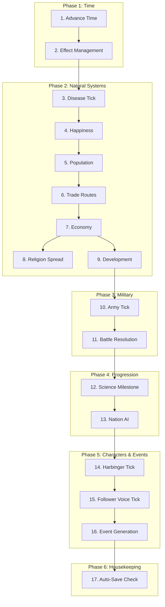
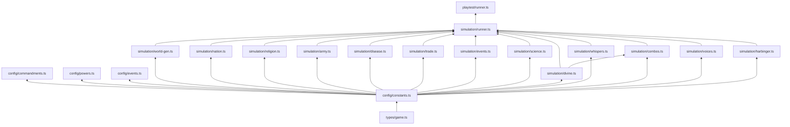

# DIVINE DOMINION — Test Specification & Technical Blueprint

> Cross-references: [INDEX](../INDEX.md) · [Constants](constants.md) · [Formulas](formulas.md) · [Types](../../src/types/game.ts) · [Stage 8 Pipeline](../pipeline/stage-08-tech-qa.md)
>
> **Source of truth for:** architecture, API contracts, test specs, invariants, edge cases, and playtest framework. Implementation creates `src/simulation/__tests__/*.test.ts` from this document. When design changes, update this file first, then regenerate tests.
>
> **Note:** This file intentionally exceeds 300 lines — it is the comprehensive technical reference for Stage 8.

---

## Decision Point Outcomes

| # | Decision | Choice |
|---|----------|--------|
| 1 | State management | **Immer proxies** — `produce(state, draft => { ... })` |
| 2 | Save format | **Compressed JSON (LZ-string)** |
| 3 | Target device baseline | **iPhone 12 / Pixel 6** (2020-2021 mid-range) |
| 4 | Test coverage | **High ~90% (~380-420 test specs)** |
| 5 | Module architecture | **Mix** — pure simulation functions + Phaser classes for rendering |

---

## §1 SIMULATION TICK ARCHITECTURE

### Tick Pipeline (17 steps, 6 phases)

Each step receives the state from the previous step. All simulation functions use the Immer `produce()` pattern. PRNG call index resets to 0 at each tick start.

| Phase | Step | System | Reads | Writes | Module |
|-------|------|--------|-------|--------|--------|
| 1: TIME | 1 | Advance time | `world.currentYear`, `world.currentTick` | `currentYear += 0.5`, `currentTick += 1` | runner.ts |
| 1: TIME | 2 | Effect management | `region.activeEffects[]` | Remove expired effects, apply ongoing modifiers | divine.ts |
| 2: NATURAL | 3 | Disease tick | `world.diseases[]`, `region.population`, trade routes | `diseases[]`, `region.population` (mortality) | disease.ts |
| 2: NATURAL | 4 | Happiness | Last tick's `economicOutput`, war/disease/blessing state, government | `region.happiness` | nation.ts |
| 2: NATURAL | 5 | Population | `region.population`, happiness, disease, war, blessings, commandments | `region.population` | nation.ts |
| 2: NATURAL | 6 | Trade routes | `region.population`, `region.development`, diplomacy | `world.tradeRoutes`, `tradeRoute.volume` | trade.ts |
| 2: NATURAL | 7 | Economy | population, development, trade, government, commandments | `region.economicOutput` (stored for next tick's happiness) | nation.ts |
| 2: NATURAL | 8 | Religion spread | `region.religiousInfluence[]`, adjacency, trade routes, missionaries | `region.religiousInfluence[]`, `region.dominantReligion` | religion.ts |
| 2: NATURAL | 9 | Development | economy, trade, era, government, blessings, commandments | `region.development` | nation.ts |
| 3: MILITARY | 10 | Army tick | `army.path`, `army.state`, terrain, supply | `army.currentRegionId`, `army.morale`, `army.strength` | army.ts |
| 3: MILITARY | 11 | Battle resolution | Hostile armies in same region | `army.strength`, `army.morale`, `army.state`, `region.nationId` | army.ts |
| 4: PROGRESS | 12 | Science milestone | `nation.development`, `scienceProgress` | `scienceProgress.milestonesReached[]` | science.ts |
| 4: PROGRESS | 13 | Nation AI | All nation/army/diplomacy state | `diplomaticRelation.atWar`, alliances, trade agreements, army orders | nation.ts |
| 5: CHARS | 14 | Harbinger tick | Era 7+: `alienState.harbinger`, player strategy | `harbinger.corruptedRegionIds`, `veiledRegionIds`, `budgetRemaining` | harbinger.ts |
| 5: CHARS | 15 | Follower Voice | `voiceRecords[]`, region state, commandments | `voiceRecords[]` (emergence, aging, loyalty, petitions) | voices.ts |
| 5: CHARS | 16 | Event generation | World state (updated), event templates, era | `gameState.currentEvent`, `eventHistory[]` | events.ts |
| 6: HOUSE | 17 | Auto-save check | Tick count, era boundary, app state | localStorage / Capacitor storage | save-manager.ts |

### Performance Target

| Metric | Target | Budget |
|--------|--------|--------|
| Max tick time (1×, 5 ticks/min) | 12ms | Fits in 16ms frame with 4ms rendering overhead |
| Max tick time (4×, 20 ticks/min) | 12ms | 3s real between ticks → 12ms is generous |
| Religion spread (heaviest step) | <5ms | ~11,520 pair evaluations at max (60 regions × 12 religions × ~16 neighbors) |

### Data Flow Diagram



### Circular Dependency Prevention

- Happiness (step 4) uses **last tick's** economy to avoid happiness↔economy loop
- Trade volume (step 6) uses population and development, not economy directly
- Economy (step 7) reads trade wealth from step 6 — no circular dependency
- Religion spread (step 8) uses a frozen snapshot of influence values at tick start

---

## §2 WORLD GENERATION PSEUDOCODE

### Input

```typescript
function generateWorld(seed: number): WorldState
```

### Steps

**Step 1: Initialize PRNG**
- Create mulberry32 PRNG with `seed`
- All random calls use this PRNG (deterministic)

**Step 2: Generate Region Points (Poisson Disk Sampling)**
- Canvas: 1000×600 pixels
- Min distance: 80px (`WORLD_GEN.POISSON_MIN_DISTANCE`)
- Target: 40-60 points (`WORLD_GEN.REGIONS_MIN` to `REGIONS_MAX`)
- Output: `Vec2[]` positions
- Validation: count ∈ [40, 60]. If under, reduce min distance by 5 and retry. If over, drop farthest from center.

**Step 3: Voronoi Tessellation**
- Library: `d3-delaunay` — `Delaunay.from(points)` → `delaunay.voronoi([0, 0, 1000, 600])`
- Output: `vertices: Vec2[][]` per region (polygon boundary), `adjacentRegionIds: RegionId[]` per region
- Validation: every region has ≥2 neighbors. Every region polygon is non-degenerate (area > 0).

**Step 4: Assign Terrain**
- Generate 2 simplex noise layers: elevation (scale 0.008, 2 octaves) and moisture (same params)
- Per region (sample at centroid):
  - elevation ≥ 0.75 → `mountain`
  - elevation ≥ 0.45 AND moisture < 0.30 → `desert`
  - elevation ≥ 0.45 → `hills`
  - moisture ≥ 0.65 → `forest`
  - elevation < 0.20 → `ocean` (if within water ratio 25%)
  - region adjacent to ocean → `coast`
  - moisture < 0.30 AND elevation ≥ 0.55 → `tundra`
  - else → `plains`
- Validation: ≤25% ocean regions. At least 1 of each land terrain type.

**Step 5: Mark Water**
- Ocean regions: population=0, development=0, no nation, impassable
- Water ratio: `WORLD_GEN.WATER_RATIO` (0.25)

**Step 6: Place Nations (8-12)**
- Count: random ∈ [NATIONS_MIN, NATIONS_MAX]
- Capital selection: pick region with highest terrain POP_BIAS, ≥3 regions from any existing capital
- Assign 3-8 regions per nation via BFS from capital
- Assign AI personality (random from 5 types)
- Assign starting government: monarchy (all nations start as monarchy)
- Validation: every land region assigned to exactly 1 nation. No nation has <3 regions.

**Step 7: Assign Starting Population & Development**
- Per region: `population = random(STARTING_POPULATION_MIN, STARTING_POPULATION_MAX) × POP_BIAS[terrain]`
- Per region: `development = random(STARTING_DEV_MIN, STARTING_DEV_MAX)`
- Capital regions: +1 dev, +50% population
- Validation: all populations ≥ POPULATION_MIN_PER_REGION (100). All dev ∈ [1, 12].

**Step 8: Create Religions**
- Player religion: id=`player_religion`, color=`#c9a84c`, commandments=player's 10 picks
- Rival religions: pick min(nationCount-1, random(8,12)) from 10 pre-made pool
- Assign 1 religion per nation (player nation gets player religion)
- Set initial influence: dominant religion = 0.80, minor presence of neighbors = 0.10-0.20
- Validation: every nation has a dominant religion. Player religion present in 2-3 starting regions.

**Step 9: Create Starting Armies**
- One army per nation, garrisoned at capital
- Strength: random(STARTING_ARMY_STRENGTH_MIN, STARTING_ARMY_STRENGTH_MAX)
- Morale: 0.80
- Commander: 50% chance of random trait, 50% null
- Validation: all armies strength ∈ [500, 50000].

**Step 10: Initialize Relations**
- All nations start with opinion 0.0 (neutral), no war, no trade, no alliance
- Set `peaceTicks = 0` for all pairs

**Step 11: Initialize Subsystems**
- `tradeRoutes`: empty Map
- `diseases`: empty array
- `scienceProgress`: { currentLevel: 0, milestonesReached: [], globalResearchOutput: 0 }
- `alienState`: { arrivalYear: 2200, harbinger: { budgetRemaining: 0, dormant, ... } }

**Step 12: Set Starting Conditions**
- `currentYear`: 1600
- `currentTick`: 0
- `currentEra`: `'renaissance'`
- `happiness`: 0.50 for all regions
- `faithStrength`: 0.80 for dominant religion in each region

### Output

Complete `WorldState` with all Maps populated. Deterministic: same seed always produces identical world.

---

## §3 STATE SERIALIZATION SPEC

### Serialization Format

```typescript
interface SaveData {
  version: number;                    // AUTO_SAVE.VERSION (currently 1)
  checksum: string;                   // SHA-256 of JSON before compression
  timestamp: number;                  // Date.now() at save time
  gameState: SerializedGameState;
}

interface SerializedGameState {
  phase: GamePhase;
  world: SerializedWorldState;
  divineState: SerializedDivineState;
  playerReligionId: string;
  selectedCommandments: string[];
  eventHistory: GameEvent[];          // capped at 50
  currentEvent?: GameEvent;
  eraNarratives: [string, string][];  // Map<EraId, string> → entries
  pivotalMoments: PivotalMoment[];    // capped at 20
  speedMultiplier: number;
  realTimeElapsed: number;
  divineOverlayActive: boolean;
  voiceRecords: FollowerVoice[];      // capped at 10
  hypocrisyLevel: number;
  prngState: number;
}
```

### Map Serialization Rules

| Type | Serialization | Deserialization |
|------|---------------|-----------------|
| `Map<K, V>` | `Array.from(map.entries())` → `[K, V][]` | `new Map(entries)` |
| `Set<T>` | `Array.from(set)` → `T[]` | `new Set(array)` |
| Nested Maps (e.g., `Nation.relations`) | Same — recursive `[K, V][]` | Recursive `new Map()` |

### Compression Pipeline

```
GameState → JSON.stringify() → SHA-256 checksum → LZ-string compress → storage
```

```typescript
import LZString from 'lz-string';

function serializeState(state: GameState): SaveData {
  const serialized = toSerializable(state);  // Maps → entries arrays
  const json = JSON.stringify(serialized);
  const checksum = sha256(json);
  return { version: AUTO_SAVE.VERSION, checksum, timestamp: Date.now(), gameState: serialized };
}

function compressAndStore(saveData: SaveData): void {
  const json = JSON.stringify(saveData);
  const compressed = LZString.compressToUTF16(json);
  storage.set('save_current', compressed);
}

function loadAndDecompress(): SaveData | null {
  const compressed = storage.get('save_current');
  if (!compressed) return null;
  const json = LZString.decompressFromUTF16(compressed);
  if (!json) return null;  // corrupted
  const saveData: SaveData = JSON.parse(json);
  // Verify checksum
  const recomputed = sha256(JSON.stringify(saveData.gameState));
  if (recomputed !== saveData.checksum) return null;  // corrupted
  return saveData;
}

function deserializeState(saveData: SaveData): GameState {
  return fromSerializable(saveData.gameState);  // entries arrays → Maps
}
```

### Size Target

| Component | Estimated Size (JSON) | Compressed (LZ-string) |
|-----------|----------------------|----------------------|
| 60 regions | ~60KB | ~15KB |
| 12 nations + relations | ~15KB | ~4KB |
| 12 religions | ~8KB | ~2KB |
| 20 armies | ~5KB | ~1.5KB |
| 10 trade routes | ~2KB | ~0.5KB |
| Event history (50) | ~25KB | ~6KB |
| Other state | ~10KB | ~3KB |
| **Total** | **~125KB** | **~32KB** |

Target: <200KB compressed. Actual expected: ~30-50KB compressed.

### Migration Strategy

```typescript
const MIGRATIONS: Record<number, (save: any) => any> = {
  // v1 → v2: add harbingerState.immuneRegionIds if missing
  // 2: (save) => { save.gameState.world.alienState.harbinger.immuneRegionIds ??= []; return save; }
};

function migrate(saveData: SaveData): SaveData {
  let current = saveData;
  while (current.version < AUTO_SAVE.VERSION) {
    const migrator = MIGRATIONS[current.version + 1];
    if (!migrator) throw new Error(`No migration for v${current.version}`);
    current = migrator(current);
    current.version++;
  }
  return current;
}
```

---

## §4 PERFORMANCE BUDGET

### Target Device: iPhone 12 / Pixel 6

| Metric | Target | Minimum | Notes |
|--------|--------|---------|-------|
| Rendering FPS | 60fps | 30fps | Below 30fps triggers LOW-QUALITY mode |
| Max tick time | 12ms | 16ms | Must complete within single frame |
| Max memory (total app) | 150MB | 200MB (warning) | 100MB textures/assets + 50MB sim state |
| Max memory (sim state) | 50MB | 75MB | WorldState + history + PRNG state |
| Max regions | 60 | — | WORLD_GEN.REGIONS_MAX |
| Max armies on screen | 20 | — | Beyond 20: cull off-screen armies |
| Cold start → splash | <3s | <5s | Static splash image loads instantly |
| Cold start → menu | <5s | <8s | Assets preloaded during splash |
| Save/load (mobile) | <100ms | <200ms (first save) | AUTO_SAVE budgets |
| Battery (20-min session) | <15% | <20% | Measured at 60fps, screen brightness 50% |

### LOW-QUALITY Rendering Tier

Triggered when FPS drops below 30 for 5+ consecutive seconds during first 30s, or manually via Settings.

| Feature | Normal | Low-Quality |
|---------|--------|-------------|
| Max particle emitters | 6 | 3 |
| Max particles per emitter | 50 | 25 |
| Terrain detail | Textured gradients | Flat color fills |
| Clouds | Animated layers | Off |
| Vegetation sway | Animated | Off |
| City glow | Animated | Static |
| Trade route particles | Flowing particles | Static dashed lines |
| Screen shake | Enabled | Disabled |
| Ambient map life | Full (birds, waves) | Minimal (city glow only) |
| Divine VFX duration | Full | 50% shorter |

### Detection Logic

```typescript
function detectQualityTier(): 'normal' | 'low' {
  const samples: number[] = [];
  // Sample FPS for first 30s
  for (let i = 0; i < 30; i++) {
    samples.push(measureFPS()); // avg over 1s window
  }
  const avgFPS = mean(samples);
  const lowCount = samples.filter(s => s < 30).length;
  if (lowCount >= 5) return 'low';
  if (avgFPS < 35) return 'low';
  return 'normal';
}
```

---

## §4b PAUSE BEHAVIOR SPEC

Pausing is a core game control that must have clearly defined behavior.

### State Model

```typescript
type SimSpeed = 1 | 2 | 4;
interface TimeControl {
  isPaused: boolean;
  speed: SimSpeed;
  previousSpeed: SimSpeed; // stored when pausing to restore on resume
}
```

### What Freezes on Pause

| System | Paused? | Notes |
|--------|---------|-------|
| Simulation ticks | **Yes** | `runSimulationTick()` is not called |
| Harbinger AI | **Yes** | No budget spend, no actions |
| Disease/trade/religion spread | **Yes** | All frozen via tick |
| Army movement | **Yes** | Frozen mid-step |
| Battle resolution | **Yes** | Frozen mid-round if multi-round |
| Event timers | **Yes** | Event cadence paused |
| Whisper cooldowns | **Yes** | Real-time cooldowns do NOT tick while paused |
| Voice aging | **Yes** | Voice lifespan clock paused |

### What Remains Active on Pause

| System | Active? | Notes |
|--------|---------|-------|
| UI interaction | **Yes** | Player can scroll map, open overlays, inspect regions |
| Divine power casting | **Yes** | Player can queue powers; they execute on resume |
| Whisper casting | **Yes** | Player can queue whispers; cooldown check uses pre-pause values |
| Speed selection | **Yes** | Player can change speed while paused; takes effect on resume |
| Save/Load | **Yes** | Paused state is a valid save state |

### Resume Behavior

1. `isPaused` → false
2. Speed restores to `previousSpeed` (unless player changed speed while paused)
3. First tick after resume uses normal `deltaRealSeconds` — no "catch-up" for paused duration
4. Queued divine actions execute in the first tick

---

## §5 MODULE FILE MAP

### Simulation Modules (pure functions, Immer pattern)

| Module | Path | Exports | Dependencies |
|--------|------|---------|-------------|
| World Gen | `src/simulation/world-gen.ts` | `generateWorld(seed)` | types, constants, d3-delaunay, simplex-noise |
| Nation | `src/simulation/nation.ts` | `tickNations(state, deltaYears)` | types, constants, immer |
| Religion | `src/simulation/religion.ts` | `tickReligionSpread(state, deltaYears)` | types, constants, immer |
| Army | `src/simulation/army.ts` | `tickArmies(state, deltaYears)`, `resolveBattle(state, atkId, defId, regionId)`, `mergeArmies(state, idA, idB)`, `splitArmy(state, id, ratio)` | types, constants, immer |
| Disease | `src/simulation/disease.ts` | `tickDiseases(state, deltaYears)` | types, constants, immer |
| Trade | `src/simulation/trade.ts` | `tickTradeRoutes(state, deltaYears)` | types, constants, immer |
| Events | `src/simulation/events.ts` | `rollEvents(state, deltaYears)` | types, constants, events config, immer |
| Science | `src/simulation/science.ts` | `tickScience(state)` | types, constants, immer |
| Divine | `src/simulation/divine.ts` | `castPower(state, powerId, regionId)`, `tickDivineEffects(state, deltaYears)`, `checkHypocrisy(state, powerId)` | types, constants, powers config, immer |
| Runner | `src/simulation/runner.ts` | `runSimulationTick(state, deltaRealSeconds)` | ALL simulation modules, types, constants, immer |
| Whispers | `src/simulation/whispers.ts` | `castWhisper(state, regionId, type)`, `tickWhispers(state, deltaRealSeconds)` | types, constants, immer |
| Combos | `src/simulation/combos.ts` | `checkAndApplyCombos(state, powerId, regionId)` | types, constants, immer |
| Voices | `src/simulation/voices.ts` | `tickVoices(state, deltaYears)`, `fulfillPetition(state, voiceId)`, `denyPetition(state, voiceId)` | types, constants, immer |
| Harbinger | `src/simulation/harbinger.ts` | `tickHarbinger(state)` | types, constants, immer |

### Config Modules (data, no logic)

| Module | Path | Exports |
|--------|------|---------|
| Types | `src/types/game.ts` | All type definitions |
| Constants | `src/config/constants.ts` | All numeric constants |
| Commandments | `src/config/commandments.ts` | `COMMANDMENT_DATA: Commandment[]` |
| Powers | `src/config/powers.ts` | `BLESSING_DATA: DivinePower[]`, `DISASTER_DATA: DivinePower[]` |
| Events | `src/config/events.ts` | `EVENT_TEMPLATES: GameEvent[]` (from event-index.json) |

### Rendering Modules (Phaser classes)

| Module | Path | Class | Dependencies |
|--------|------|-------|-------------|
| Map Renderer | `src/rendering/map-renderer.ts` | `MapRenderer extends Phaser.GameObjects.Container` | Phaser, types |
| Religion Overlay | `src/rendering/religion-overlay.ts` | `ReligionOverlay` | Phaser, types |
| Army Renderer | `src/rendering/army-renderer.ts` | `ArmyRenderer` | Phaser, types |
| Trade Renderer | `src/rendering/trade-renderer.ts` | `TradeRenderer` | Phaser, types |
| Disease Overlay | `src/rendering/disease-overlay.ts` | `DiseaseOverlay` | Phaser, types |
| Divine VFX | `src/rendering/divine-vfx.ts` | `DivineVFX` | Phaser, types, art-spec |
| Era Transitions | `src/rendering/era-transitions.ts` | `EraTransitions` | Phaser, types, art-spec |
| Camera | `src/rendering/camera.ts` | `CameraController` | Phaser |

### Scene, UI, System, LLM, and Playtest Modules

| Module | Path | Exports |
|--------|------|---------|
| Menu Scene | `src/scenes/menu.ts` | `MenuScene extends Phaser.Scene` |
| Commandment Select | `src/scenes/commandment-select.ts` | `CommandmentSelectScene` |
| Game Scene | `src/scenes/game.ts` | `GameScene` |
| Result Scene | `src/scenes/result.ts` | `ResultScene` |
| HUD | `src/ui/hud.ts` | `HUD` |
| FAB | `src/ui/fab.ts` | `FABController` |
| Event Card | `src/ui/event-card.ts` | `EventCard` |
| Bottom Sheet | `src/ui/bottom-sheet.ts` | `BottomSheet` |
| Overlay | `src/ui/overlay.ts` | `OverlayManager` |
| Save Manager | `src/systems/save-manager.ts` | `saveGame(state)`, `loadGame()`, `validateSave(data)` |
| Sharing | `src/systems/sharing.ts` | `generateCard(state)`, `shareCard(card)` |
| Analytics | `src/systems/analytics.ts` | `trackEvent(name, data)` |
| LLM Client | `src/llm/client.ts` | `callLLM(prompt, schema)` |
| LLM Templates | `src/llm/templates.ts` | Fallback templates for all LLM calls |
| Agent Player | `src/playtest/agent-player.ts` | `decideAction(state, profile)` |
| Metrics Collector | `src/playtest/metrics-collector.ts` | `collectTickMetrics(state)`, `summarizeRun(metrics)` |
| Analyzer | `src/playtest/analyzer.ts` | `analyzeResults(results)`, `generateReport(analysis)` |
| Playtest Runner | `src/playtest/runner.ts` | `runHeadless(config)`, `runAll()` |

### Build Order (no-dependency modules first)

1. `src/types/game.ts` (no deps)
2. `src/config/constants.ts` (types only)
3. `src/config/commandments.ts`, `powers.ts`, `events.ts` (types + constants)
4. Individual simulation modules (types + constants + immer)
5. `src/simulation/runner.ts` (all simulation modules)
6. Rendering modules (Phaser + types)
7. Scenes and UI (Phaser + rendering + simulation)
8. Systems, LLM (types + constants)
9. Playtest (simulation + types + constants)

### Dependency Diagram



---

## §6 API Contracts

All simulation modules use the Immer pattern: mutate `draft` inside `produce()`, return new immutable state. No module mutates input state directly.

```typescript
import { produce } from 'immer';
export function tickX(state: GameState, ...): GameState {
  return produce(state, draft => { ... });
}
```

---

### 1. src/simulation/world-gen.ts

#### `generateWorld(seed: number): WorldState`

**JSDoc:** Creates the initial WorldState from a deterministic seed. Uses mulberry32 PRNG, d3-delaunay for Voronoi regions, simplex noise for terrain. Produces 40–60 regions, 8–12 nations, 8–12 rival religions. Player religion starts in 2–3 regions. Returns a fully populated WorldState with regions, nations, religions, armies, trade routes (empty), diseases (empty), science progress, alien state.

**Parameter constraints:**
- `seed`: integer, any value (used as PRNG state)

**Return type:** `WorldState`
- `seed`: same as input
- `currentYear`: 1600
- `currentTick`: 0
- `regions`: Map of 40–60 regions with positions, terrain, population, development, religion influence
- `nations`: Map of 8–12 nations with capitals, government types, relations
- `religions`: Map including player religion + 8–12 rivals
- `armies`: Map of starting armies (one per nation, garrisoned at capital)
- `tradeRoutes`: empty Map
- `diseases`: empty array
- `scienceProgress`: initial level 0, no milestones
- `alienState`: dormant (arrivalYear, signalDetectedYear, confirmedYear unset)
- `currentEra`: `'renaissance'`

**Side effects:** None. Pure function. Does not use Immer (creates new state from scratch).

**Example:**
```
Input:  generateWorld(12345)
Output: WorldState with seed=12345, ~48 regions, ~10 nations, currentYear=1600
```

---

### 2. src/simulation/nation.ts

#### `tickNations(state: GameState, deltaYears: number): GameState`

**JSDoc:** Updates population (logistic growth), economy, happiness, development, and recruitment for all regions and nations. Applies commandment modifiers from dominant religion. Checks government evolution conditions. Uses last tick's economy for happiness derivation to avoid circular dependency.

**Parameter constraints:**
- `state`: valid GameState with world.regions, world.nations
- `deltaYears`: number, typically 0.5 (TICK_GAME_YEARS)

**Return type:** `GameState` — same structure, with updated:
- `world.regions`: population, happiness, development per region
- `world.nations`: development (pop-weighted avg), economicOutput, militaryStrength, government (if evolved), relations, stability, warWeariness

**Side effects:** Immer — mutates draft, returns new GameState. No I/O.

**Formulas (key):**
- Pop growth: base 0.005, carrying cap = 50K × dev, logistic model
- Economy: (pop/1000) × dev × gov_mod × trade_bonus × war_penalty
- Dev growth: 0.003/tick × era_scaling × trade_bonus × gov_mod
- Happiness: base 0.50 + wealth_factor (cap 0.20) + blessing_bonus − war_penalty − disease_penalty
- Recruitment: pop × 0.001 × (economy/500 factor)

**Example:**
```
Input:  state with region pop=10000, dev=5; deltaYears=0.5
Output: region pop increased by logistic growth; economy/happiness/dev updated
```

---

### 3. src/simulation/religion.ts

#### `tickReligionSpread(state: GameState, deltaYears: number): GameState`

**JSDoc:** Applies heat-diffusion religion spread across adjacent regions. Dominant religions (≥0.60 influence) have 0.60 outflow inertia. Missionary conversion is one-sided (Prophet adds to neighbors). Schism check: tension × 0.001 × (1−happiness) × (1+hypocrisy); doubles if tension ≥ 0.50. Normalizes influence per region after applying deltas.

**Parameter constraints:**
- `state`: valid GameState
- `deltaYears`: number, typically 0.5

**Return type:** `GameState` — updated `world.regions[].religiousInfluence`, `world.regions[].dominantReligion`. May add new religion (schism) to `world.religions` if schism fires.

**Side effects:** Immer — mutates draft. Uses frozen snapshot of influence at tick start for all flow calculations.

**Example:**
```
Input:  Region A: player=0.70, rival=0.30; Region B: player=0.20, rival=0.60; adjacent
Output: Small flow from A→B (player), B→A (rival); both normalized; dominantReligion updated if threshold crossed
```

---

### 4. src/simulation/army.ts

#### `tickArmies(state: GameState, deltaYears: number): GameState`

**JSDoc:** Moves armies along paths (ticks by terrain), applies supply attrition (morale/strength decay when beyond supply range), and updates siege mechanics. Resolves battles when hostile armies share a region.

**Parameter constraints:**
- `state`: valid GameState
- `deltaYears`: number, typically 0.5

**Return type:** `GameState` — updated `world.armies` (positions, morale, strength, state). May remove destroyed armies (strength < 500).

**Side effects:** Immer — mutates draft. Calls `resolveBattle` internally when armies meet.

---

#### `resolveBattle(state: GameState, attackerArmyId: ArmyId, defenderArmyId: ArmyId, regionId: RegionId): GameState`

**JSDoc:** Resolves a single battle between two armies in the given region. Effectiveness = strength × morale_weight × terrain × commander × supply × divine × tech × faith. Applies casualties, morale changes, retreat logic. Loser retreats if remaining < 30% strength or morale < 20%.

**Parameter constraints:**
- `state`: valid GameState
- `attackerArmyId`, `defenderArmyId`: must exist in state.world.armies
- `regionId`: must be currentRegionId of both armies

**Return type:** `GameState` — armies updated (strength, morale, state); loser may be removed if destroyed; `path` cleared for retreating army.

**Side effects:** Immer — mutates draft. Uses seeded RNG for ±15% variance.

**Example:**
```
Input:  Attacker 8500 str, 0.75 morale vs Defender 6200 str, 0.85 morale; hills, no commanders
Output: Casualties applied; winner morale +0.10, loser −0.20; retreat if thresholds met
```

---

#### `mergeArmies(state: GameState, armyIdA: ArmyId, armyIdB: ArmyId): GameState`

**JSDoc:** Merges two armies of the same nation in the same region. Combined strength and morale (weighted). Commander kept by rank: brilliant 4, aggressive 3, cautious 2, reckless 1. Army B is removed.

**Parameter constraints:**
- Both armies must exist, same nationId, same currentRegionId

**Return type:** `GameState` — one army with combined strength/morale; other removed.

**Side effects:** Immer — mutates draft.

---

#### `splitArmy(state: GameState, armyId: ArmyId, splitRatio: number): GameState`

**JSDoc:** Splits an army into two. `splitRatio` in [0, 1] — that fraction stays with original, rest goes to new army. New army gets new id, same region. Commander stays with larger fraction (or original if 0.5).

**Parameter constraints:**
- `armyId`: must exist
- `splitRatio`: number in (0, 1)

**Return type:** `GameState` — original army reduced; new army added.

**Side effects:** Immer — mutates draft.

---

### 5. src/simulation/disease.ts

#### `tickDiseases(state: GameState, deltaYears: number): GameState`

**JSDoc:** Handles disease emergence (0.0005/tick × war × famine × trade × density), severity (mild/moderate/severe/pandemic), spread (rate + trade bonus, quarantine reduction, dev resistance), mortality (rate × divine multiplier × dev reduction), and recovery (base + dev bonus, max 60 ticks). Removes inactive diseases with no affected regions.

**Parameter constraints:**
- `state`: valid GameState
- `deltaYears`: number, typically 0.5

**Return type:** `GameState` — `world.diseases` updated; `world.regions[].population` reduced by mortality; `world.regions[].immuneRegionIds` updated per disease.

**Side effects:** Immer — mutates draft. Uses seeded RNG for emergence, spread, recovery rolls.

**Example:**
```
Input:  Region at war, pop 50K, dev 5; no disease
Output: May add new Disease (moderate severity); if infected, pop reduced, spread/recovery checked
```

---

### 6. src/simulation/trade.ts

#### `tickTradeRoutes(state: GameState, deltaYears: number): GameState`

**JSDoc:** Forms trade routes (adjacency + sea + opinion + dev ≥ 0.30). Volume = (popA × popB / 10^10) × sqrt(devA × devB)/6 × 1/dist². Effects: wealth (volume × 0.05), tech transfer (dev_gap × 0.015 × volume). Disrupts routes on war, disaster, conquest.

**Parameter constraints:**
- `state`: valid GameState
- `deltaYears`: number, typically 0.5

**Return type:** `GameState` — `world.tradeRoutes` updated (formed, dissolved, disrupted, volume). Region economy/nation stats affected indirectly via wealth and tech transfer.

**Side effects:** Immer — mutates draft.

**Example:**
```
Input:  Two nations at peace, opinion 0.5, adjacent regions, dev 4 each
Output: Route may form if score ≥ 0.30; volume computed; wealth/tech applied
```

---

### 7. src/simulation/events.ts

#### `rollEvents(state: GameState, deltaYears: number): GameState`

**JSDoc:** Rolls for events every 2 real minutes (converted from deltaYears/ticks). Weight = base × era_modifier × situational × cooldown. Cooldown: 2nd fire 0.25×, 3rd+ 0.05×. Max queue 5; overflow auto-resolves. Progressive density: max(6, 15 − era_index) events per era.

**Parameter constraints:**
- `state`: valid GameState
- `deltaYears`: number, typically 0.5

**Return type:** `GameState` — `eventHistory` appended; `currentEvent` set if new event queued; overflow events auto-resolved and appended.

**Side effects:** Immer — mutates draft. Uses seeded RNG.

**Example:**
```
Input:  state at tick 100, no recent events
Output: May add 1–3 events to queue; currentEvent set if player must choose
```

---

### 8. src/simulation/science.ts

#### `tickScience(state: GameState): GameState`

**JSDoc:** Applies global science speed modifier (war penalty 0.3, trade bonus 0.15). Checks milestones: count nations at dev thresholds. Special conditions: internet (peace), space (alliance), planetary defense (5 nations dev 10+ cooperating OR 1 superpower dev 12). Nuclear deterrence: dev 8+ vs dev 8+ → 0.5× war declaration. Defense grid construction: 100 ticks after planetary defense.

**Parameter constraints:**
- `state`: valid GameState

**Return type:** `GameState` — `world.scienceProgress` updated (currentLevel, milestonesReached, globalResearchOutput). May update nation AI war-declaration modifier (nuclear deterrence).

**Side effects:** Immer — mutates draft.

**Example:**
```
Input:  state with 3 nations at dev 4
Output: scientific_method milestone may be reached; globalResearchOutput updated
```

---

### 9. src/simulation/divine.ts

#### `castPower(state: GameState, powerId: PowerId, regionId: RegionId): GameState`

**JSDoc:** Casts a divine power on a region. Checks energy (cost ≤ current), cooldown. Applies power effects (ActiveEffect added to region). Deducts energy, sets cooldown. Calls `checkHypocrisy` and `checkAndApplyCombos` (from combos module).

**Parameter constraints:**
- `state`: valid GameState
- `powerId`: must exist in powers config, must be unlocked for current era
- `regionId`: must exist in state.world.regions

**Return type:** `GameState` — `divineState.energy` reduced, `divineState.cooldowns` updated, `world.regions[regionId].activeEffects` updated, `hypocrisyLevel` possibly increased.

**Side effects:** Immer — mutates draft. Throws or returns unchanged state if energy/cooldown insufficient.

**Example:**
```
Input:  castPower(state, 'bountiful_harvest', 'region_5')
Output: Energy −2, cooldown set, ActiveEffect added to region_5 for 10 game-years
```

---

#### `tickDivineEffects(state: GameState, deltaYears: number): GameState`

**JSDoc:** Advances divine energy regeneration, decrements cooldowns (real-time). Expires ActiveEffects past endYear. Applies hypocrisy decay (0.00125/tick).

**Parameter constraints:**
- `state`: valid GameState
- `deltaYears`: number, typically 0.5

**Return type:** `GameState` — `divineState`, `hypocrisyLevel`, `world.regions[].activeEffects` updated.

**Side effects:** Immer — mutates draft.

---

#### `checkHypocrisy(state: GameState, powerId: PowerId): GameState`

**JSDoc:** After casting a power, checks if action contradicts commandments. Mild +0.05, moderate +0.12, severe +0.25 hypocrisy gain. No mutation if hypocrisy disabled by commandment.

**Parameter constraints:**
- `state`: valid GameState
- `powerId`: the power just cast

**Return type:** `GameState` — `hypocrisyLevel` possibly increased.

**Side effects:** Immer — mutates draft.

---

### 10. src/simulation/runner.ts

#### `runSimulationTick(state: GameState, deltaRealSeconds: number): GameState`

**JSDoc:** Orchestrates all 17 simulation steps in order. Manages PRNG call index (reset to 0 each tick). Converts deltaRealSeconds to deltaGameYears via speed multiplier. Returns complete updated GameState.

**Parameter constraints:**
- `state`: valid GameState
- `deltaRealSeconds`: number ≥ 0

**Return type:** `GameState` — fully updated after one tick.

**Side effects:** Immer — each sub-step uses produce; runner composes them. PRNG state advanced deterministically.

**Example:**
```
Input:  state at tick 50, deltaRealSeconds=12 (1× speed)
Output: state at tick 51, currentYear += 0.5, all systems ticked
```

---

### 11. src/simulation/whispers.ts

#### `castWhisper(state: GameState, regionId: RegionId, whisperType: WhisperType): GameState`

**JSDoc:** Applies a Divine Whisper (war, peace, science, faith) to a region. 0 energy cost. Checks 30s region cooldown (per type), 10s global cooldown. AI nudge strength: 0.15 base, compound +0.05 per repeat on same nation, max 3 stacks, cap 0.30. Loyalty bonus: +0.02 per whisper to voice's region.

**Parameter constraints:**
- `state`: valid GameState
- `regionId`: must exist
- `whisperType`: `'war' | 'peace' | 'science' | 'faith'`

**Return type:** `GameState` — whisper cooldowns set; nation AI weights in region updated; voice loyalty in region +0.02 if applicable.

**Side effects:** Immer — mutates draft.

---

#### `tickWhispers(state: GameState, deltaRealSeconds: number): GameState`

**JSDoc:** Decrements whisper cooldowns using real-time (not game-time). Cooldowns are in real seconds (30s region, 10s global) and must tick at the same rate regardless of speed multiplier. The runner passes `deltaRealSeconds` (e.g., 12s at 1×, 6s at 2×, 3s at 4×).

**Parameter constraints:**
- `state`: valid GameState
- `deltaRealSeconds`: positive number — real seconds elapsed since last tick (varies by speed)

**Return type:** `GameState` — cooldowns decremented by `deltaRealSeconds`.

**Side effects:** Immer — mutates draft.

---

### 12. src/simulation/combos.ts

#### `checkAndApplyCombos(state: GameState, powerId: PowerId, regionId: RegionId): GameState`

**JSDoc:** After a power is cast, checks for combo triggers. 9 combos: quake_scatter, storm_fleet, flood_famine, plague_trade, harvest_golden, inspire_prophet, shield_miracle, wildfire_rebirth, divine_purge. Each has specific condition (power + world state). Effect types vary: multiplier (1.5×–2.0× for storm_fleet, inspire_prophet, shield_miracle, flood_famine), additive (+1 dev for wildfire_rebirth, +3yr golden age for harvest_golden), percentage (20%/30% for quake_scatter), boolean (divine_purge removes corruption + immunizes 1 era).

**Parameter constraints:**
- `state`: valid GameState
- `powerId`: the power just cast
- `regionId`: target region

**Return type:** `GameState` — combo effects applied if triggered (e.g., army scatter, trade disruption, corruption removal).

**Side effects:** Immer — mutates draft.

**Example:**
```
Input:  Earthquake cast on region with army
Output: quake_scatter: 20% strength loss, 30% defect to nearby nations
```

---

### 13. src/simulation/voices.ts

#### `tickVoices(state: GameState, deltaYears: number): GameState`

**JSDoc:** Handles Follower Voice emergence (prophet, ruler, general, scholar, heretic), aging, loyalty decay, petition generation. Max 5 alive. Emergence per type: faith/war/dev/schism thresholds. Loyalty: start 0.7; fulfill +0.10, deny −0.15, auto-deny −0.08. Betrayal: loyalty < 0.3, prob 0.02/tick, grace 2 ticks. Lifespan 100–200 years; lineage 30% chance.

**Parameter constraints:**
- `state`: valid GameState
- `deltaYears`: number, typically 0.5

**Return type:** `GameState` — `voiceRecords` updated (emergence, death, lineage, petitions, loyalty).

**Side effects:** Immer — mutates draft. Uses seeded RNG for emergence, betrayal, lineage.

---

#### `fulfillPetition(state: GameState, voiceId: VoiceId): GameState`

**JSDoc:** Marks a voice's petition as fulfilled. +0.10 loyalty. Applies the petition's requested action (e.g., cast power) if applicable.

**Parameter constraints:**
- `voiceId`: must exist and have currentPetition

**Return type:** `GameState` — voice loyalty increased, petition cleared.

**Side effects:** Immer — mutates draft. May trigger power cast.

---

#### `denyPetition(state: GameState, voiceId: VoiceId): GameState`

**JSDoc:** Marks a voice's petition as denied. −0.15 loyalty. Petition cleared.

**Parameter constraints:**
- `voiceId`: must exist and have currentPetition

**Return type:** `GameState` — voice loyalty decreased, petition cleared.

**Side effects:** Immer — mutates draft.

---

### 14. src/simulation/harbinger.ts

#### `tickHarbinger(state: GameState): GameState`

**JSDoc:** Harbinger tick. Dormant Eras 1–6; active Era 7+. Signal strength: Era 7: 3, Era 8: 6, …, Era 12: 25. 6 actions: discord (2), corruption (3), false_miracle (4), plague_seed (3), sever (2), veil (4). Targets based on player strategy assessment (science_rush, faith_expansion, peace_cooperation, military_dominance, balanced). Rubber banding: player_score > 0.6 → 1.0, < 0.3 → 0.5. Prosperity resistance: dev 8+ regions double cost. Shield blocks all actions. Tick interval: every 10 ticks.

**Parameter constraints:**
- `state`: valid GameState

**Return type:** `GameState` — `world.alienState.harbinger` updated (budgetRemaining, corruptedRegionIds, veiledRegionIds, actionsLog). Regions may be corrupted, veiled, or receive plague/discord/sever/false_miracle.

**Side effects:** Immer — mutates draft. Uses seeded RNG for action selection when multiple options.

**Example:**
```
Input:  state at Era 8, player science rush, budget 6
Output: May corrupt high-dev city (cost 3 or 6 if resisted); budget reduced
```

---

## §7 COMPREHENSIVE TEST SPECIFICATIONS

For each simulation module, specific test cases. Each test case has: ID, Scenario, Input state, Expected output, Priority (P0 = must pass, P1 = important, P2 = nice to have).

**Target:** ~380–420 test cases total across all modules.

---

### world-gen (15 tests)

| ID | Scenario | Input | Expected | Priority |
|----|----------|-------|----------|----------|
| WG_001 | Region count within bounds | seed=12345 | 40 ≤ regions.size ≤ 60 | P0 |
| WG_002 | Nation count within bounds | seed=99999 | 8 ≤ nations.size ≤ 12 | P0 |
| WG_003 | Rival religion count | seed=42 | 8 ≤ rivalReligions ≤ min(12, nationCount-1) | P0 |
| WG_004 | Player religion in 2–3 regions | seed=777 | 2 ≤ playerRegions ≤ 3 | P0 |
| WG_005 | Seed determinism | seed=1 | Same output for two calls with seed=1 | P0 |
| WG_006 | Different seeds produce different worlds | seed=1 vs seed=2 | Different region/nation layouts | P0 |
| WG_007 | Capital min distance | any seed | All capitals ≥ 3 regions apart | P0 |
| WG_008 | Starting year | any seed | currentYear = 1600, currentTick = 0 | P0 |
| WG_009 | Terrain distribution | seed=555 | No region has invalid terrain; ocean ≈ 25% | P1 |
| WG_010 | Starting dev per region | any seed | 1 ≤ dev ≤ 3 for non-capital regions; 2 ≤ dev ≤ 4 for capitals (base + 1) | P0 |
| WG_011 | Starting army strength | any seed | 1000 ≤ army.strength ≤ 5000 per nation | P0 |
| WG_012 | Empty trade routes at start | any seed | tradeRoutes.size = 0 | P0 |
| WG_013 | Empty diseases at start | any seed | diseases.length = 0 | P0 |
| WG_014 | Alien state dormant | any seed | alienState.arrivalYear unset, dormant | P0 |
| WG_015 | Current era renaissance | any seed | currentEra = 'renaissance' | P0 |

---

### nation (25 tests)

| ID | Scenario | Input | Expected | Priority |
|----|----------|-------|----------|----------|
| NATION_001 | Population logistic growth | pop=10K, dev=5, happy=0.6 | pop increases by ~0.005×logistic per tick | P0 |
| NATION_002 | Carrying capacity cap | pop=250K, dev=5 (cap 250K) | growth ≈ 0 | P0 |
| NATION_003 | Min population floor | pop=50, dev=1 | pop ≥ 100 after tick | P0 |
| NATION_004 | Economy base formula | pop=10K, dev=5, monarchy | base = (10000/1000)×5 = 50 | P0 |
| NATION_005 | Gov mod monarchy | monarchy | gov_mod = 1.00 | P0 |
| NATION_006 | Gov mod republic | republic | gov_mod = 1.15 | P0 |
| NATION_007 | Gov mod democracy | democracy | gov_mod = 1.25 | P0 |
| NATION_008 | Gov mod theocracy | theocracy | gov_mod = 0.90 | P0 |
| NATION_009 | Gov mod military junta | military_junta | gov_mod = 0.85 | P0 |
| NATION_010 | War penalty | at war | economy × 0.70 | P0 |
| NATION_011 | Golden Age bonus | golden age active | economy × 1.30 | P0 |
| NATION_012 | Happiness bounds | any state | 0.10 ≤ happiness ≤ 0.95 | P0 |
| NATION_013 | Dev growth base | peace, republic, era 1 | dev_growth ≈ 0.003/tick | P0 |
| NATION_014 | Dev growth era scaling | era 12 vs era 1 | era_mod = 1.0 + 11×0.10 = 2.1; era 12 dev growth ~2.1× era 1 | P0 |
| NATION_015 | Dev growth trade bonus | 3 trade routes | +0.03×3 = 0.09 bonus | P0 |
| NATION_016 | Dev bounds | any state | 1 ≤ dev ≤ 12 | P0 |
| NATION_017 | Nation dev pop-weighted | regions with different dev | nation.dev = pop-weighted avg | P0 |
| NATION_018 | Government evolution monarchy→republic | dev≥5, era≥4 | may transition | P1 |
| NATION_019 | Government evolution monarchy→theocracy | faith≥0.8, 50%+ regions | may transition | P1 |
| NATION_020 | Recruitment rate | pop=100K, econ=500 | recruits ≈ pop×0.001×factor | P0 |
| NATION_021 | Total population consistency | any state | sum(region.pop) = nation.totalPopulation | P0 |
| NATION_022 | Region ownership consistency | any state | region.nationId ∈ nation.regionIds | P0 |
| NATION_023 | War weariness gain | at war 10 ticks | weariness increases | P1 |
| NATION_024 | Stability decay in war | at war | stability decreases | P1 |
| NATION_025 | Stability regen in peace | at peace | stability increases | P1 |

---

### religion (25 tests)

| ID | Scenario | Input | Expected | Priority |
|----|----------|-------|----------|----------|
| REL_001 | Diffusion rate | A=0.7, B=0.2, adjacent, plains | flow ≈ 0.01 × gradient × (1-resistance) | P0 |
| REL_002 | Dominance inertia | A player=0.70 (dominant) | outflow × 0.60 | P0 |
| REL_003 | No dominance inertia | A player=0.50 | full gradient flow | P0 |
| REL_004 | Missionary rate | Prophet in region, 3 neighbors | +0.01/tick per neighbor | P0 |
| REL_005 | Influence normalization | after deltas | sum(influence) ≤ 1.0 per region | P0 |
| REL_006 | Dominant religion update | influence ≥ 0.60 | dominantReligion set | P0 |
| REL_007 | Schism base formula | tension=0.3, happy=0.5, hypocrisy=0 | prob = 0.3×0.001×0.5×1.0 | P0 |
| REL_008 | Schism tension double | tension ≥ 0.50 | prob × 2 | P0 |
| REL_009 | Schism hypocrisy factor | hypocrisy=0.5 | prob × (1+0.5) | P0 |
| REL_010 | Schism happiness factor | happiness=1.0 (formula boundary — INV_004 caps at 0.95) | prob = 0 (1−1.0=0 zeroes out); at actual max 0.95, prob ≈ 0.000015 (near-zero, non-zero) | P0 |
| REL_011 | Ocean blocks diffusion | ocean between A and B | flow = 0 | P0 |
| REL_012 | Trade route spread bonus | trade route A↔B | +0.005 flow | P0 |
| REL_013 | Terrain resistance hills | B terrain=hills | flow × (1-0.10) | P0 |
| REL_014 | Terrain resistance mountain | B terrain=mountain | flow × (1-0.35) | P0 |
| REL_015 | Snapshot rule | concurrent flows | all flows from frozen snapshot | P0 |
| REL_016 | UNAFFILIATED fill | total influence < 0.01 | remainder → UNAFFILIATED | P0 |
| REL_017 | New religion on schism | schism fires | new religion added to religions map | P0 |
| REL_018 | No negative influence | after apply | all influence ≥ 0 | P0 |
| REL_019 | Commandment spread mod | passiveSpread | flow × (1 + cmd_mod) | P1 |
| REL_020 | Missionary one-sided | Prophet in A | A not reduced, B gains | P0 |
| REL_021 | Religion merge threshold | 7+ shared commandments, proximity | may merge | P1 |
| REL_022 | Forced conversion on conquest | region conquered | conversion rate × 2 | P1 |
| REL_023 | Theocracy faith spread | theocracy | +30% spread | P1 |
| REL_024 | Conversion retention stronghold | influence ≥ 0.80 | high retention | P1 |
| REL_025 | Extinction threshold | pop < 100 in region | religion extinct there | P1 |

---

### army (30 tests)

| ID | Scenario | Input | Expected | Priority |
|----|----------|-------|----------|----------|
| ARMY_001 | Equal forces plains | str=5K vs 5K, morale 0.8, plains, same dev | ratio ≈ 1.0, ~50/50 outcome | P0 |
| ARMY_002 | Tech gap Dev 7 vs Dev 3 | str=5K vs 8K, dev 7 vs 3 | tech_mod_a=1.60, tech_mod_d=1.00 | P0 |
| ARMY_003 | Holy war faith mod | attacker holy war | faith_mod_a = 1.20 | P0 |
| ARMY_004 | Stronghold faith mod | defender influence ≥ 0.80 | faith_mod_d = 1.15 | P0 |
| ARMY_005 | Righteous Defense | defender has Righteous Defense | faith_mod_d += 0.30 → 1.45 | P0 |
| ARMY_006 | Morale weight at 0 | morale=0 | effectiveness × 0.50 | P0 |
| ARMY_007 | Fort level 5 | fort_level=5 | fort_mod = 1.75 | P0 |
| ARMY_008 | Base casualty rate | ratio=1.0 | loss_rate ≈ 0.10 | P0 |
| ARMY_009 | Casualty clamp min | ratio=0.1 (attacker losing) | loss_rate_a ≥ 0.30 | P0 |
| ARMY_010 | Casualty clamp max | ratio=10 (attacker winning) | loss_rate_d ≤ 3.00 | P0 |
| ARMY_011 | Retreat strength | loser < 30% original | retreat triggered | P0 |
| ARMY_012 | Retreat morale | loser morale < 0.20 | retreat triggered | P0 |
| ARMY_013 | Winner morale +0.10 | winner | morale += 0.10 | P0 |
| ARMY_014 | Loser morale −0.20 | loser | morale -= 0.20 | P0 |
| ARMY_015 | Army destroyed | strength < 500 after battle | army removed | P0 |
| ARMY_016 | Supply factor in range | distance ≤ 3 | supply_factor = 1.0 | P0 |
| ARMY_017 | Supply attrition | distance = 10 | supply_factor = 0.3 | P0 |
| ARMY_018 | Terrain movement plains | plains | 2 ticks to cross | P0 |
| ARMY_019 | Terrain movement mountain | mountain | 8 ticks to cross | P0 |
| ARMY_020 | Merge armies | same nation, same region | combined strength, B removed | P0 |
| ARMY_021 | Merge commander rank | brilliant vs aggressive | brilliant kept | P0 |
| ARMY_022 | Split army | splitRatio=0.6 | 60% stays, 40% new army | P0 |
| ARMY_023 | Siege ticks per fort | fort_level=3 | base + 15 ticks | P0 |
| ARMY_024 | Dev 6+ siege equipment | dev≥6 | siege duration × 0.6 | P0 |
| ARMY_025 | Shield divine modifier | Shield on defender region | divine_d += 0.50 | P0 |
| ARMY_026 | Earthquake divine modifier | Earthquake on region | both × 0.80 | P0 |
| ARMY_027 | Battle variance ±15% | seeded RNG | ratio × (1 ± 0.15) | P0 |
| ARMY_028 | Strength bounds | any army | 500 ≤ str ≤ 50000 or destroyed | P0 |
| ARMY_029 | Retreat path | retreat triggered | path to nearest friendly | P0 |
| ARMY_030 | Simultaneous battles | 2 hostile pairs in same region | both resolved, no cross-contamination | P1 |

---

### disease (20 tests)

| ID | Scenario | Input | Expected | Priority |
|----|----------|-------|----------|----------|
| DIS_001 | Emergence base | pop=25K, no war/famine | chance ≈ 0.0005 × density | P0 |
| DIS_002 | Emergence war multiplier | at war | chance × 3.0 | P0 |
| DIS_003 | Emergence famine multiplier | famine | chance × 2.0 | P0 |
| DIS_004 | Mortality mild | severity=mild | 0.001/tick | P0 |
| DIS_005 | Mortality moderate | severity=moderate | 0.005/tick | P0 |
| DIS_006 | Mortality severe | severity=severe | 0.015/tick | P0 |
| DIS_007 | Mortality pandemic | severity=pandemic | 0.030/tick | P0 |
| DIS_008 | Recovery base | dev=1 | 0.010 + 0.005 = 0.015/tick | P0 |
| DIS_009 | Recovery dev bonus | dev=12 | 0.010 + 0.060 = 0.070/tick | P0 |
| DIS_010 | Max infection 60 ticks | infected 60+ ticks | auto-recover | P0 |
| DIS_011 | Divine plague severity | divine Plague | severity=severe, mortality × 2 | P0 |
| DIS_012 | Dev mortality reduction | dev=12 | rate × (1 - 0.84) | P0 |
| DIS_013 | Trade spread bonus | trade route exists | spread_chance += 0.015 | P0 |
| DIS_014 | Quarantine reduction | quarantined | spread × 0.30 | P0 |
| DIS_015 | Disease cleanup | isActive=false, no regions | removed from diseases[] | P0 |
| DIS_016 | Immune region | recovered | no re-infection | P0 |
| DIS_017 | Harvest reduces mortality | Bountiful Harvest active | mortality × 0.5 | P0 |
| DIS_018 | Plague combo trade spread | plague + trade routes | disease spreads along routes | P0 |
| DIS_019 | Zero pop skip | pop=0 | skip mortality | P0 |
| DIS_020 | Severity from modifier | modifier≥5.0 | may roll pandemic | P0 |

---

### trade (15 tests)

| ID | Scenario | Input | Expected | Priority |
|----|----------|-------|----------|----------|
| TRADE_001 | Formation threshold | adjacent, opinion=0.5, dev=4 | score ≥ 0.30, route forms | P0 |
| TRADE_002 | No route at war | nations at war | route cannot form | P0 |
| TRADE_003 | Volume formula | pop 80K×150K, dev 4×6, dist=2 | volume ≈ 0.245 | P0 |
| TRADE_004 | Wealth per volume | volume=0.5 | wealth = 0.5 × 0.05 = 0.025 | P0 |
| TRADE_005 | Tech transfer | dev_gap=2, volume=0.2 | transfer = 2×0.015×0.2 = 0.006 | P0 |
| TRADE_006 | Distance penalty | dist=5 | 1/25 = 0.04 | P0 |
| TRADE_007 | Sea route distance | no land path, both coastal | distance = 3 | P0 |
| TRADE_008 | Disruption on war | nations at war | route disrupted 5 years | P0 |
| TRADE_009 | Storm fleet combo | Storm + trade routes | disruption × 2 (10 years) | P0 |
| TRADE_010 | No circular routes | A→B and B→A | not same route (no duplicate) | P0 |
| TRADE_011 | Conquest re-eval | region conquered | routes re-evaluated | P0 |
| TRADE_012 | Volume clamp | high pop, dev 12, dist=1 | volume ≤ 1.0 | P0 |
| TRADE_013 | Disrupted volume zero | isDisrupted | volume = 0 | P0 |
| TRADE_014 | Formation score components | adjacent + sea + opinion + dev | score = sum of components | P0 |
| TRADE_015 | Auto-resume after disruption | disruptedUntilYear ≤ currentYear | route.isActive = true | P0 |

---

### events (16 tests)

| ID | Scenario | Input | Expected | Priority |
|----|----------|-------|----------|----------|
| EVT_001 | Weight base × era | tick 100, era 3 | weight = base × era_modifier | P0 |
| EVT_002 | Cooldown 2nd fire | event fired once this run | weight × 0.25 | P0 |
| EVT_003 | Cooldown 3rd+ fire | event fired 2+ times | weight × 0.05 | P0 |
| EVT_004 | Max queue 5 | 6 events rolled | overflow auto-resolved | P0 |
| EVT_005 | Density cap early era | era 1 | max(6, 15−1) = 14 per era | P0 |
| EVT_006 | Density cap late era | era 12 | max(6, 15−12) = 6 per era | P0 |
| EVT_007 | Roll interval | 2 real minutes | roll triggers | P0 |
| EVT_008 | Events per roll | single roll | 1–3 events | P0 |
| EVT_009 | Seeded RNG | same seed | same event sequence | P0 |
| EVT_010 | currentEvent set | new event queued | currentEvent populated | P0 |
| EVT_011 | Event history append | event resolved | eventHistory appended | P0 |
| EVT_016 | Event history cap at 50 | 50 events in history, resolve 51st | eventHistory.length stays 50, oldest dropped | P0 |
| EVT_012 | Situational weight | war nearby | war events weighted up | P1 |
| EVT_013 | Alien-caused flag | Era 7+, Harbinger | alienCaused may be true | P1 |
| EVT_014 | Choice resolution | player chooses | outcome applied | P0 |
| EVT_015 | Auto-resolve overflow | queue full, new event | oldest auto-resolved, appended | P0 |

---

### science (15 tests)

| ID | Scenario | Input | Expected | Priority |
|----|----------|-------|----------|----------|
| SCI_001 | Milestone printing press | 1 nation Dev 3 | milestone reached | P0 |
| SCI_002 | Milestone scientific method | 3 nations Dev 4 | milestone reached | P0 |
| SCI_003 | Milestone industrialization | 5 nations Dev 5 | milestone reached | P0 |
| SCI_004 | Milestone internet | 3 nations Dev 9, at peace | milestone reached | P0 |
| SCI_005 | Milestone space | 2 nations Dev 10, cooperating | milestone reached | P0 |
| SCI_006 | Milestone planetary defense | 5 nations Dev 10 cooperating OR 1 Dev 12 | milestone reached | P0 |
| SCI_007 | Defense grid construction | planetary defense achieved | 100 ticks to build | P0 |
| SCI_008 | Nuclear deterrence | both Dev 8+ | war declaration × 0.50 | P0 |
| SCI_009 | Global science war penalty | at war | mod × 0.30 | P0 |
| SCI_010 | Global science trade bonus | trade routes | mod + 0.15 | P0 |
| SCI_011 | Milestones in order | any run | printing_press before scientific_method, etc. | P0 |
| SCI_012 | currentLevel update | milestone reached | scienceProgress.currentLevel incremented | P0 |
| SCI_013 | Special condition peace | internet | requires peace | P0 |
| SCI_014 | Special condition alliance | space | requires cooperation | P0 |
| SCI_015 | Global research output | world state | globalResearchOutput computed | P0 |

---

### divine (20 tests)

| ID | Scenario | Input | Expected | Priority |
|----|----------|-------|----------|----------|
| DIV_001 | Cast energy cost | castPower harvest (cost 2) | energy −2 | P0 |
| DIV_002 | Insufficient energy | energy=1, cost=4 | cast fails or unchanged | P0 |
| DIV_003 | Cooldown blocks | cooldown active | cast fails | P0 |
| DIV_004 | ActiveEffect added | cast harvest on region | ActiveEffect with endYear | P0 |
| DIV_005 | Hypocrisy mild | cast contradicts, mild | +0.05 hypocrisy | P0 |
| DIV_006 | Hypocrisy moderate | cast contradicts, moderate | +0.12 hypocrisy | P0 |
| DIV_007 | Hypocrisy severe | cast contradicts, severe | +0.25 hypocrisy | P0 |
| DIV_008 | Hypocrisy disabled by cmd | commandment disables | no gain | P0 |
| DIV_009 | Hypocrisy decay | no violation | −0.00125/tick | P0 |
| DIV_010 | Energy bounds | any state | 0 ≤ energy ≤ 20 | P0 |
| DIV_011 | Hypocrisy bounds | any state | 0 ≤ hypocrisy ≤ 1 | P0 |
| DIV_012 | Effect expiry | endYear passed | effect removed | P0 |
| DIV_013 | Energy regen | 1 real minute | +1 energy | P0 |
| DIV_014 | Power unlocked for era | Era 3, Shield | Shield available | P0 |
| DIV_015 | Power locked for era | Era 1, Miracle | Miracle not available | P0 |
| DIV_016 | checkHypocrisy called | after cast | hypocrisy checked | P0 |
| DIV_017 | checkAndApplyCombos called | after cast | combos checked | P0 |
| DIV_018 | Region must exist | invalid regionId | cast fails | P0 |
| DIV_019 | Power must exist | invalid powerId | cast fails | P0 |
| DIV_020 | Cooldown decrement | tickDivineEffects | cooldowns decremented (real-time) | P0 |

---

### runner (10 tests)

| ID | Scenario | Input | Expected | Priority |
|----|----------|-------|----------|----------|
| RUN_001 | Tick order | full tick | 17 steps in pipeline order | P0 |
| RUN_002 | PRNG determinism | same seed, same inputs | identical output | P0 |
| RUN_003 | currentYear advance | deltaYears=0.5 | currentYear += 0.5 | P0 |
| RUN_004 | currentTick advance | one tick | currentTick += 1 | P0 |
| RUN_005 | Speed 1× | deltaRealSeconds=12 | deltaGameYears=0.5 | P0 |
| RUN_006 | Speed 2× | deltaRealSeconds=6 | deltaGameYears=0.5 | P0 |
| RUN_007 | Speed 4× | deltaRealSeconds=3 | deltaGameYears=0.5 | P0 |
| RUN_008 | PRNG call index reset | each tick | call index = 0 at tick start | P0 |
| RUN_009 | Immer composition | all steps | each step uses produce, no mutation | P0 |
| RUN_010 | Full state update | one tick | all systems updated | P0 |

---

### whispers (16 tests)

| ID | Scenario | Input | Expected | Priority |
|----|----------|-------|----------|----------|
| WHIS_001 | Region cooldown 30s | cast war on region | 30s cooldown per type | P0 |
| WHIS_002 | Global cooldown 10s | cast any whisper | 10s before next on any region | P0 |
| WHIS_003 | Nudge base strength | cast war | AI weight +0.15 | P0 |
| WHIS_004 | Compound bonus | repeat on same nation | +0.05 per stack, max 3 | P0 |
| WHIS_005a | 3-stack nudge value | 3 whispers same nation | compound_nudge == 0.25 (0.15 + 2×0.05) | P0 |
| WHIS_005b | 4-stack nudge cap | 4+ whispers same nation | compound_nudge == 0.30 (capped by WHISPER_NUDGE_CAP) | P0 |
| WHIS_006 | Zero energy cost | cast whisper | energy unchanged | P0 |
| WHIS_007 | Voice loyalty bonus | whisper to voice's region | voice loyalty +0.02 | P0 |
| WHIS_008 | tickWhispers cooldown decrement | deltaRealSeconds=12 (1× speed) | cooldowns decremented by 12s | P0 |
| WHIS_009 | Whisper types | war, peace, science, faith | all 4 types valid | P0 |
| WHIS_010 | Region must exist | invalid regionId | cast fails | P0 |
| WHIS_011 | Peace cancels Discord | Harbinger Discord + Peace whisper | Discord removed | P0 |
| WHIS_012 | Compound stacks same nation | 3 whispers to nation A | stack count = 3 | P0 |
| WHIS_013 | Cooldown blocks rapid cast | cast at t=0 | cast at t=5 blocked (global) | P0 |
| WHIS_014 | Per-type region cooldown | cast war, then peace on same region | peace allowed (different type) | P1 |
| WHIS_015 | AI weight application | nudge on region | nation AI weights updated | P0 |

---

### combos (23 tests)

| ID | Scenario | Input | Expected | Priority |
|----|----------|-------|----------|----------|
| COMBO_001 | quake_scatter | Earthquake + army in region | 20% strength loss, 30% defect | P0 |
| COMBO_002 | storm_fleet | Storm + trade routes | 2× disruption duration | P0 |
| COMBO_003 | flood_famine | Flood + famine | 5% additional pop loss | P0 |
| COMBO_004 | plague_trade | Plague + trade routes | disease spreads along routes | P0 |
| COMBO_005 | harvest_golden | Harvest + golden age, dev≥6 | 3 extra years | P0 |
| COMBO_006 | inspire_prophet | Inspiration + Prophet | 2× conversion | P0 |
| COMBO_007 | shield_miracle | Shield then Miracle within 120s | 1.5× boost | P0 |
| COMBO_008 | wildfire_rebirth | Wildfire + dev≥3 | +1 dev after fire | P0 |
| COMBO_009 | divine_purge | Shield + Miracle on corrupted | remove corruption + 1 era immunity | P0 |
| COMBO_010 | quake_scatter no army | Earthquake, no army | no scatter | P0 |
| COMBO_011 | storm_fleet no routes | Storm, no trade | no fleet combo | P0 |
| COMBO_012 | harvest_golden dev 5 | Harvest + golden age, dev=5 | no combo (dev<6) | P0 |
| COMBO_013 | wildfire_rebirth dev 2 | Wildfire, dev=2 | no rebirth (dev<3) | P0 |
| COMBO_014 | divine_purge no corruption | Shield + Miracle, no corruption | no purge (may trigger shield_miracle) | P0 |
| COMBO_015a | Multiplier combos in range | storm_fleet, inspire_prophet, shield_miracle, flood_famine | multiplier ∈ [1.5, 2.0] | P0 |
| COMBO_015b | Additive combos correct | harvest_golden (+3yr), wildfire_rebirth (+1 dev) | additive values match constants | P0 |
| COMBO_015c | Percentage combos correct | quake_scatter (20% str loss, 30% defect) | percentages match constants | P0 |
| COMBO_015d | Boolean combo correct | divine_purge (remove corruption + immunize) | corruption cleared, immunity = 1 era | P0 |
| COMBO_016 | checkAndApplyCombos after cast | cast power | combos checked | P0 |
| COMBO_017 | Combo pivotal moment | combo fires | logged to pivotal moments | P1 |
| COMBO_018 | Divine Chain toast | combo fires | toast shown | P1 |
| COMBO_019 | flood_famine pop loss | Flood + famine active | base 5% + 5% = 10% | P0 |
| COMBO_020 | shield_miracle window | Miracle 121s after Shield | no combo (window expired) | P0 |

---

### voices (20 tests)

| ID | Scenario | Input | Expected | Priority |
|----|----------|-------|----------|----------|
| VOICE_001 | Max alive 5 | 5 voices, 6th would emerge | retire oldest non-petitioning voice; 6th spawns (total stays 5) | P0 |
| VOICE_002 | Starting loyalty | new voice | loyalty = 0.7 | P0 |
| VOICE_003 | Fulfill +0.10 | fulfillPetition | loyalty += 0.10 | P0 |
| VOICE_004 | Deny −0.15 | denyPetition | loyalty -= 0.15 | P0 |
| VOICE_005 | Auto-deny −0.08 | petition expires | loyalty -= 0.08 | P0 |
| VOICE_006 | Betrayal threshold | loyalty < 0.3 | betrayal prob 0.02/tick | P0 |
| VOICE_007 | Betrayal grace | loyalty = 0 | 2 ticks grace before betrayal | P0 |
| VOICE_008 | Prophet emergence | Prophet cast | Prophet spawns | P0 |
| VOICE_009 | Ruler emergence | nation faith ≥ 0.6 | Ruler may spawn | P0 |
| VOICE_010 | General emergence | nation at war, faith ≥ 0.6 | General may spawn | P0 |
| VOICE_011 | Scholar emergence | region dev ≥ 6, player religion | Scholar may spawn | P0 |
| VOICE_012 | Heretic emergence | schism risk ≥ 0.4 OR Prophet ignored 50y | Heretic may spawn | P0 |
| VOICE_013 | Lineage chance | voice dies | 30% lineage | P1 |
| VOICE_014 | Petition max pending | 2 pending | no new petition | P0 |
| VOICE_015 | Petition cooldown 60s | last petition < 60s ago | no new petition | P0 |
| VOICE_016 | Petition timeout 90s | 90s no response | auto-deny | P0 |
| VOICE_017 | Loyalty decay | 100 ticks no interaction | −0.01 | P0 |
| VOICE_018 | Whisper loyalty bonus | whisper to voice region | +0.02 | P0 |
| VOICE_019 | Death in war | region conquered | voice dies (war) | P0 |
| VOICE_020 | Natural death | age ≥ lifespan | voice dies (natural) | P0 |

---

### harbinger (25 tests)

| ID | Scenario | Input | Expected | Priority |
|----|----------|-------|----------|----------|
| HARB_001 | Dormant Eras 1–6 | era ≤ 6 | no actions | P0 |
| HARB_002 | Signal Era 7 | era=7 | budget = 3 | P0 |
| HARB_003 | Signal Era 8 | era=8 | budget = 6 | P0 |
| HARB_004 | Signal Era 9 | era=9 | budget = 10 | P0 |
| HARB_005 | Signal Era 10 | era=10 | budget = 15 | P0 |
| HARB_006 | Signal Era 11 | era=11 | budget = 20 | P0 |
| HARB_007 | Signal Era 12 | era=12 | budget = 25 | P0 |
| HARB_008 | Action cost discord | Discord | cost 2 | P0 |
| HARB_009 | Action cost corruption | Corruption | cost 3 | P0 |
| HARB_010 | Action cost false_miracle | False Miracle | cost 4 | P0 |
| HARB_011 | Action cost plague_seed | Plague Seed | cost 3 | P0 |
| HARB_012 | Action cost sever | Sever | cost 2 | P0 |
| HARB_013 | Action cost veil | Veil | cost 4 | P0 |
| HARB_014 | Prosperity resistance | dev ≥ 8 | cost × 2 | P0 |
| HARB_015 | Rubber band high | player_score > 0.6 | budget_usage = 1.0 | P0 |
| HARB_016 | Rubber band low | player_score < 0.3 | budget_usage = 0.5 | P0 |
| HARB_017 | Rubber band mid | 0.3 ≤ score ≤ 0.6 | budget_usage = 0.8 | P0 |
| HARB_018 | Shield blocks all | Shield on region | action skipped | P0 |
| HARB_019 | Tick interval 10 | last_tick=0 | acts at 0, 10, 20, ... | P0 |
| HARB_020 | Divine Purge clears | Divine Purge on corrupted | corruption removed | P0 |
| HARB_021 | Voice detect Era 8 | era≥8 | Voices sense Harbinger | P1 |
| HARB_022 | Confirmed Era 9 | era≥9 | player confirmation event | P1 |
| HARB_023 | Overlay Era 10 | era≥10 | Anomaly overlay unlocks | P1 |
| HARB_024 | Adaptive targeting | science_rush | prefers Corruption, Plague Seed | P0 |
| HARB_025 | Budget insufficient | budget=2, action cost 4 | action skipped | P0 |

---

### save-manager (9 tests)

| ID | Scenario | Input | Expected | Priority |
|----|----------|-------|----------|----------|
| SAVE_001 | Round-trip save/load | valid GameState | load(save(state)) deep-equals state | P0 |
| SAVE_002 | LZ-string compression | GameState → JSON → compressed | compressed.length < json.length * 0.3 | P0 |
| SAVE_003 | SHA-256 checksum validation | tampered save data | validateSave returns false | P0 |
| SAVE_004 | Corrupted save → backup fallback | corrupt save_current, valid save_backup | loads backup, warns user | P0 |
| SAVE_005 | Both saves corrupted | corrupt save_current + save_backup | returns null, triggers new game prompt | P0 |
| SAVE_006 | Save size under limit | 60-region world, full state | compressed < 200KB | P0 |
| SAVE_007 | Map/Set serialization | state with Map and Set fields | Maps serialize as [key,value][] arrays, Sets as value[] arrays | P0 |
| SAVE_008 | Version migration | save with older version number | migrateSave upgrades to current version | P1 |
| SAVE_009 | eraNarratives Map round-trip | eraNarratives with 3 entries | save → load preserves all 3 era→string mappings as [EraId, string][] | P0 |

---

### pause-behavior (4 tests)

| ID | Scenario | Input | Expected | Priority |
|----|----------|-------|----------|----------|
| PAUSE_001 | Pause freezes simulation | pause during active tick | no further ticks execute, UI responsive | P0 |
| PAUSE_002 | Pause allows divine actions | paused state | player can cast powers, queue whispers | P0 |
| PAUSE_003 | Resume restores speed | pause at 2×, resume | speed returns to 2× | P0 |
| PAUSE_004 | Pause during battle | battle in progress, pause | battle state frozen, no resolution until resume | P0 |

---

### boundary (50 tests)

| ID | Scenario | Input | Expected | Priority |
|----|----------|-------|----------|----------|
| BND_001 | Pop exactly 100 | pop=100 | stays ≥ 100 | P0 |
| BND_002 | Pop exactly 0 | plague kills all | region dead — pop stays 0, growth formula skipped (floor 100 only applies to living regions) | P0 |
| BND_003 | Dev exactly 1 | dev=1 | dev ≥ 1 | P0 |
| BND_004 | Dev exactly 12 | dev=12 | dev ≤ 12 | P0 |
| BND_005 | Happiness exactly 0.10 | min happiness | clamped | P0 |
| BND_006 | Happiness exactly 0.95 | max happiness | clamped | P0 |
| BND_007 | Energy exactly 0 | energy=0 | no cast if cost > 0 | P0 |
| BND_008 | Energy exactly 20 | energy=20 | cap, no overflow | P0 |
| BND_009 | Hypocrisy exactly 0 | hypocrisy=0 | no negative | P0 |
| BND_010 | Hypocrisy exactly 1 | hypocrisy=1 | cap | P0 |
| BND_011 | Army strength 500 | str=500 | at min, may be destroyed | P0 |
| BND_012 | Army strength 50000 | str=50000 | at max | P0 |
| BND_013 | Influence sum 1.0 | normalized | sum = 1.0 | P0 |
| BND_014 | Influence sum 0 | all zero | UNAFFILIATED = 1.0 | P0 |
| BND_015 | Tension exactly 0.50 | schism | prob × 2 | P0 |
| BND_016 | Loyalty exactly 0.30 | betrayal threshold | at boundary | P0 |
| BND_017 | Formation score 0.30 | trade | route may form | P0 |
| BND_018 | Formation score 0.29 | trade | route does not form | P0 |
| BND_019 | Carrying capacity exact | pop = dev×50K | growth = 0 | P0 |
| BND_020 | Morale exactly 0.20 | retreat | retreat if loser | P0 |
| BND_021 | Morale exactly 0.19 | retreat | retreat triggered | P0 |
| BND_022 | Remaining 30% strength | retreat | retreat if loser | P0 |
| BND_023 | Remaining 29% strength | retreat | retreat triggered | P0 |
| BND_024 | Infection 60 ticks | disease | auto-recover | P0 |
| BND_025 | Infection 59 ticks | disease | may still be infected | P0 |
| BND_026 | Era index 1 | era 1 | formulas use 1 | P0 |
| BND_027 | Era index 12 | era 12 | formulas use 12 | P0 |
| BND_028 | Regions 40 | world gen | ≥ 40 regions | P0 |
| BND_029 | Regions 60 | world gen | ≤ 60 regions | P0 |
| BND_030 | Nations 8 | world gen | ≥ 8 nations | P0 |
| BND_031 | Nations 12 | world gen | ≤ 12 nations | P0 |
| BND_032 | Voices 5 | voices | ≤ 5 alive | P0 |
| BND_033 | Event queue 5 | events | max 5 queued | P0 |
| BND_034 | Speed 1 | speed | 1 ∈ {1,2,4} | P0 |
| BND_035 | Speed 2 | speed | 2 ∈ {1,2,4} | P0 |
| BND_036 | Speed 4 | speed | 4 ∈ {1,2,4} | P0 |
| BND_037 | Distance 0 | trade | adjacent = 1 | P0 |
| BND_038 | Fort level 0 | battle | fort_mod = 1.0 | P0 |
| BND_039 | Fort level 5 | battle | fort_mod = 1.75 | P0 |
| BND_040 | Split ratio 0.5 | split army | 50/50 split | P0 |
| BND_041 | Split ratio 0.01 | split army | 1% / 99% | P0 |
| BND_042 | Split ratio 0.99 | split army | 99% / 1% | P0 |
| BND_043 | Player score 0.6 | rubber band | high | P0 |
| BND_044 | Player score 0.3 | rubber band | low | P0 |
| BND_045 | Faith 0.60 | dominance | dominant threshold | P0 |
| BND_046 | Faith 0.80 | stronghold | stronghold threshold | P0 |
| BND_047 | Ruler faith 0.6 | voice | Ruler may spawn | P0 |
| BND_048 | Scholar dev 6 | voice | Scholar may spawn | P0 |
| BND_049 | Heretic schism 0.4 | voice | Heretic may spawn | P0 |
| BND_050 | Tick 1199 | last tick | valid, no overflow | P0 |

---

### integration (12 tests)

| ID | Scenario | Input | Expected | Priority |
|----|----------|-------|----------|----------|
| INT_001 | Nation → Religion | nation tick updates regions | religion spread uses updated pop | P0 |
| INT_002 | Trade → Economy | trade forms | economy gets trade_wealth | P0 |
| INT_003 | Disease → Population | disease mortality | population reduced | P0 |
| INT_004 | Army → Nation | conquest | region.nationId updated | P0 |
| INT_005 | Divine → Region | cast power | region.activeEffects updated | P0 |
| INT_006 | Harbinger → Divine | Shield blocks | Harbinger skips shielded region | P0 |
| INT_007 | Combos → Divine | cast triggers combo | combo effects applied | P0 |
| INT_008 | Voices → Harbinger | Era 8+ | Voices sense, petition "purge" | P0 |
| INT_009 | Events → Nation AI | event choice | nation state may change | P0 |
| INT_010 | Science → Nation AI | nuclear deterrence | war declaration modified | P0 |
| INT_011 | Religion → Voices | schism risk | Heretic emergence | P0 |
| INT_012 | Full tick chain | runSimulationTick | all 17 steps, no circular deps | P0 |

---

## §8 SIMULATION INVARIANT LIST (26 invariants)

Invariants that must ALWAYS hold true. Format: ID | Invariant | Check | Module

| ID | Invariant | Check | Module |
|----|-----------|-------|--------|
| INV_001 | No region population < 0 | assert pop >= 0 for all regions | nation.ts |
| INV_002 | Population floor 100 | assert pop >= 100 for all land regions (exclude `terrain: 'ocean'` and depopulated/dead regions) | nation.ts |
| INV_003 | Development bounds 1–12 | assert 1 <= dev <= 12 for all regions | nation.ts |
| INV_004 | Happiness bounds 0.10–0.95 | assert 0.10 <= happiness <= 0.95 for all regions | nation.ts |
| INV_005 | Faith/influence normalization | assert sum(religiousInfluence) <= 1.0 per region | religion.ts |
| INV_006 | No negative influence | assert all influence >= 0 | religion.ts |
| INV_007 | Army strength bounds | assert 500 <= strength <= 50000 OR army destroyed | army.ts |
| INV_008 | Divine energy bounds 0–20 | assert 0 <= energy <= 20 | divine.ts |
| INV_009 | Hypocrisy bounds 0–1 | assert 0 <= hypocrisy <= 1 | divine.ts |
| INV_010 | Science milestones in order | assert milestones reached in defined sequence | science.ts |
| INV_011 | Total population consistency | assert sum(region.pop) matches nation totals | nation.ts |
| INV_012 | PRNG determinism | same seed + same inputs → same output | runner.ts |
| INV_013 | No circular trade routes | not (A→B and B→A as same route) | trade.ts |
| INV_014 | Region ownership matches nation.regionIds | region.nationId ∈ nation.regionIds | nation.ts |
| INV_015 | Era monotonically advancing | currentEra index never decreases | runner.ts |
| INV_016 | Speed always 1, 2, or 4 | assert speed ∈ {1, 2, 4} | runner.ts |
| INV_017 | Voices max alive ≤ 5 | assert voicesAlive.length <= 5 | voices.ts |
| INV_018 | No negative distances | assert tradeRoute.distance >= 1 | trade.ts |
| INV_019 | Morale bounds 0–1 | assert 0 <= morale <= 1 for all armies | army.ts |
| INV_020 | currentTick in range | assert 0 <= currentTick <= 1200 | runner.ts |
| INV_021 | currentYear in range | assert 1600 <= currentYear <= 2200 | runner.ts |
| INV_022 | Event queue max 5 | assert eventQueue.length <= 5 | events.ts |
| INV_023 | Disease cleanup | no disease with isActive=false and affectedRegions=[] | disease.ts |
| INV_024 | Nation regionIds consistency | nation.regionIds contains all regions where nationId matches | nation.ts |
| INV_025 | Army currentRegionId exists | army.currentRegionId ∈ regions | army.ts |
| INV_026 | Trade route endpoints exist | route endpoints ∈ regions | trade.ts |

---

## §9 MONTE CARLO VALIDATION SPEC

Based on Stage 6's 20 scenarios in `docs/design/monte-carlo-scenarios.json`.

### Implementation

- **Headless runner:** Uses `runSimulationTick()` in a loop (1200 ticks per game)
- **No rendering, no Phaser, no browser** — pure Node.js
- **Input:** Scenario config (seed, archetype, commandments, strategy profile)
- **Output:** Per-run JSON file with metrics

### Run Distribution

| Type | Count | Configuration |
|------|-------|----------------|
| Curated (from JSON) | 20 | The 20 scenarios defined in `monte-carlo-scenarios.json` — each has a fixed seed, archetype, commandments, and expected outcome range. These run first as a smoke test. |
| Specific combos | 54 | 3 seeds (42, 7777, 314159) × 3 archetypes (shepherd, judge, conqueror) × 6 active strategies (excludes `no_input`) |
| Randomized | 926 | Random seed [1, 999999], random archetype, random strategy from all 7 profiles (including `no_input`) |
| **Total** | **1000** | |

> **Note:** The 20 curated scenarios are a subset of the 1000 total. They run first (fast-fail). If any curated scenario fails its expected outcome range, the full run is aborted early.

### Output Format

One JSON file per run at `playtest-results/{seed}-{strategy}-{archetype}.json`.

### Fields Per Run Output

| Field | Type | Description |
|-------|------|-------------|
| seed | number | World seed |
| strategy | string | Strategy profile ID |
| archetype | string | Archetype ID |
| commandments | CommandmentId[] | Selected commandments |
| outcome | 'win' \| 'loss' | Game result |
| endingType | EndingType | How the game ended |
| defenseGridYear | number \| null | Year defense grid reached (null if not reached) |
| finalPopulation | number | Total population at end |
| finalScienceLevel | number | Science level at end |
| warCount | number | Number of wars |
| totalBattles | number | Total battles fought |
| religionsSurvivingYear2000 | number | Religions with followers at year 2000 |
| eventsPerEra | number[] | 12 entries, events per era |
| maxGapBetweenPlayerActions | number | Max seconds between player actions |
| peakHypocrisyLevel | number | Peak hypocrisy during run |
| harbingerActionsReceived | number | Harbinger actions that targeted player |

### Aggregation

The analyzer reads all 1000 JSON files and computes pass/fail per criterion. See §14d for analyzer thresholds.

### npm Scripts

| Script | Description |
|--------|-------------|
| `npm run playtest:headless` | Runs 1000 headless games |
| `npm run playtest:visual` | Runs 10 Playwright tests |
| `npm run playtest:all` | Both in sequence |

### Pass/Fail Criteria

Reference the analyzer thresholds from §14d. All criteria must pass for the playtest checkpoint to succeed.

---

## §10 EDGE CASE CATALOG (35+ edge cases)

Format: ID | Setup | Expected Behavior | Priority

| ID | Setup | Expected Behavior | Priority |
|----|-------|-------------------|----------|
| EDGE_001 | All nations same religion | World where all follow player religion | No holy war; faith combat mods may not apply | P0 |
| EDGE_002 | Player uses only disasters | No blessings cast entire game | Hypocrisy from disasters; no harvest/prophet combos | P0 |
| EDGE_003 | Player uses only blessings | No disasters cast entire game | No quake_scatter, flood_famine, plague_trade | P0 |
| EDGE_004 | No trade routes form | All nations at war or hostile | Economy without trade bonus; no storm_fleet | P0 |
| EDGE_005 | All nations at war simultaneously | Global war | Economy × 0.70; high disease emergence | P0 |
| EDGE_006 | Single nation world | 7 nations conquered, 1 remains | Science milestones may stall; win conditions affected | P0 |
| EDGE_007 | Nuclear war | Both sides Dev 8+ | Nuclear deterrence: 0.5× war declaration | P0 |
| EDGE_008 | Max population world | All regions at carrying capacity | Growth = 0; economy maxed | P0 |
| EDGE_009 | Zero population region | Plague kills all, floor 100 | Region at 100 or depopulated | P0 |
| EDGE_010 | 5 tension pairs selected | Max commandment tension | Schism risk very high; ×2 if tension ≥ 0.50 | P0 |
| EDGE_011 | All 10 commandments same category | e.g. all expansion | Modifier caps apply; possible degenerate build | P1 |
| EDGE_012 | Harbinger targets shielded region | Shield of Faith active | Action blocked; budget not spent | P0 |
| EDGE_013 | All voices betrayed | 5 voices, all loyalty < 0.3 | Betrayals; no petitions | P0 |
| EDGE_014 | Disease spreads to all regions | Pandemic, no quarantine | All regions infected; mortality everywhere | P0 |
| EDGE_015 | Event queue overflow | 6+ events rolled | Oldest auto-resolved; queue stays ≤ 5 | P0 |
| EDGE_016 | Save at tick 1199 | Last tick before end | Save succeeds; load resumes correctly | P0 |
| EDGE_017 | Defense grid at tick 1190 | Planetary defense at 1190 | 100 ticks = 1290 > 1200; grid may not complete | P0 |
| EDGE_018 | Player does nothing entire era | No casts, no whispers | Abandonment score; possible Abandoned ending | P1 |
| EDGE_019 | Schism during holy war | Holy war + schism fires | New religion; combat mods re-evaluated | P0 |
| EDGE_020 | Army retreat with no friendly region | All adjacent hostile/conquered | Army is **disbanded** — soldiers absorbed into region population (capped at pop max). Equipment lost. No survivors flee. | P0 |
| EDGE_021 | Religion merge | 7+ shared commandments, proximity | Religions may merge | P1 |
| EDGE_022 | Every region has active effect | 50 regions, 50 effects | Performance; no crash | P1 |
| EDGE_023 | Speed change during battle | Speed 1→4 mid-battle | Battle resolves at correct deltaYears | P0 |
| EDGE_024 | Harbinger Veil + Divine Overlay | Veil on region, overlay open | "⚠ Data unreliable" shown | P0 |
| EDGE_025 | Simultaneous battles same region | 2 hostile pairs in one region | Both resolved; no cross-contamination | P0 |
| EDGE_026 | Army at exactly 500 strength | Enters battle, takes 1 casualty | May be destroyed (strength < 500) | P0 |
| EDGE_027 | Divine Purge on non-corrupted | Shield + Miracle, no corruption | No purge; shield_miracle may fire | P0 |
| EDGE_028 | Prophet ignored 50 years | Prophet spawned, never fulfilled | Heretic may emerge | P0 |
| EDGE_029 | All nations Dev 12 | Superpower path | Planetary defense alt condition | P0 |
| EDGE_030 | Zero trade routes | No routes entire game | No storm_fleet, plague_trade; no tech transfer | P0 |
| EDGE_031 | Harbinger Era 6 | Last dormant era | No actions; budget 0 | P0 |
| EDGE_032 | Shield then Miracle 121s later | Outside combo window | No shield_miracle combo | P0 |
| EDGE_033 | Split ratio 0.5 | Exactly half | Commander stays with original; tie-break defined | P0 |
| EDGE_034 | Carrying capacity from conquest | Pop > cap after conquest | Logistic factor < 0; pop declines | P0 |
| EDGE_035 | Event choice with no valid options | Edge case in template | Fallback or skip | P1 |
| EDGE_036 | Voice petition during Harbinger action | Voice in targeted region | Petition may reference purge | P1 |
| EDGE_037 | Peace whisper cancels Discord | Harbinger Discord on region | Discord removed | P0 |
| EDGE_038 | Divine Plague + trade routes | plague_trade combo | Disease spreads along routes | P0 |
| EDGE_039 | Golden Age + Harvest dev 6 | harvest_golden combo | +3 years duration | P0 |
| EDGE_040 | Earthquake + army in region | quake_scatter combo | 20% loss, 30% defect | P0 |

---

## §11 NAMING AND CONSISTENCY RESOLUTION

Audit of design docs, types, and constants for naming mismatches. Key files audited:

- `src/types/game.ts`
- `src/config/constants.ts`
- `docs/design/constants.md`
- `docs/design/formulas.md`
- `docs/design/*.md`

### Rename Table

| Location | Old Name | New Name | Reason |
|----------|----------|----------|--------|
| stage-08-tech-qa.md (agent prompt) | `src/simulation/whisper.ts` | `src/simulation/whispers.ts` | phase-1.md and INDEX.md CODE routing table use plural |
| stage-08-tech-qa.md (agent prompt) | `src/simulation/combo.ts` | `src/simulation/combos.ts` | phase-1.md and INDEX.md CODE routing table use plural |
| stage-08-tech-qa.md (agent prompt) | `src/simulation/voice.ts` | `src/simulation/voices.ts` | phase-1.md and INDEX.md CODE routing table use plural |

**Canonical source:** `docs/implementation/phase-1.md` and `docs/INDEX.md` CODE routing table. Module file names are:

- `whispers.ts` (not whisper.ts)
- `combos.ts` (not combo.ts)
- `voices.ts` (not voice.ts)

### Verification Checklist

1. **Module file names** — Match INDEX.md CODE routing table (whispers, combos, voices)
2. **Power IDs** — constants.ts BLESSINGS/DISASTERS keys match design docs (e.g. `bountiful_harvest`, `great_storm`)
3. **Commandment IDs** — Commandment data matches `03-commandments.md` IDs
4. **Science milestone IDs** — constants.ts SCIENCE_MILESTONES match `07-eras-and-endgame.md` (printing_press, scientific_method, etc.)

---

## §14 PLAYTEST FRAMEWORK SPEC

Complete spec for automated playtesting. A small model builds this — zero creative decisions.

### §14a AGENT PLAYER API CONTRACT

```typescript
// src/playtest/agent-player.ts
type WhisperType = 'war' | 'peace' | 'science' | 'faith';
type PlayerAction =
  | { type: 'cast_power'; powerId: PowerId; regionId: RegionId }
  | { type: 'cast_whisper'; regionId: RegionId; whisperType: WhisperType }
  | { type: 'event_choice'; eventId: EventId; choiceIndex: number }
  | { type: 'fulfill_petition'; voiceId: VoiceId }
  | { type: 'deny_petition'; voiceId: VoiceId }
  | { type: 'wait' };

function decideAction(state: GameState, profile: StrategyProfile): PlayerAction
```

The agent player is a pure function — NO LLM, NO creative judgment. Decision logic is a lookup table.

### §14b STRATEGY PROFILES (JSON data)

7 profiles with exact weights. File: `src/playtest/profiles.json`.

| ID | eventBias (war/peace/science/faith/neutral) | powerPolicy | whisperPolicy | petitionPolicy | castFrequency |
|----|---------------------------------------------|-------------|---------------|----------------|---------------|
| aggressive | 0.9/0.1/0.3/0.5/0.5 | military, rival_strongest, 3, preferDisasters | war/faith, 0.8 | fulfill military+faith, deny peace | whenever_available |
| passive | 0.1/0.9/0.7/0.7/0.5 | highest_faith, never, 5, false | peace/science, 0.5 | fulfill faith only | energy_above_threshold |
| hybrid | 0.5/0.5/0.6/0.5/0.5 | weakest_player_region, rival_at_war, 4, false | science/faith, 0.6 | fulfill both, deny none | energy_above_threshold |
| random | 0.5/0.5/0.5/0.5/0.5 | random, random, 2, false | random/random, 0.5 | all random | random |
| optimal | 0.4/0.6/0.8/0.6/0.5 | lowest_dev_player, highest_dev_rival, 4, false | science/peace, 0.7 | fulfill both, deny none | energy_above_threshold |
| degenerate | 0.1/0.1/1.0/0.1/0.5 | highest_dev_player, never, 6, false | science/science, 1.0 | fulfill none, deny none | energy_above_threshold |
| no_input | n/a | none | none | none | never |

> **`no_input` profile:** Always returns `{ type: 'wait' }`. Never casts powers, never whispers, never responds to events or petitions (auto-deny via timeout). Used exclusively for `WIN_RATE_NO_INPUT` validation — the game should be unwinnable with zero player interaction (max 10% win rate).

Full JSON structure in implementation phase-7.md task 7.2.

### §14c METRICS COLLECTOR SCHEMA

Per-tick metrics log — JSON shape:

```typescript
interface TickMetrics {
  tick: number;
  gameYear: number;
  era: EraId;
  populations: Record<NationId, number>;
  religionShares: Record<ReligionId, number>;
  warCount: number;
  activeTradeRoutes: number;
  scienceLevel: number;
  eventsFired: number;
  playerActions: PlayerAction[];
  divineEnergy: number;
  hypocrisyLevel: number;
  harbingerBudget: number;
  voicesAlive: number;
}

interface RunResult {
  seed: number;
  strategy: string;
  archetype: string;
  commandments: CommandmentId[];
  outcome: 'win' | 'loss';
  endingType: EndingType;
  defenseGridYear: number | null;
  finalYear: number;
  totalTicks: number;
  metrics: TickMetrics[];
  summary: RunSummary;
}

interface RunSummary {
  finalPopulation: number;
  finalScienceLevel: number;
  warCount: number;
  totalBattles: number;
  religionsSurvivingYear2000: number;
  eventsPerEra: number[];
  maxGapBetweenPlayerActions: number;
  peakHypocrisyLevel: number;
  harbingerActionsReceived: number;
  totalDivineInterventions: number;
  commandmentSynergyScore: number;
}
```

Output: one JSON file per run at `playtest-results/{seed}-{strategy}-{archetype}.json`. Metrics sampled every 10 ticks to save space.

### §14d ANALYZER THRESHOLDS TABLE

| Criterion ID | Metric | Aggregation | Pass Min | Pass Max | Source |
|--------------|--------|-------------|----------|----------|--------|
| WIN_RATE_PEACE | winRate where strategy=passive | mean over 100+ runs | 0.30 | 0.40 | Stage 6 |
| WIN_RATE_WAR | winRate where strategy=aggressive | mean over 100+ runs | 0.30 | 0.40 | Stage 6 |
| WIN_RATE_HYBRID | winRate where strategy=hybrid | mean over 100+ runs | 0.40 | 0.50 | Stage 6 |
| WIN_RATE_RANDOM | winRate where strategy=random | mean over 100+ runs | 0.15 | 0.25 | Stage 6 |
| WIN_RATE_OPTIMAL | winRate where strategy=optimal | max | 0.0 | 0.70 | Stage 6 |
| WIN_RATE_NO_INPUT | winRate where strategy=no_input (zero actions) | max | 0.0 | 0.10 | `WIN_RATE_TARGETS.NO_INPUT_MAX` |
| WIN_ARCHETYPE | winRate grouped by archetype | mean per group, max spread | 0.25 | 0.45 | Stage 6 |
| PACING_DEADZONE | maxGapBetweenPlayerActions per run | max across all runs | 0 | 120 | Stage 3 |
| PACING_DENSITY | eventsPerEra[0:2] / eventsPerEra[9:11] | ratio | 1.2 | 3.0 | 01-overview |
| SCIENCE_PACE | defenseGridReached by year 2150 | % of hybrid runs | 0.50 | 1.0 | Stage 6 |
| NO_DEGENERATE | winRate for degenerate strategy | max | 0.0 | 0.60 | Stage 6 |
| RELIGION_DIVERSITY | religionsSurvivingYear2000 >= 2 | % of all runs | 0.80 | 1.0 | Stage 4 |
| EVENT_IMPACT | population/dev change magnitude per event choice | mean of absolute changes | 0.01 | 1.0 | Stage 5 |
| COMPLETION | runs with crash, NaN, or infinite loop | count | 0 | 0 | invariant |
| POP_BOUNDS | runs where any region pop < 0 | count | 0 | 0 | invariant |
| DEV_BOUNDS | runs where any region dev outside [1,12] | count | 0 | 0 | invariant |
| HARBINGER_BALANCE | runs where harbinger blocked >50% actions | % | 0.0 | 0.30 | Stage 6 |
| VOICE_ENGAGEMENT | runs with ≥1 petition fulfilled | % of all runs | 0.60 | 1.0 | Stage 5 |
| SCHISM_RATE | runs with ≥1 schism | % of all runs | 0.10 | 0.50 | Stage 6 |

### §14e FIX PLAYBOOK

| Criterion | If too low | If too high | Constant to adjust | Step size |
|-----------|-------------|-------------|--------------------|-----------|
| WIN_RATE_PEACE | Buff blessing effectiveness | Nerf blessing effectiveness | BLESSINGS.*.durationYears | ±2 |
| WIN_RATE_WAR | Buff disaster damage | Nerf disaster damage | DISASTERS.*.cost | ∓1 |
| WIN_RATE_HYBRID | Increase whisper nudge | Decrease whisper nudge | WHISPERS.AI_NUDGE_STRENGTH | ±0.02 |
| WIN_RATE_RANDOM | Increase base pop growth | Decrease base pop growth | NATIONS.POPULATION_GROWTH_BASE | ±0.001 |
| WIN_RATE_OPTIMAL | n/a (ceiling check) | Nerf strongest combo modifier | COMBOS.* modifier | -0.1 |
| WIN_RATE_NO_INPUT | n/a (floor — should lose) | Nerf passive pop growth / auto-resolve buffs | NATIONS.POPULATION_GROWTH_BASE, event auto-resolve outcomes | -0.001 / reduce neutral outcome value |
| WIN_ARCHETYPE | Buff weaker archetype's `CommandmentEffects` values | Nerf stronger archetype's effects | Per-commandment `effects.*` fields in `config/commandments.ts` | ±0.05 |
| PACING_DEADZONE | Increase event density for sparse eras | Decrease event density | SPEED.EVENTS_PER_ERA_LATE_MIN | +1 |
| PACING_DENSITY | Increase late-era events | Decrease early-era events | SPEED.EVENTS_PER_ERA_EARLY_MAX | ±1 |
| SCIENCE_PACE | Increase dev growth base | Decrease dev growth base | DEVELOPMENT.GROWTH_BASE_PER_TICK | ±0.0005 |
| NO_DEGENERATE | n/a | Nerf research stacking cap | COMMANDMENT_STACKING.MODIFIER_CAP_POSITIVE | -0.05 |
| RELIGION_DIVERSITY | Increase dominance inertia | Decrease dominance inertia | RELIGION.DOMINANCE_INERTIA | ±0.05 |
| EVENT_IMPACT | Increase event effect magnitudes | Decrease magnitudes | Event outcome values in events.ts | ±0.02 |
| COMPLETION | Fix crash/NaN (code bug) | n/a | Debug specific error | n/a |
| POP_BOUNDS | Fix population formula bug (negative pop) | n/a | Debug: check clamp in nation.ts population growth | n/a |
| DEV_BOUNDS | Fix dev formula bug (outside [1,12]) | n/a | Debug: check clamp in nation.ts dev growth | n/a |
| HARBINGER_BALANCE | Reduce shield duration | Increase harbinger action costs | HARBINGER.ACTION_COSTS.* | ±1 |
| VOICE_ENGAGEMENT | Lower petition cooldown | Increase petition cooldown | PETITIONS.COOLDOWN_SEC | ±10 |
| SCHISM_RATE | Increase schism base risk | Decrease schism base risk | HYPOCRISY.SCHISM_BASE_RISK_PER_TICK | ±0.0005 |

**Rules:**

- Always adjust constants first
- Only adjust formulas if 3 constant tweaks don't fix it
- Never change architecture — escalate to human
- Max 1 constant change per fix iteration
- After each fix, re-run ALL criteria

### §14f VISUAL TEST ASSERTIONS (Playwright)

| Assertion ID | Description | Playwright Command | Pass Condition |
|--------------|-------------|--------------------|----------------|
| FTUE_COMPLETES | Navigate splash → archetype → commandments → map | `page.click('[data-testid="new-game"]'); await page.waitForSelector('[data-testid="archetype-select"]'); ...` | All selectors found in <180s |
| ALL_SCREENS | Visit each screen state | Navigate to menu, settings, commandment select, game, results | 0 error overlays |
| MAP_RENDERS | Canvas has content | Sample 5 region centers via `page.evaluate()` | All sampled pixels ≠ background (#06061a) |
| FPS_STABLE | Frame rate check | 60 frames, measure performance.now() deltas | Avg frame time < 33ms (30+ FPS) |
| SAFE_AREA | HUD within viewport | `const hud = await page.$('[data-testid="hud"]'); const box = await hud.boundingBox();` | No element outside safe area |
| POWER_CAST | Blessing triggers VFX | `await page.evaluate(() => window.game.castPower('bountiful_harvest', 'r1'));` | Particle count > 0 |
| EVENT_DISPLAY | Event card shows | `await page.evaluate(() => window.game.triggerEvent('EVT_001'));` | `[data-testid="event-card"]` visible |
| OVERLAY_TOGGLE | Divine overlay works | `await page.click('[data-testid="overlay-toggle"]');` | Overlay canvas layer visible |
| ERA_TRANSITION | Era transition screen | `await page.evaluate(() => window.game.advanceEra());` | `[data-testid="era-transition"]` visible |
| WHISPER_CAST | Whisper triggers | `await page.evaluate(() => window.game.castWhisper('r1', 'war'));` | Toast notification visible |

### §14g RUN CONFIGURATION

- **Headless:** 1000 games total
  - 20 curated: from `monte-carlo-scenarios.json` (fixed seed, archetype, commandments, expected outcome range). Run first as smoke test — abort on failure.
  - 54 specific: 3 seeds (42, 7777, 314159) × 3 archetypes × 6 active strategies (excludes `no_input`)
  - 926 randomized: random seed [1, 999999], random archetype, random strategy from all 7 profiles
- **Visual:** 10 Playwright test runs covering FTUE + 2 eras of play
- **npm scripts:** `npm run playtest:headless`, `npm run playtest:visual`, `npm run playtest:all`
- **Output:** `playtest-results/` directory, `playtest-report.md` auto-generated

---

## §12 DEVICE TESTING MATRIX

### Platform Requirements

| Platform | Minimum | Target |
|----------|---------|--------|
| Android API | 28 (Android 9) | 34 (Android 14) |
| iOS | 15.0 | 17.0 |

### Reference Devices

| # | Device | Chip | RAM | Resolution | Quality Tier | FPS Target | Max Tick | Max Memory | Load Time |
|---|--------|------|-----|-----------|-------------|-----------|---------|-----------|----------|
| 1 | Samsung Galaxy A13 | Helio G80 | 3GB | 720×1600 | LOW | 30fps | 16ms | 100MB | <8s |
| 2 | Pixel 6a | Tensor 1 | 6GB | 1080×2400 | NORMAL | 45fps | 14ms | 130MB | <6s |
| 3 | Samsung S24 | SD 8 Gen 3 | 8GB | 1440×3120 | NORMAL | 60fps | 8ms | 180MB | <3s |
| 4 | iPhone SE 3 | A15 | 4GB | 750×1334 | LOW | 30fps | 16ms | 100MB | <6s |
| 5 | **iPhone 12** | **A14** | **4GB** | **1170×2532** | **NORMAL** | **60fps** | **12ms** | **150MB** | **<5s** |
| 6 | iPhone 15 | A16 | 6GB | 1179×2556 | NORMAL | 60fps | 8ms | 180MB | <3s |
| 7 | iPhone 15 Pro Max | A17 Pro | 8GB | 1290×2796 | NORMAL | 60fps | 6ms | 200MB | <3s |
| 8 | iPad Air M1 | M1 | 8GB | 2360×1640 | NORMAL | 60fps | 6ms | 250MB | <3s |

### Screen Aspect Ratios to Validate

| Ratio | Examples | Layout Concern |
|-------|----------|---------------|
| 16:9 | iPad, older phones | Wider — more horizontal map space, HUD may need repositioning |
| 19.5:9 | iPhone 12-15 | Standard tall — primary design target |
| 20:9 | Samsung S24, Pixel | Extra tall — bottom sheet and FAB positioning |

### LOW-QUALITY Tier Detection

```
IF (avgFPS over first 30s < 35) OR (lowFPS_samples >= 5 out of 30):
  SET qualityTier = 'low'
  APPLY low-quality rendering settings (see §4)
ELSE:
  SET qualityTier = 'normal'
```

Manual override: Settings → Graphics → Quality: Auto / Normal / Low

---

## §13 CORRUPTED SAVE RECOVERY

### Detection Pipeline

```typescript
function validateSave(compressed: string): { valid: boolean; error?: string } {
  // Step 1: Decompress
  const json = LZString.decompressFromUTF16(compressed);
  if (!json) return { valid: false, error: 'decompression_failed' };

  // Step 2: Parse JSON
  let saveData: SaveData;
  try { saveData = JSON.parse(json); }
  catch { return { valid: false, error: 'json_parse_failed' }; }

  // Step 3: Version check
  if (typeof saveData.version !== 'number' || saveData.version < 1)
    return { valid: false, error: 'invalid_version' };
  if (saveData.version > AUTO_SAVE.VERSION)
    return { valid: false, error: 'future_version' };

  // Step 4: Checksum verification
  const recomputed = sha256(JSON.stringify(saveData.gameState));
  if (recomputed !== saveData.checksum)
    return { valid: false, error: 'checksum_mismatch' };

  // Step 5: Schema validation (critical fields exist)
  const gs = saveData.gameState;
  if (!gs.world || !gs.divineState || !gs.playerReligionId || !gs.prngState)
    return { valid: false, error: 'missing_critical_fields' };

  // Step 6: Range checks
  if (gs.world.currentYear < 1600 || gs.world.currentYear > 2200)
    return { valid: false, error: 'year_out_of_range' };
  if (gs.world.currentTick < 0 || gs.world.currentTick > 1200)
    return { valid: false, error: 'tick_out_of_range' };

  return { valid: true };
}
```

### Recovery Strategy

```
1. Attempt to load 'save_current'
2. IF validation passes → deserialize and resume
3. IF validation fails:
   a. Attempt to load 'save_backup'
   b. IF backup validation passes → deserialize backup, warn user "Restored from backup"
   c. IF backup also fails → offer fresh start dialog:
      "Your save data appears corrupted. Start a new Earth?"
      [New Earth] [Try Again]
4. On "Try Again": re-attempt load (handles transient storage errors)
```

### Save Slot Rotation

```
On successful save:
  1. Copy 'save_current' → 'save_backup' (overwrite old backup)
  2. Write new save → 'save_current'
  3. Verify 'save_current' with validateSave()
  4. IF verification fails: restore 'save_backup' → 'save_current', retry save

Max slots: 1 active ('save_current') + 1 backup ('save_backup')
Storage keys: 'dd_save_current', 'dd_save_backup' (prefixed to avoid collision)
```

### Save Migration

```typescript
interface MigrationRegistry {
  [targetVersion: number]: (saveData: any) => any;
}

const MIGRATIONS: MigrationRegistry = {
  // Example: v1 → v2 migration
  // 2: (save) => {
  //   save.gameState.world.alienState.harbinger.immuneRegionIds ??= [];
  //   save.gameState.voiceRecords ??= [];
  //   return save;
  // },
};

function migrateSave(saveData: SaveData): SaveData {
  let current = { ...saveData };
  while (current.version < AUTO_SAVE.VERSION) {
    const next = current.version + 1;
    const migrator = MIGRATIONS[next];
    if (!migrator) throw new SaveMigrationError(current.version, next);
    current = migrator(current);
    current.version = next;
    current.checksum = sha256(JSON.stringify(current.gameState));
  }
  return current;
}
```

### Function Signatures

```typescript
// src/systems/save-manager.ts

/** Save current game state. Returns true if successful. */
function saveGame(state: GameState): boolean;

/** Load saved game. Returns null if no save or corrupted. */
function loadGame(): GameState | null;

/** Validate a compressed save string. */
function validateSave(compressed: string): { valid: boolean; error?: string };

/** Migrate save data to current version. Throws if migration missing. */
function migrateSave(saveData: SaveData): SaveData;

/** Delete all save data (for "New Earth" after corruption). */
function clearSaves(): void;
```
